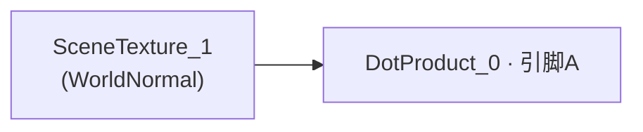
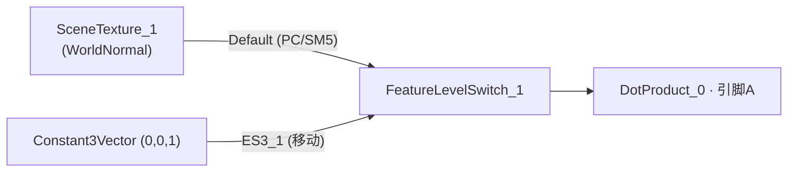
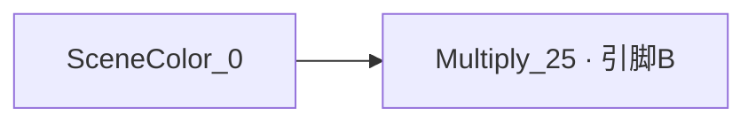
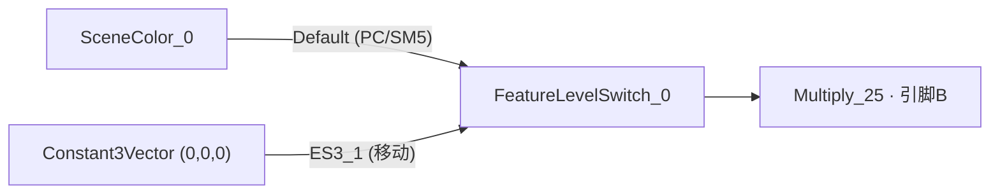

# 特效材质移动端兼容修复说明（给美术）

> 涉及材质：`M_EFX_BaseMat_decal`、`M_EFX_Hero17_Skill01`
> 平台：Android（移动 / ES3.1，前向渲染）
> 结论：PC/主机效果不变；移动端从"变灰白默认材质"恢复为正常显示（少了一层依赖场景缓冲的屏幕空间效果）。

---

## 一、背景：出了什么问题

这两个特效基材质在 **Android（移动 / ES3.1）** 下**编译失败**，导致引用它们的所有特效在移动端**直接显示成默认灰白材质（WorldGridMaterial）**：

| 基材质 | 失败原因（移动端不支持的节点） |
|---|---|
| `M_EFX_BaseMat_decal` | 用了 `SceneTexture → WorldNormal`（读取场景法线，属于 GBuffer） |
| `M_EFX_Hero17_Skill01` | 用了 `SceneColor` 节点（读取场景颜色） |

原因：这类"读取屏幕/场景缓冲"的节点**只在 PC/主机（延迟渲染）有效**；移动端是前向渲染，**没有这些数据**，所以整支材质编译不过。

引擎日志中的原始报错：

```
M_EFX_BaseMat_decal.uasset: Failed to compile Material for platform PCD3D_ES31 ...
    (Node SceneTexture) GBuffer scene textures not available with forward shading (platform id 57).

M_EFX_Hero17_Skill01.uasset: Failed to compile Material for platform PCD3D_ES31 ...
    (Node SceneColor) Node not supported in feature level ES3_1. SM5 required.
```

---

## 二、改了什么

给这两个材质里那个"读场景"的节点，套了一个 **Feature Level Switch（特性级别开关）**：

- **PC / 主机分支（Default / SM5）**：接**原来的**节点 → 效果**完全不变**。
- **移动端分支（ES3_1）**：接一个**常量 fallback**：
  - `M_EFX_BaseMat_decal`：WorldNormal → 常量 `(0, 0, 1)`（朝上的法线）
  - `M_EFX_Hero17_Skill01`：SceneColor → 常量 `(0, 0, 0)`（黑）

原理：Feature Level Switch **只编译当前平台对应分支**。移动端只编译 ES3_1 分支（常量），那个"读场景"的节点在移动端**不再参与编译**，于是通过编译、不再回退默认材质；PC/主机走 Default 分支，保持原节点。

---

## 三、修改前 / 后 节点连线对比图

### 3.1 `M_EFX_BaseMat_decal`（病灶节点：`SceneTexture_1` = WorldNormal，下游 `DotProduct_0.A`）

**修改前：**



**修改后：**



ASCII 示意：

```
修改前:
   [SceneTexture:WorldNormal] ----------------> [DotProduct_0 . A]

修改后:
   [SceneTexture:WorldNormal] --(Default)--> [FeatureLevelSwitch] --> [DotProduct_0 . A]
   [Constant3 (0,0,1)]        --(ES3_1)---->        ^
```

### 3.2 `M_EFX_Hero17_Skill01`（病灶节点：`SceneColor_0`，下游 `Multiply_25.B`）

**修改前：**



**修改后：**



ASCII 示意：

```
修改前:
   [SceneColor_0] --------------------------> [Multiply_25 . B]

修改后:
   [SceneColor_0]       --(Default)--> [FeatureLevelSwitch] --> [Multiply_25 . B]
   [Constant3 (0,0,0)]  --(ES3_1)---->        ^
```

---

## 四、视觉影响（重点）

- **PC / 主机端：无任何变化**，和以前一模一样。
- **移动端（Android）**：
  - 修复前：整个特效是**灰白棋盘 / 默认材质**（等于坏掉）。
  - 修复后：特效**正常显示**，但**少了那一层"依赖场景颜色 / 场景法线"的屏幕空间叠加效果**（移动端本来就取不到这些数据）。
  - 直观说：贴花 / 技能特效在手机上会比 PC 上"少一点和背景融合 / 扭曲 / 受环境影响"的细节，但整体形态、颜色、贴图、动画都正常。

---

## 五、连带修好的实例（无需逐个处理）

改的是**基材质**，所以下面这些引用它们的 MI 实例会**自动跟着恢复**，不用一个个改：

- 来自 `M_EFX_BaseMat_decal`：
  `MI_EFX_Grenade_Decal_LHT_001 / 002 / 003`、`MI_EFX_Hero9_Skill01_004 / 005 / 011 / 012`、
  `MI_EFX_Airdrop_Common_LHT_003`、`MI_EFX_Airdrop_LHT_004`、`MI_EFX_Common_Grenade_LLF_028`、
  `MI_EFX_Hero02_Skill02_Decal_002`、`MI_EFX_Hero04_Skill01_Base_028`、`MI_EFX_Hero07_Skill01_Flare_DYG_006` 等
- 来自 `M_EFX_Hero17_Skill01`：
  `MI_Effect_Hero17_Skill01_3P`

---

## 六、请美术确认 / 注意事项

1. **确认移动端观感可接受**：在编辑器切到 Android Vulkan 预览，看上述特效在手机分支下的效果是否 OK（尤其手雷贴花、Hero9 / Hero17 技能、空投）。如果某个特效"少的那层"很关键，需要美术单独做移动端替代方案（例如用贴图近似，而不是读场景）。
2. **以后不要在移动端要走的材质里直接用** `SceneColor` / `SceneTexture(WorldNormal 等 GBuffer 通道)`——移动端一定编译不过、会变默认材质。若必须用，请像这次一样用 **Feature Level Switch** 给移动端单独接 fallback。
3. 移动端可用的场景读取只有少数（如 `SceneDepth`、`CustomDepth`、`CustomStencil`）——需要深度 / 软粒子效果用这些，不要用 GBuffer 类。
4. 打开这两个材质会看到新增的 `FeatureLevelSwitch` + `Constant3Vector` 节点（这就是本次改动），请勿误删。
5. 编辑这两个材质时，**改动期间请先关闭它们的材质编辑器窗口**再用脚本/工具改；材质编辑器开着时会用它的 UI 状态回写覆盖外部改动（本次修复曾因此被回退一次）。

---

*本说明对应引擎渲染侧的配套改动（BasePass/CSM 合并的崩溃保护）由程序侧维护，美术无需关注。*
