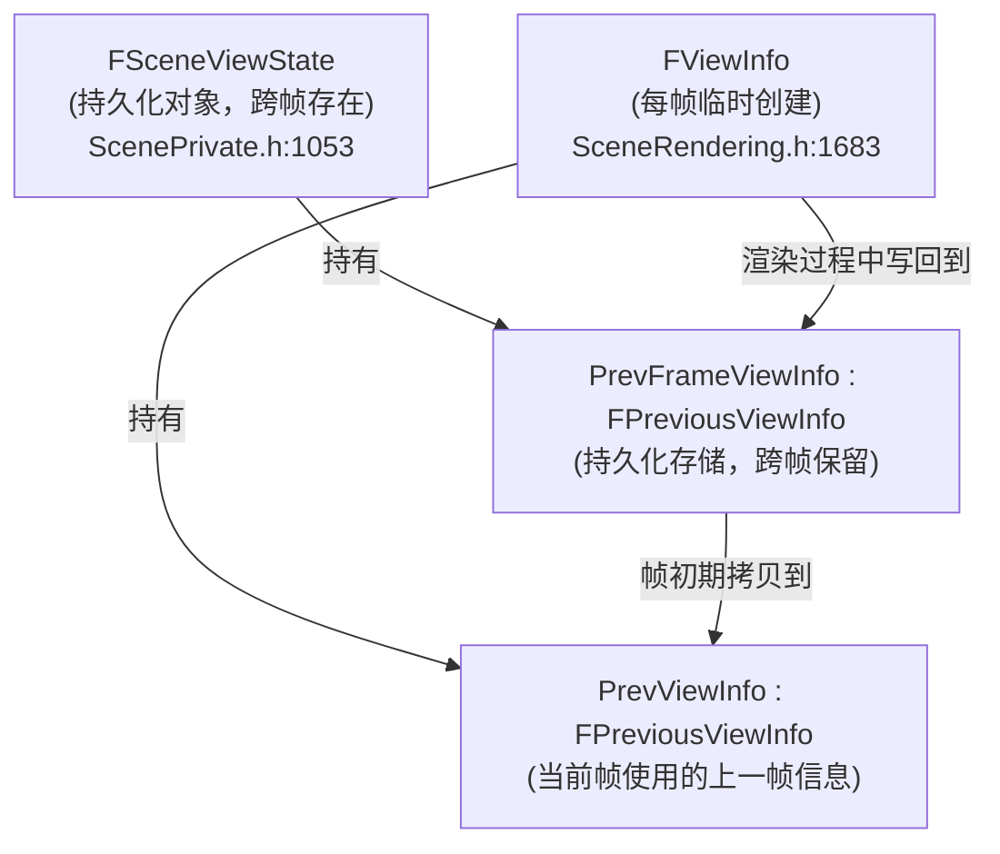
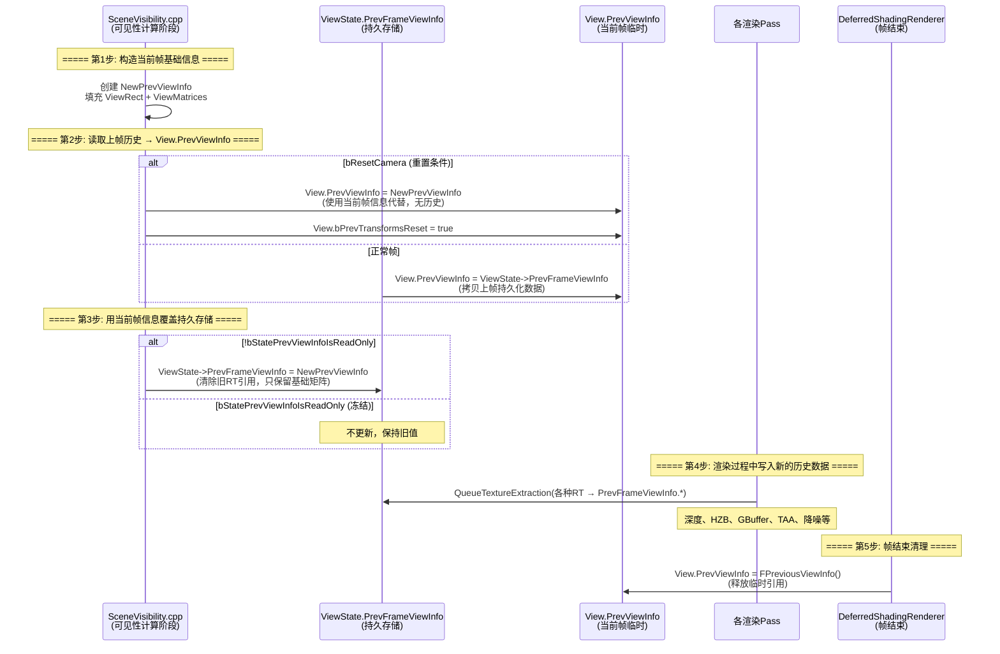

# FPreviousViewInfo 保存流程 — 技术总结

## 一、概述

`FPreviousViewInfo` 是 UE5 渲染器中用于保存**前一帧视图信息**的核心结构体，它在帧间传递渲染历史数据（如深度缓冲、GBuffer、HZB、TAA 历史、降噪历史等），主要服务于所有**时间性（Temporal）相关的渲染效果**，包括 TAA/TSR、时间性降噪、运动模糊、SSR 等。

## 二、核心数据结构

### 2.1 FPreviousViewInfo 结构体

定义于 `Engine/Source/Runtime/Renderer/Private/SceneRendering.h:1145`：

```cpp
// Structure that hold all information related to previous frame.
struct FPreviousViewInfo
{
    FIntRect ViewRect;                   // 视口区域
    FViewMatrices ViewMatrices;          // 视图矩阵（投影、世界等）
    float SceneColorPreExposure = 1.0f;  // 场景颜色预曝光值
    bool bUsesGlobalDistanceField = false;

    // ---- 持久化渲染纹理（跨帧缓存） ----
    TRefCountPtr<IPooledRenderTarget> DepthBuffer;                   // 前帧深度
    TRefCountPtr<IPooledRenderTarget> LightingChannelsTexture;       // 光照通道纹理
    TRefCountPtr<IPooledRenderTarget> GBufferA;                      // GBuffer A
    TRefCountPtr<IPooledRenderTarget> GBufferB;                      // GBuffer B
    TRefCountPtr<IPooledRenderTarget> GBufferC;                      // GBuffer C
    TRefCountPtr<IPooledRenderTarget> HZB;                           // 层次化深度缓冲
    TRefCountPtr<IPooledRenderTarget> NaniteHZB;                     // Nanite HZB
    TRefCountPtr<IPooledRenderTarget> CompressedDepthViewNormal;     // 压缩的深度+法线
    TRefCountPtr<IPooledRenderTarget> CompressedOpaqueDepth;         // 压缩的不透明深度
    TRefCountPtr<IPooledRenderTarget> CompressedOpaqueShadingModel;  // 压缩的着色模型ID
    TRefCountPtr<IPooledRenderTarget> ScreenSpaceRayTracingInput;    // SSR 输入
    TRefCountPtr<IPooledRenderTarget> SSXRHistoryInfo;               // SSXR 历史
    TRefCountPtr<IPooledRenderTarget> SSXRHistoryUtil;
    TRefCountPtr<IPooledRenderTarget> LuminanceHistory;              // 亮度历史

    // ---- 时间性抗锯齿 / 超分辨率历史 ----
    FTemporalAAHistory TemporalAAHistory;        // TAA
    FTSRHistory TSRHistory;                      // TSR
    FTemporalAAHistory DOFSetupHistory;          // DOF TAA
    FTemporalAAHistory SSRHistory;               // SSR TAA
    FTemporalAAHistory WaterSSRHistory;          // 水面 SSR TAA
    FTemporalAAHistory RoughRefractionHistory;   // 粗糙折射 TAA
    FTemporalAAHistory HairHistory;              // 头发 TAA

    // ---- 降噪历史 ----
    FScreenSpaceDenoiserHistory ReflectionsHistory;           // 反射降噪
    FScreenSpaceDenoiserHistory AmbientOcclusionHistory;      // AO 降噪
    FScreenSpaceDenoiserHistory DiffuseIndirectHistory;       // GI 降噪
    FScreenSpaceDenoiserHistory SkyLightHistory;              // 天光降噪
    TMap<const ULightComponent*, TSharedPtr<FScreenSpaceDenoiserHistory>> ShadowHistories; // 阴影降噪

    // ... 还有更多字段 ...
};
```

### 2.2 数据结构关系



**两份 FPreviousViewInfo 的职责**：

| 实例 | 所在位置 | 生命周期 | 职责 |
|------|---------|---------|------|
| `ViewState->PrevFrameViewInfo` | `FSceneViewState`（持久化） | 跨帧存在 | 持久化存储，接收各渲染 Pass 写入的新历史数据 |
| `View.PrevViewInfo` | `FViewInfo`（临时） | 仅当前帧 | 供当前帧渲染使用的上一帧历史数据（只读消费） |

## 三、完整生命周期流程



### 流程概括："读 → 清 → 写 → 释放"循环

1. **读**：帧初期从持久化的 `ViewState->PrevFrameViewInfo` 拷贝到临时的 `View.PrevViewInfo`
2. **清**：用当前帧基础信息（ViewRect + ViewMatrices）覆盖 `ViewState->PrevFrameViewInfo`，清除旧 RT 引用
3. **写**：渲染过程中各 Pass 通过 `QueueTextureExtraction` 将当前帧结果写入 `ViewState->PrevFrameViewInfo`
4. **释放**：帧结束时清空 `View.PrevViewInfo` 释放临时引用

## 四、各阶段详解

### 4.1 第1步：构造当前帧基础信息

**位置**：`SceneVisibility.cpp:6588`

```cpp
// Setup a new FPreviousViewInfo from current frame infos.
FPreviousViewInfo NewPrevViewInfo;
{
    NewPrevViewInfo.ViewRect = View.ViewRect;
    NewPrevViewInfo.ViewMatrices = View.ViewMatrices;
    NewPrevViewInfo.ViewRect = View.ViewRect;
}
```

此处只填充了 **ViewRect** 和 **ViewMatrices** 两个基础字段，作为一个"空壳"。后续各渲染 Pass 会通过 `QueueTextureExtraction` 往 `ViewState->PrevFrameViewInfo` 中逐步填入各种渲染纹理历史。

### 4.2 第2步：读取上帧历史 → View.PrevViewInfo

**位置**：`SceneVisibility.cpp:6659-6670`

```cpp
if (bResetCamera)
{
    View.PrevViewInfo = NewPrevViewInfo;  // 重置：用当前帧信息代替
    View.bPrevTransformsReset = true;
}
else
{
    View.PrevViewInfo = ViewState->PrevFrameViewInfo;  // 正常：拷贝上帧缓存
}
```

#### 重置条件 bResetCamera

```cpp
const float DeltaTime = View.Family->Time.GetRealTimeSeconds() - ViewState->LastRenderTime;
const bool bFirstFrameOrTimeWasReset = DeltaTime < -0.0001f || ViewState->LastRenderTime < 0.0001f;
const bool bIsLargeCameraMovement = IsLargeCameraMovement(
    View,
    ViewState->PrevFrameViewInfo.ViewMatrices.GetViewMatrix(),
    ViewState->PrevFrameViewInfo.ViewMatrices.GetViewOrigin(),
    75.0f, GCameraCutTranslationThreshold);
const bool bResetCamera = (bFirstFrameOrTimeWasReset || View.bCameraCut || bIsLargeCameraMovement || View.bForceCameraVisibilityReset);
```

| 条件 | 含义 |
|------|------|
| `bFirstFrameOrTimeWasReset` | 首帧或时间被重置（DeltaTime < 0 或 LastRenderTime ≈ 0） |
| `View.bCameraCut` | 相机切换（如过场动画镜头切换） |
| `bIsLargeCameraMovement` | 大幅相机移动（旋转 > 75° 或位移 > 阈值） |
| `View.bForceCameraVisibilityReset` | 强制重置可见性标志 |

当触发重置时，`View.PrevViewInfo` 被填充为当前帧信息（等于没有历史数据），所有时间性效果将从零开始积累。

### 4.3 第3步：用当前帧信息覆盖持久存储

**位置**：`SceneVisibility.cpp:6674`

```cpp
// Replace previous view info of the view state with this frame, clearing out references over render target.
if (!View.bStatePrevViewInfoIsReadOnly)
{
    ViewState->PrevFrameViewInfo = NewPrevViewInfo;
}
```

**关键设计**：这里用 `NewPrevViewInfo`（只有 ViewRect + ViewMatrices）覆盖 `PrevFrameViewInfo`，**相当于清除了所有旧的 RT 引用**。这样做的目的是：
- 释放上一帧渲染纹理的引用计数，让不再需要的 RT 可以被回收
- 为当前帧的渲染 Pass 提供一个干净的写入目标

接下来渲染过程中各个 Pass 会通过 `QueueTextureExtraction` 逐步将新的纹理历史写入。

#### 只读保护 bStatePrevViewInfoIsReadOnly

**设置位置**：`SceneVisibility.cpp:6339`

```cpp
View.bStatePrevViewInfoIsReadOnly = ViewFamily.bWorldIsPaused 
    || ViewFamily.EngineShowFlags.HitProxies 
    || bFreezeTemporalHistories;
```

| 条件 | 含义 |
|------|------|
| `bWorldIsPaused` | 世界暂停（编辑器 pause） |
| `HitProxies` | 命中代理模式（编辑器拾取） |
| `bFreezeTemporalHistories` | `r.Test.FreezeTemporalHistories` CVar |

当为只读时，持久存储中的所有数据保持不变，当前帧渲染不会写入任何新历史。

### 4.4 第4步：渲染过程中各 Pass 写入历史数据

在帧渲染过程中，各个渲染 Pass 通过 `GraphBuilder.QueueTextureExtraction` 将当前帧的渲染结果写入到 `ViewState->PrevFrameViewInfo` 的对应字段。

典型的写入模式为：

```cpp
if (View.ViewState && !View.bStatePrevViewInfoIsReadOnly)
{
    GraphBuilder.QueueTextureExtraction(
        SomeRDGTexture,
        &View.ViewState->PrevFrameViewInfo.SomeField);
}
```

#### 各 Pass 写入汇总表

| 渲染 Pass | 写入字段 | 源文件（大致位置） |
|-----------|---------|------------------|
| 深度 Pass | `DepthBuffer` | DeferredShadingRenderer.cpp:4282 |
| HZB 构建 | `HZB` | DeferredShadingRenderer.cpp:634 |
| GBuffer | `GBufferA` | PostProcessDeferredDecals.cpp:1531 |
| 光照通道 | `LightingChannelsTexture` | DeferredShadingRenderer.cpp:3121 |
| 场景颜色 | `ScreenSpaceRayTracingInput` | DeferredShadingRenderer.cpp:4283 |
| TAA/TSR | `TemporalAAHistory` | PostProcessing.cpp:417 |
| 曝光 | `SceneColorPreExposure` | PostProcessEyeAdaptation.cpp:1307 |
| 阴影降噪 | `ShadowHistories` | LightRendering.cpp:1913 |
| 反射降噪 | `ReflectionsHistory` | ScreenSpaceDenoise.cpp |
| AO 降噪 | `AmbientOcclusionHistory` | ScreenSpaceDenoise.cpp |
| 亮度历史 | `LuminanceHistory` | PostProcessTonemap.cpp:1107 |

**所有写入都受 `!bStatePrevViewInfoIsReadOnly` 保护**，确保冻结/暂停状态下不会覆盖历史数据。

### 4.5 第5步：帧结束清理

**位置**：`DeferredShadingRenderer.cpp:4449`

```cpp
// Release the view's previous frame histories so that their memory can be reused at the graph's execution.
for (int32 ViewIndex = 0; ViewIndex < Views.Num(); ViewIndex++)
{
    Views[ViewIndex].PrevViewInfo = FPreviousViewInfo();
}
```

帧结束后，将 `View.PrevViewInfo` 重置为空的默认值，**释放临时 RT 引用**（减少引用计数）。此时真正的历史数据已经安全存储在 `ViewState->PrevFrameViewInfo` 中，等待下一帧使用。

### 4.6 补充：PreviousViewTransform 覆盖

**位置**：`SceneVisibility.cpp:6680`

```cpp
// If the view has a previous view transform, then overwrite the previous view info for the _current_ frame.
if (View.PreviousViewTransform.IsSet())
{
    View.PrevViewInfo.ViewMatrices.UpdateViewMatrix(
        View.PreviousViewTransform->GetTranslation(), 
        View.PreviousViewTransform->GetRotation().Rotator());
}
```

某些情况下（如运动模糊需要手动指定上一帧变换），可以通过 `View.PreviousViewTransform` 覆盖 `PrevViewInfo` 中的视图矩阵。

## 五、相关文件清单

| 文件 | 角色 |
|------|------|
| `Engine/Source/Runtime/Renderer/Private/SceneRendering.h` | `FPreviousViewInfo` 结构体定义；`FViewInfo::PrevViewInfo` 字段 |
| `Engine/Source/Runtime/Renderer/Private/ScenePrivate.h` | `FSceneViewState::PrevFrameViewInfo` 持久化存储 |
| `Engine/Source/Runtime/Renderer/Private/SceneVisibility.cpp` | 核心保存/读取逻辑（读 → 清 → 覆盖） |
| `Engine/Source/Runtime/Renderer/Private/SceneRendering.cpp` | `bStatePrevViewInfoIsReadOnly` 默认设置 |
| `Engine/Source/Runtime/Renderer/Private/DeferredShadingRenderer.cpp` | 各种 `QueueTextureExtraction` 写入 + 帧结束清理 |
| `Engine/Source/Runtime/Renderer/Private/CompositionLighting/PostProcessDeferredDecals.cpp` | GBuffer 历史写入 |
| `Engine/Source/Runtime/Renderer/Private/PostProcess/PostProcessing.cpp` | TAA/TSR 历史写入 |
| `Engine/Source/Runtime/Renderer/Private/ScreenSpaceDenoise.cpp` | 各种降噪历史写入 |

## 六、设计要点总结

1. **两份拷贝隔离读写**：`View.PrevViewInfo`（临时只读消费） 与 `ViewState->PrevFrameViewInfo`（持久化写入） 分离，避免当前帧渲染读取到正在写入的不完整数据。

2. **先清后写**：第3步用 `NewPrevViewInfo`（只有基础矩阵）覆盖持久存储，释放旧 RT 引用，然后各 Pass 逐步写入新数据。这保证了旧帧资源可以被及时回收。

3. **只读保护**：`bStatePrevViewInfoIsReadOnly` 机制确保暂停/冻结时历史数据不被覆盖，时间性效果可以使用稳定的历史进行调试。

4. **重置机制**：当检测到首帧、相机切换、大幅移动等情况时，使用当前帧信息替代历史数据，防止时间性效果产生鬼影。

5. **帧末释放**：帧结束时清空 `View.PrevViewInfo`，使临时引用的 RT 引用计数减少，允许 RDG 在图执行时复用内存。
