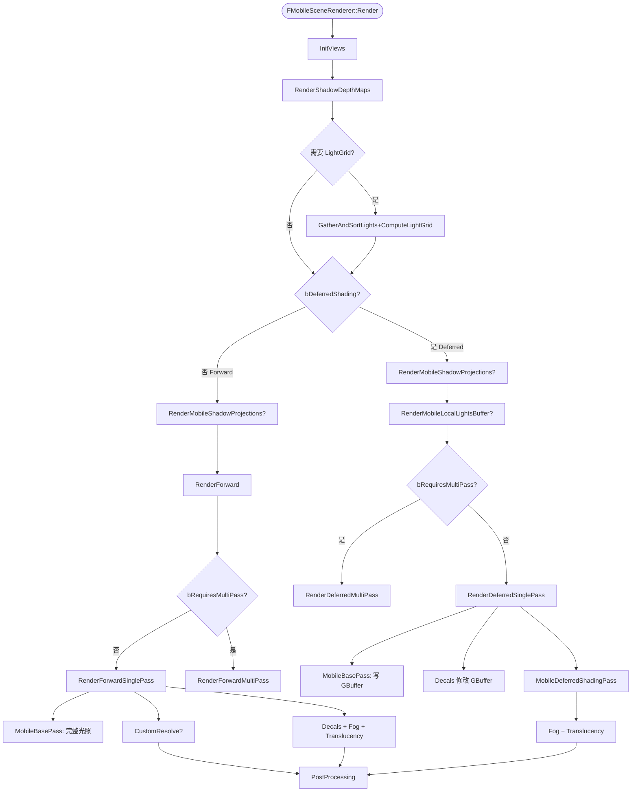

# UE Mobile Forward vs Deferred —— 源码索引脚手架

> 配套：
> - 主文档：`UE_Mobile_Forward_vs_Deferred_Tech_Doc.md`
> - 补充篇：`UE_Mobile_Forward_vs_Deferred_Tech_Doc_Appendix.md`
> - 实战篇：`UE_Mobile_Forward_vs_Deferred_Tech_Doc_Practical.md`
>
> 本文是一份"行号级"导航索引。基于工作树 `f:/ZJG_GR_DevTest/UE5EA/` 与 `f:/ZJG_GR_DevTest/S1Game/`，可直接 Ctrl+Click 跳转。所有行号均为本工程 UE5.5 + 项目补丁实际状态，与 Epic 官方略有差异。

---

## 1. 平台特性判断（路径分叉的"DNA"）

文件：`Engine/Source/Runtime/RenderCore/Private/RenderUtils.cpp`

| 函数 | 行号 | 说明 |
|------|------|------|
| `MobileRequiresSceneDepthAux` | 493 | Forward HDR 时需独立深度辅助贴图 |
| `MobileForwardEnableClusteredReflections` | 611 | LightGrid 反射球（Forward） |
| `MobileUsesShadowMaskTexture` | 617 | 项目改为始终 true |
| `MobileUsesExtenedGBuffer` | 643 | **本工程恒返回 false**（无 GBufferD） |
| `MobileUsesGBufferCustomData` | 662 | 是否支持 CustomData |
| `PlatformSupportLuxGI` | 669 | LuxGI 仅 Deferred |
| `MobileBasePassAlwaysUsesCSM` | 756 | Deferred 永远 true |
| `MobileUsesFullDepthPrepass` | 770 | EarlyZ 全开关 |

文件：`Engine/Source/Runtime/RenderCore/Public/RenderUtils.h`

| 函数 | 说明 |
|------|------|
| `IsMobileDeferredShadingEnabled` | 总开关 |
| `MobileForwardEnableLocalLights` | LightGrid 多光源 |
| `MobileForwardEnableParticleLights` | 粒子 SimpleLight |
| `IsUsingDBuffers` | DBuffer 启用 |
| `AreMobileScreenSpaceReflectionsEnabled` | SSR 启用 |

---

## 2. 渲染器主入口

文件：`Engine/Source/Runtime/Renderer/Private/MobileShadingRenderer.cpp`

| 范围 | 行号 | 说明 |
|------|------|------|
| 构造函数 | 329-369 | `bDeferredShading / bGammaSpace / bRequiresDBufferDecals / bEnableClusteredLocalLights / bEnableClusteredReflections / bRequiresScreenSpaceReflections / NumMSAASamples / bTonemapSubpass / bRequiresSceneDepthAux` |
| `PrepareViewVisibilityLists` | 413 | 准备 CSM 接收性可见性表 |
| `SetupMobileBasePassAfterShadowInit` | 431-481 | 设置 BasePass MDC（Forward 路径专属：MobileBasePassCSM） |
| `InitViews` | 542-1034 | 可见性 / OcclusionQuery / SceneTextures 配置 |
| `bIsFullDepthPrepassEnabled` 设置 | 345 | DDM_AllOpaque / DDM_AllOpaqueNoVelocity |
| `bKeepDepthContent` 计算 | 715-746 | Deferred 多了 PostProcessUsesSceneDepth / SceneDepthCapture 条件 |
| `RequiresMultiPass` | 2780-2819 | Subpass 能力判断 |
| `Render()` 顶层分支 | 1581-1611 | bDeferredShading 分叉 |
| `RenderForward` | 1858 | 多视图循环 |
| `RenderForwardSinglePass` | 1937 | Single RenderPass + Subpass |
| `RenderForwardMultiPass` | 2017 | 多 RenderPass 退化 |
| `InitRenderTargetBindings_Forward` | 1802 | RT0=SceneColor / RT1=DepthAux |
| `RenderDeferredSinglePass` | 2241 | Single RenderPass + 3 Subpass |
| `RenderDeferredMultiPass` | 2379 | 多 RenderPass 退化 |
| `InitRenderTargetBindings_Deferred` | 2224 | RT0=SceneColor / RT1-3=GBufferABC |
| `GetColorTargets_Deferred` | 2192 | PLS 模式只挂 SceneColor |
| `UsingPixelLocalStorage` | 2187 | GLES PLS 检测 |
| `FMobileDeferredCopyPLSPS` | 2106 | PLS 拷回 SceneColor |
| `MobileDeferredCopyBuffer` 模板 | 2158 | PLS Copy 调度 |
| `PostRenderBasePass` | 2728 | ViewExtension hook |
| `UpdateDirectionalLightUniformBuffers` | 2821 | 主光 UB 更新 |
| Light 准备（GatherAndSortLights + ComputeLightGrid） | 1305-1322 | 二路径共享 |
| `RenderMobileLocalLightsBuffer` | 1539 | Forward 专属 LocalLight Buffer |
| `RenderShadowDepthMaps` | 1392 | 阴影深度 |
| `RenderMobileShadowProjections` | 1526 | ShadowMaskTexture 生成 |

---

## 3. BasePass CPU 端

文件：`Engine/Source/Runtime/Renderer/Private/MobileBasePass.cpp`

| 范围 | 行号 | 说明 |
|------|------|------|
| `MobileLocalLightsUseSinglePermutation` | 44 | 单 Permutation 优化 |
| `GetMobileForwardLocalLightSetting` | 49 | r.Mobile.Forward.LocalLights 解析 |
| `GetMobileShadingModelStencilValue` | 69 | 项目改为恒返回 1u |
| `SetMobileBasePassDepthState` | 90 | Stencil 编码（Forward / Deferred 不同） |
| `GetUniformLightMapPolicyTypeForPSOCollection` | 468 | LightmapPolicy 选择（区分 bUsesDeferredShading） |
| `MobileBasePass::SetOpaqueRenderState` | 539 | Stencil + 半透明 Blend |
| `GetBlendStateForColorTransmittanceBlending` | 565 | Dual / Single / Programmable |
| `MobileBasePass::SelectMeshLightmapPolicy` | 366 | Lightmap 路径选择 |
| `FMobileBasePassMeshProcessor` 构造 | 813-829 | `bDeferredShading / bPassUsesDeferredShading` |
| `FMobileBasePassMeshProcessor::ShouldDraw` | 831 | 半透明 / 不透明判别 |
| `FMobileBasePassMeshProcessor::TryAddMeshBatch` | 854 | 主入口 |
| `FMobileBasePassMeshProcessor::AddMeshBatch` | 882 | MeshBatch 分发 |
| `FMobileBasePassMeshProcessor::Process` | 944 | LocalLightSetting 选择 |
| `CollectPSOInitializersForLMPolicy` | 1060 | PSO 预缓存 |
| `CollectPSOInitializers` | 1120 | 总入口 |
| `CreateMobileBasePassProcessor` | 1232 | 基础 BasePass |
| `CreateMobileBasePassCSMProcessor` | 1288 | MobileBasePassCSM（仅 Forward） |

文件：`Engine/Source/Runtime/Renderer/Private/MobileBasePassRendering.cpp`

| 范围 | 行号 | 说明 |
|------|------|------|
| `MobileLocalLightsBufferEnabled` | 21 | LightsBuffer 开关 |
| `MobileMergeLocalLightsInPrepassEnabled` | 26 | PrePass 合成 |
| `MobileMergeLocalLightsInBasepassEnabled` | 31 | BasePass 合成 |
| `IMPLEMENT_MATERIAL_SHADER_TYPE TMobileBasePassPS` | 167-174 | 4 倍 Permutation 实例化（LuxGI × ColorTransmittance） |
| `MobileBasePassModifyCompilationEnvironment` | 241-276 | 共享 ModifyCompilationEnvironment |
| `ModifyCompilationEnvironmentForQualityLevel` | 279-294 | Quality Level 宏（FULLY_ROUGH 等） |
| `SetupMobileBasePassUniformParameters` | 298 | UB 装配 |
| `IMPLEMENT_STATIC_UNIFORM_BUFFER_STRUCT FMobileBasePassUniformParameters` | 89 | UB 注册 |
| `CreateMobileBasePassUniformBuffer` | 441 | UB 创建 |
| `GetMobileBasePassShaders` | 190 | LightMapPolicy 分发 |
| `GetUniformMobileBasePassShaders` | 152 | 具体 Shader 实例 |

文件：`Engine/Source/Runtime/Renderer/Private/MobileBasePassRendering.h`

| 范围 | 行号 | 说明 |
|------|------|------|
| `FMobileBasePassUniformParameters` 定义 | 45-78 | 包含 Forward 反射、SkyLight、SceneTextures、Substrate |
| `EMobileBasePass` | 80 | DepthPrePass / Opaque / Translucent |
| `MobileBasePassModifyCompilationEnvironment` 声明 | 137 | – |
| `TMobileBasePassVS` 系列 | 232-263 | VS 模板 |
| `TMobileBasePassPS` 系列 | 405-535 | PS 模板（含 LocalLightSetting Permutation） |
| `TMobileBasePassPS::ShouldCompilePermutation` | 411-435 | Forward / Deferred 编译过滤 |
| `TMobileBasePassPS::ModifyCompilationEnvironment` | 466-526 | 注入所有关键宏 |

---

## 4. Deferred 专属 LightingPass

文件：`Engine/Source/Runtime/Renderer/Private/MobileDeferredShadingPass.cpp`

| 范围 | 行号 | 说明 |
|------|------|------|
| CVar `r.Mobile.UseClusteredDeferredShading` | 26-32 | – |
| CVar `r.Mobile.LocalExposure` | 34-40 | 1=LightPass / 2=PP |
| `UseClusteredDeferredShading` | 42 | 必须先开 LocalLights |
| CVar `r.Mobile.UseLightStencilCulling` | 48-54 | 默认 1 |
| CVar `r.Mobile.IgnoreDeferredShadingSkyLightChannels` | 56-63 | – |
| `FMobileDirectionalLightFunctionPS` | 80-253 | 大批 Permutation |
| `FMobileRadialLightFunctionPS` | 258-342 | Local Light PS |
| `FMobileReflectionEnvironmentSkyLightingPS` | 348-413 | 反射 + 天光 |
| `RenderReflectionEnvironmentSkyLighting` | 488-597 | 全屏 Pass + Stencil |
| `SetDirectionalLightDepthStencilState` 模板 | 599-636 | Stencil Equal Test |
| `RenderDirectionalLight` | 638-817 | 主光 + Inline 反射 |
| `RenderDirectionalLights` | 819-843 | 调度 |
| `SetLocalLightRasterizerAndDepthState` 模板 | 845-933 | Stencil/Z 剔除 |
| `RenderLocalLight_StencilMask` | 935-972 | Stencil 标记 |
| `RenderLocalLight` | 974-1094 | 单光源 Pass |
| `RenderSimpleLights` | 1096-1210 | 粒子简单光 |
| `MobileDeferredShadingPass` | 1212-1272 | **总入口** |

---

## 5. BasePass Shader

文件：`Engine/Shaders/Private/MobileBasePassPixelShader.usf`

| 范围 | 行号 | 说明 |
|------|------|------|
| `MOBILE_CHARACTER_FORWARD` 定义 | 15 | 项目改造开关 |
| `MOBILE_USE_GBUFFER` / `DEFERRED_SHADING_PATH` 宏 | 112-118 | 路径分支根 |
| `SV_TargetDepthAux` 偏移 | 139-145 | RT 槽位 |
| `FrameBufferBlendOp` | 187-200 | 半透明手工混合 |
| `GetPrecomputedIndirectLightingAndSkyLight` | 266 | 静态光照 + SkyLight |
| `Main()` 入口 | ≈ 365 | 主函数（项目签名增加了 OutCharRenderMask） |
| `EnvBRDFApproxFullyRough` 使用 | 689-691 | FULLY_ROUGH 路径 |
| Lightmap + SkyLight 取值 | 980-998 | LuxGI / Lightmap 分支 |
| Toon Character DEFERRED 例外 | 1011-1039 | 角色反向 Forward 入口 |
| `MobileEncodeGBuffer` 调用 | 1090 | Deferred BasePass 输出 |
| Forward BasePass 完整光照 | 1097-1322 | DirectionalLight / IBL / LocalLight / Fog |
| `MERGED_LOCAL_LIGHTS_MOBILE` 分支 | 1165-1230 | LightTexture / LightGrid 两路 |
| GBuffer / 颜色最终输出 | 1459-1463 | USE_GLES_FBF_DEFERRED 走 OutProxy |

---

## 6. Deferred LightingPass Shader

文件：`Engine/Shaders/Private/MobileDeferredShading.usf`

| 范围 | 行号 | 说明 |
|------|------|------|
| 头宏 + Include | 1-50 | MOBILE_DEFERRED_LIGHTING / 反路由 MobileSceneTextures |
| `ComputeLightFunctionMultiplier` | 55-75 | LightFunction 衰减 |
| `SkyLightDiffuseMobile` | 77-141 | 球谐 + 子表面 |
| `ReflectionEnvironmentSkyLighting` | 143-188 | 反射混合 |
| `MobileDirectionalLightPS` | 190-359 | **主光 + Inline 反射 + LuxGI** |
| `InitDeferredLightFromLightParameters` | 370-407 | LocalLight 数据初始化 |
| `MobileRadialLightPS` | 409-508 | **Point/Spot/Rect** |
| `MobileReflectionEnvironmentSkyLightingPS` | 510-559 | 全屏反射 + 天光 |
| USE_GLES_FBF_DEFERRED 输出签名 | 193-200, 412-418, 513-520 | 三个 PS 都要保持 RT 数量一致 |

文件：`Engine/Shaders/Private/MobileDeferredUtils.usf`

| 范围 | 说明 |
|------|------|
| `MobileDeferredCopyPLSPS` | PLS 拷贝 |
| `MobileDeferredCopyDepthPS` | Depth 拷贝 |

---

## 7. GBuffer 编解码与 SceneTextures

文件：`Engine/Shaders/Private/DeferredShadingCommon.ush`

| 范围 | 行号 | 说明 |
|------|------|------|
| `MobileEncodeGBuffer` | 674 | 编码 Normal/PBR/CustomData |
| `MobileFetchAndDecodeGBuffer` | 1081-1114 | 解码（两个重载） |
| `EncodeGBuffer` 通用 | 1130-1135 | SHADING_PATH_MOBILE 分支 |

文件：`Engine/Source/Runtime/RenderCore/Private/GBufferInfo.cpp`

| 范围 | 行号 | 说明 |
|------|------|------|
| `FetchMobileGBufferInfo` | 582-606 | PLS=1 RT / 否则 4(+1) RT |
| `MobileUsesExtenedGBuffer` 影响 | 592 | 决定是否多 GBufferD |
| 入口选择 | 611-617 | Mobile + Deferred 才走 Mobile 路径 |

文件：`Engine/Source/Runtime/Renderer/Private/SceneTextures.cpp`

| 范围 | 行号 | 说明 |
|------|------|------|
| GBufferA/B/C/D 创建 | 828-862 | 包含 MultiView Array |
| Toon 项目特定 ToonData 系列 | 998-1066 | ToonDataTexture02/03/04/05 + ToonRimLight + ToonTransGbuffer + BaseColorCopy |
| Memoryless 决定 | 1116-1119 | Deferred 允许 Memoryless 深度 |
| `FetchGBufferLayout` | 1200-1210 | 各 GBuffer Slot 索引 |

---

## 8. 半透明 / Decal / 后处理调度

| 文件 | 范围 | 说明 |
|------|------|------|
| `TranslucentRendering.cpp` | `RenderTranslucency` | 半透明 Pass 入口 |
| `MeshDecalRendering.cpp` | `EMeshPass::MeshDecal_*` | 网格贴花 |
| `PostProcessing/MobilePostProcessing.cpp` | `AddMobilePostProcessingPasses` | 后处理总入口 |
| `MobileSSR.cpp` | `RenderScreenSpaceReflections` | SSR 实现 |
| `ScreenSpaceRayTracing.cpp` | `RenderScreenSpaceXReflectionsMobile` | SSXR 实现 |

---

## 9. 阴影 / ShadowMask

| 文件 | 说明 |
|------|------|
| `ShadowDepthRendering.cpp` | `RenderShadowDepthMaps` 主光 / 局部光阴影 Depth |
| `MobileShadowProjections.cpp` | `RenderMobileShadowProjections` ShadowMaskTexture 生成 |
| `Engine/Shaders/Private/ShadowProjectionPixelShader.usf` | ShadowMask 输出 |
| `Engine/Shaders/Private/ShadowFilteringCommon.ush` | PCF / 滤波 |

---

## 10. 光照 / Cluster

| 文件 | 说明 |
|------|------|
| `LightRendering.cpp` | `FDeferredLightVS` / `GetDeferredLightParameters` |
| `LightSceneInfo.cpp` | 光源场景信息 |
| `LocalLightSceneProxy.h` | 局部光 Proxy |
| `LightFunctionRendering.cpp` | LightFunction Material |
| `Engine/Shaders/Private/DynamicLightingCommon.ush` | 衰减、阴影组合 |
| `Engine/Shaders/Private/LightGridCommon.ush` | LightGrid 数据结构 |

---

## 11. LuxGI / ToonLighting

| 文件 | 说明 |
|------|------|
| `LuxMobileGI/LuxGIRendering.cpp` | LuxGI 主入口 |
| `Engine/Shaders/Private/LuxIrradianceVolume/LuxGI*.usf` | LuxGI Shader |
| `Engine/Shaders/Private/ToonMobileLightingCommon.ush` | 项目 Toon BRDF |
| `Engine/Shaders/Private/ToonDeferredLightingCommon.ush` | 项目 Toon Deferred |

---

## 12. 项目自定义新增

| 文件 | 说明 |
|------|------|
| `RenderCharacterForward.cpp` | 项目专属 Forward 角色 Pass |
| `MMHShadowMapProjection.usf` | MMH 阴影投影 |
| `MobilePreOutlinePass.cpp` | 预描边 Pass |
| `MobileLocalFogVolume.cpp` | 局部雾体 |

---

## 13. 关键 CVar 一览（按字母排序）

| CVar | 默认 | 位置 |
|------|------|------|
| `r.Mobile.ShadingPath` | 0 | RendererSettings (project) |
| `r.Mobile.Forward.EnableLocalLights` | 0 | RenderUtils.cpp |
| `r.Mobile.Forward.EnableClusteredReflections` | 0 | RenderUtils.cpp:611 |
| `r.Mobile.Forward.LocalLightsSinglePermutation` | 0 | MobileBasePassRendering.cpp:37 |
| `r.Mobile.UseClusteredDeferredShading` | 0 | MobileDeferredShadingPass.cpp:27 |
| `r.Mobile.UseLightStencilCulling` | 1 | MobileDeferredShadingPass.cpp:49 |
| `r.Mobile.IgnoreDeferredShadingSkyLightChannels` | 0 | MobileDeferredShadingPass.cpp:57 |
| `r.Mobile.LocalExposure` | 2 | MobileDeferredShadingPass.cpp:35 |
| `r.Mobile.ScreenSpaceReflections` | 0 | MobileSSR.cpp |
| `r.Mobile.DBuffer` | 0 | RenderUtils.cpp:1002 |
| `r.Mobile.AmbientOcclusion` | 0 | RenderUtils.cpp |
| `r.Mobile.AllowSoftwareOcclusion` | 0 | MobileShadingRenderer.cpp:711 |
| `r.Mobile.EnableStaticAndCSMCombinedShadow` | – | ShadowProjection |
| `r.Mobile.EnableNoPrecomputedLighting` | – | StaticLightingAllowed 路径 |
| `r.Mobile.EarlyZPass` | 0 | RenderUtils.cpp:772 |
| `r.Mobile.Shadow.CSMShaderCullingMethod` | – | RenderUtils.cpp:758 |
| `r.Mobile.AdrenoOcclusionMode` | 0 | MobileShadingRenderer.cpp:1992 |
| `r.Mobile.ForceDepthResolve` | 0 | MobileShadingRenderer.cpp:706 |
| `r.MobileMSAA` | 1 | – |
| `r.MobileXRMSAAMode` | 0 | MobileShadingRenderer.cpp:1746 |
| `r.Mobile.Shadow.AllowDistanceFieldShadows` | – | MobileBasePass.cpp |

---

## 14. 关键 Shader Compile Define（按字母排序）

| Define | 位置 | 描述 |
|--------|------|------|
| `MOBILE_DEFERRED_SHADING` | 项目层 / LuxGIVisualize.cpp:97 | 全 Deferred 编译 |
| `MOBILE_USE_GBUFFER` | MobileBasePassPixelShader.usf:113 | 当前材质走 GBuffer |
| `DEFERRED_SHADING_PATH` | MobileBasePassPixelShader.usf:115 | Shader 内 Deferred 主分支 |
| `MOBILE_EXTENDED_GBUFFER` | MobileUsesExtenedGBuffer 注入 | 是否 GBufferD |
| `MOBILE_DEFERRED_LIGHTING` | MobileDeferredShading.usf:3 | LightingPass 编译 |
| `IS_MOBILE_DEFERREDSHADING_SUBPASS` | MobileBasePassRendering.cpp:268 | 半透明可读 GBuffer |
| `IS_MOBILE_DEPTHREAD_SUBPASS` | MobileBasePassRendering.cpp:265 | 半透明可读 Depth |
| `USE_GLES_FBF_DEFERRED` | DDPI | GLES FBF Deferred |
| `MOBILE_DEFERRED_EXPORT_MRT` | 项目层 | 角色 mask 导出 |
| `MOBILE_CHARACTER_FORWARD` | MobileBasePassPixelShader.usf:15 | Toon Character 反向 Forward |
| `MOBILE_SHADINGMODEL_SUPPORT` | – | 非默认 ShadingModel |
| `MERGED_LOCAL_LIGHTS_MOBILE` | MobileBasePassRendering.h:501 | 0/1/2 |
| `ENABLE_CLUSTERED_LIGHTS` | MobileBasePassRendering.h:486 | LightGrid 多光源 |
| `ENABLE_CLUSTERED_REFLECTION` | MobileBasePassRendering.h:502 | LightGrid 反射 |
| `ENABLE_SKY_LIGHT` | MobileBasePassRendering.h:482 | BasePass SkyLight |
| `ENABLE_PLANAR_REFLECTION` | – | Planar 反射 |
| `ENABLE_AMBIENT_OCCLUSION` | MobileBasePassRendering.h:483 | BasePass AO |
| `ENABLE_DBUFFER_TEXTURES` | MobileBasePassRendering.h:504 | DBuffer 输入 |
| `ENABLE_MOBILE_CSM` | MobileDeferredShadingPass.cpp:90 | LightingPS CSM |
| `MOBILE_CSM_QUALITY` | – | CSM PCF 档 |
| `MOBILE_SHADOW_QUALITY` | MobileDeferredShadingPass.cpp:91 | 1/2/3 |
| `MOBILE_SSR_QUALITY` | – | EMobileSSRQuality |
| `MOBILE_SSR_ENABLED` | MobileBasePassRendering.h:513 | 编译 SSR |
| `SUPPORT_SPOTLIGHTS_SHADOW` | MobileBasePassPixelShader.usf:110 | Spot 阴影 |
| `RADIAL_LIGHT_TYPE` | MobileDeferredShadingPass.cpp:265 | Point/Spot/Rect |
| `USE_IES_PROFILE` | MobileDeferredShadingPass.cpp:266 | IES 配置 |
| `LIGHT_SOURCE_SHAPE` | MobileDeferredShadingPass.cpp:268 | 灯体形状 |
| `USE_LIGHT_FUNCTION` | MobileDeferredShadingPass.cpp:146 | LightFunction Material |
| `USE_LOCAL_EXPOSURE` | MobileDeferredShadingPass.cpp:96 | Inline 局部曝光 |
| `AVOID_LEAK_ENABLE` | MobileDeferredShadingPass.cpp:94 | LuxGI 防漏 |
| `USE_SHADOWMASKTEXTURE` | MobileBasePassRendering.h:503 | Forward 多用 |
| `USE_SPARSE_STORAGE` | MobileBasePassRendering.h:525 | LuxGI 稀疏 |
| `MOBILE_QL_FORCE_FULLY_ROUGH` | MobileBasePassRendering.cpp:287 | 全粗糙裁 IBL |
| `MOBILE_QL_FORCE_NONMETAL` | MobileBasePassRendering.cpp:288 | 非金属裁 F0 |
| `MOBILE_QL_FORCE_DISABLE_PREINTEGRATEDGF` | MobileBasePassPixelShader.usf:28 | 跳过 PreIntegratedGF |
| `MOBILE_QL_DISABLE_MATERIAL_NORMAL` | MobileBasePassRendering.cpp:292 | 强制 VertexNormal |
| `QL_FORCEDISABLE_LM_DIRECTIONALITY` | MobileBasePassRendering.cpp:289 | Lightmap 方向裁 |
| `MOBILE_TRANSLUCENT_COLOR_TRANSMITTANCE_*` | MobileBasePassRendering.h:510-512 | DualSrc / Programmable / SingleSrc |
| `MOBILE_MULTI_VIEW` | – | MultiView 编译 |
| `STATIC_LIGHTING_LIGHTMAP_ONLY/LUXGI_ONLY/HYBRID` | MobileBasePassPixelShader.usf:38-46 | LuxGI 静态光照模式 |

---

## 15. 关键 RDG Pass 名称（在 GPU Visualizer 中可见）

| Pass 名 | 在哪 |
|---------|------|
| `SceneColorRendering` | Forward / Deferred SinglePass 顶层 |
| `BasePass` | Deferred MultiPass |
| `DecalsAndTranslucency` | Forward MultiPass 第二个 |
| `Decals` | Deferred MultiPass |
| `LightingAndTranslucency` | Deferred CharacterForward=0 时 |
| `MobileLighting` | Deferred CharacterForward=1 时 |
| `CharacterForwardRendering` | 项目专属 |
| `FogTranslucencyAndOcclusion` | CharacterForward 后 |
| `DeferredShading` | Lighting Pass GPU Stat |
| `ShadowDepth` | RenderShadowDepthMaps |
| `ShadowProjection` | ShadowMaskTexture 生成 |
| `Postprocessing` | 后处理 |
| `VirtualTextureUpdate` | VT 反馈 |
| `MobileHZBOcclusion` | HZB |
| `VisualizeLuxLightProbes` | 项目 GI 调试 |

---

## 16. 总览路径图（Mermaid 文本，可贴到任何 Mermaid 渲染器查看）

---

## 17. 结语

四份文档构成完整学习/调试体系：

| 文档 | 用途 |
|------|------|
| 主文档 | 理论 / 机制对比 |
| 补充篇 | 项目层细节 / Tile / Stencil / LuxGI |
| 实战篇 | 性能数据 / 改造 / 调试 |
| **索引脚手架（本文）** | 行号级源码导航 |

> 配合 `F:\MobileWP\UE_Mobile_Forward_Pipeline_Study_Guide.md` 学习指南，可形成"概念 → 机制 → 细节 → 落地 → 索引"五层学习闭环。
>
> **晚安。**
