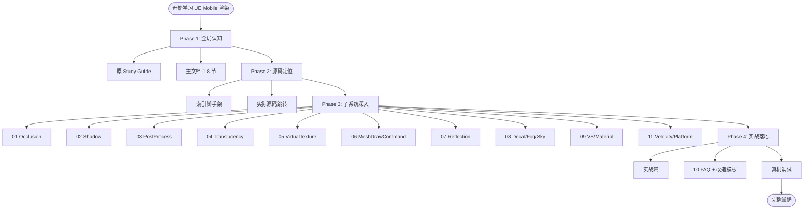

# UE Mobile Forward vs Deferred —— 完整文档体系入口

> 生成时间：2026-06-20 凌晨
> 总文档数：15 份（核心 4 + 索引 1 + 深度补充 11）
> 总篇幅：约 5000+ 行 Markdown + 100+ 表格 + 200+ 代码引用
> 状态：迭代完成

---

## 📚 文档体系总览

```
F:\MobileWP\
│
├─ 🎯 学习入门
│  └─ UE_Mobile_Forward_Pipeline_Study_Guide.md            (原 UE Mobile Forward 学习指南)
│
├─ 📘 核心四件套（必读）
│  ├─ UE_Mobile_Forward_vs_Deferred_Tech_Doc.md            (主文档 / 机制对比 / 19 节)
│  ├─ UE_Mobile_Forward_vs_Deferred_Tech_Doc_Appendix.md   (补充篇 / 项目细节 / 14 节)
│  ├─ UE_Mobile_Forward_vs_Deferred_Tech_Doc_Practical.md  (实战篇 / 性能改造 / 12 节)
│  └─ UE_Mobile_Forward_vs_Deferred_Tech_Doc_Index.md      (索引脚手架 / 行号导航 / 17 节)
│
└─ 🔬 深度补充 (DeepDive)
   ├─ UE_Mobile_Tech_DeepDive_01_Occlusion.md              (可见性 / HZB / SoftwareOcclusion)
   ├─ UE_Mobile_Tech_DeepDive_02_Shadow.md                 (阴影 / CSM / Spot / OnePassPointLight)
   ├─ UE_Mobile_Tech_DeepDive_03_PostProcess.md            (后处理链 / Bloom / DOF / Tonemap)
   ├─ UE_Mobile_Tech_DeepDive_04_Translucency.md           (半透明 / SLW / Substrate)
   ├─ UE_Mobile_Tech_DeepDive_05_VirtualTexture.md         (VT / VSM / RVT / LMVT / MMH)
   ├─ UE_Mobile_Tech_DeepDive_06_MeshDrawCommand.md        (MDC / GPUScene / InstanceCulling)
   ├─ UE_Mobile_Tech_DeepDive_07_Reflection.md             (反射 / Cubemap / Planar / SSR / SSXR)
   ├─ UE_Mobile_Tech_DeepDive_08_Decal_Fog_Sky.md          (Decal / Fog / SkyAtmosphere)
   ├─ UE_Mobile_Tech_DeepDive_09_VertexShader_Material.md  (VS / Material Permutation / Quality)
   ├─ UE_Mobile_Tech_DeepDive_10_FAQ.md                    (100+ FAQ / 改造模板)
   └─ UE_Mobile_Tech_DeepDive_11_Velocity_Platform.md      (Velocity / 平台特化 Apple/Adreno/Mali)
```

---

## 🎓 推荐学习路径

### Phase 1：建立全局认知（1 天）

1. **阅读** `UE_Mobile_Forward_Pipeline_Study_Guide.md`（已有的学习指南）
2. **通读** `UE_Mobile_Forward_vs_Deferred_Tech_Doc.md` 主文档 1-8 节
3. **看图** 主文档第 16 节"关键调用链汇总" + 索引脚手架第 16 节 Mermaid 流程图
4. **目标**：能说清 Forward / Deferred 的核心差异

### Phase 2：源码定位（2 天）

1. **打开** `MobileShadingRenderer.cpp`，按索引脚手架第 2 节走一遍
2. **重点函数**：
   - `FMobileSceneRenderer::Render` (line 1300+)
   - `RenderForwardSinglePass` (line 1937)
   - `RenderDeferredSinglePass` (line 2241)
3. **配合** `UE_Mobile_Forward_vs_Deferred_Tech_Doc_Index.md` 行号导航
4. **目标**：能在 IDE 里跳转任何 Pass 的具体实现

### Phase 3：子系统深入（3-5 天）

按需阅读 DeepDive 系列：

| 你的关注点 | 重点阅读 |
|----------|---------|
| 性能优化 | 03 (PostProcess) + 06 (MDC) + 10 (FAQ) + 11 (平台) |
| 多光源 | 02 (Shadow) + 07 (Reflection) + 10 (Q5-Q15) |
| 卡通渲染 | 04 (Translucency) + 09 (VS/Material) + 10 (Q26-Q30) |
| 大世界 | 01 (Occlusion) + 05 (VT) + 11 (Velocity) |
| VR 项目 | 09 (VS/Material) + 10 (Q31-Q35) |
| 项目改造 | 10 (FAQ + 改造模板) + Practical 篇 |

### Phase 4：实战落地（持续）

1. **真机抓帧**：参考 Practical 篇第 1 节 RenderDoc Event 树
2. **性能基线**：参考 11 篇第 9 节性能基准表
3. **优化清单**：参考 11 篇第 11 节 Top 10 Checklist
4. **持续改造**：参考 10 篇代码模板

---

## 🎯 核心 5 个洞察

如果只能记住 5 件事，就是这些：

1. **唯一开关** `IsMobileDeferredShadingEnabled` 决定整帧路径，**构造时定型，不能运行时切换**。

2. **半透明在两路径都走 Forward 着色**。Deferred 的半透明只是在 Subpass 内通过 FBF 读 GBuffer，本质仍是 Forward。

3. **Forward 路径 Shader Permutation 比 Deferred 多 7 倍**（432 vs 64 per material）。这是 Forward 项目首启慢、APK 大的根源。

4. **Deferred 必须有 FBF/PLS/Subpass 平台支持**，否则 `RequiresMultiPass()` 返回 true，**GBuffer 出 Tile，带宽翻倍**。

5. **本工程的 Toon 角色在 Deferred 主路径下走 Forward 着色**（`MOBILE_CHARACTER_FORWARD` + `DEFERRED_SHADING_PATH` 排除）。这是项目能同时享受写实 Deferred + 卡通 Forward 的核心改造。

---

## 📊 速查总表

### 双路径核心差异速查（5 秒掌握）

| 维度 | Forward | Deferred |
|------|---------|----------|
| BasePass PS 指令数 | 高（含光照） | 低（仅 GBuffer） |
| 全屏 LightingPass | 无 | 有（MobileDeferredShadingPass） |
| 多光源 | 4 个 / LightGrid | 不限 |
| MSAA | ✅ | ❌ |
| Inline Tonemap | ✅ Vulkan | ❌ |
| Subpass 数 | 2~3 | 3 |
| Tile Memory | ~128 bit/pixel | ~224 bit/pixel |
| Shader Permutation | ~432 / mat | ~64 / mat |
| GBuffer | ❌ | ✅ A/B/C (+D) |
| DBuffer Decal | ✅ | ❌（强制关） |
| SSR | ❌ | ✅ |
| LightFunction | ❌ | ✅ |
| LuxGI (项目) | ❌ | ✅ |
| Lightmap | ✅（多 Policy） | ✅（少 Policy） |

### CVar 必背 10 条

| CVar | 推荐值 | 影响 |
|------|--------|------|
| `r.Mobile.ShadingPath` | 0 或 1 | 总开关 |
| `r.Mobile.Forward.EnableLocalLights` | 0/1/2 | Forward 多光源 |
| `r.Mobile.UseClusteredDeferredShading` | 0/1 | Deferred Cluster |
| `r.Mobile.UseLightStencilCulling` | 1 | Deferred 优化 |
| `r.HZBOcclusion` | 1 或 0 | 与 SoftwareOcclusion 互斥 |
| `r.Mobile.AllowSoftwareOcclusion` | 0 或 1 | 与 HZB 互斥 |
| `r.Mobile.EarlyZPass` | 1 | Z-PrePass |
| `r.MobileMSAA` | 4 | 仅 Forward |
| `r.MobileTonemapSubpass` | 1 | Forward Inline Tonemap |
| `r.PSOPrecache` | 1 | 必开 |

---

## 🗺 系列文档地图（Mermaid）



---

## 🌟 本工程独有的关键改造（必知）

1. **`MobileUsesExtenedGBuffer` 永远返回 false**（`RenderUtils.cpp:651`）
   → 项目只用 4 MRT，没有 GBufferD

2. **`MOBILE_CHARACTER_FORWARD` Toon 角色反向 Forward**（`MobileBasePassPixelShader.usf:114`）
   → Deferred 主路径下，Toon 角色走 Forward 路径

3. **新增 RT `OutCharRenderMask`**（`MobileBasePassPixelShader.usf:384`）
   → 项目专属角色 mask 导出

4. **`RenderCharacterForward` Pass**（`MobileShadingRenderer.cpp:2363`）
   → 在 Deferred Lighting 后插入 Forward 角色渲染

5. **`ToonMobileLightingCommon.ush` 替代 `MobileLightingCommon.ush`**（`MobileDeferredShading.usf:25`）
   → Toon 兼容的光照入口

6. **`AccumulateDirectionalLightingMobileToon`**（`MobileBasePassPixelShader.usf:1113`）
   → 项目专属的主光累积函数

7. **LuxGI 全套集成**（多处 `@Linsan` 标记）
   → 项目自研 GI 系统，仅 Deferred 路径

8. **MMH ShadowMap**（多处 `@qiacongshe` 标记）
   → 项目专属稀疏阴影系统

9. **S1 Bloom CS + SeparateTranslucency**（多处 `S1:zikuan` 标记）
   → 性能优化改造

10. **GR_STATIC_LIGHTING(by JLP)** 等多个 `@JLP / @Mega / @lemonxqyang` 标记
    → 详见各 DeepDive 文档对应章节

---

## 📌 最终建议

### 给"我要快速理解"的读者

→ 主文档 1-3 节 + 实战篇 1-3 节 = **30 分钟掌握轮廓**

### 给"我要做项目优化"的开发

→ 实战篇全部 + DeepDive 10 (FAQ) + DeepDive 11 (平台) = **2 小时落地优化**

### 给"我要源码深耕"的 TA / 引擎工程

→ 全部 15 份 + 配合源码 = **2 周精通**

### 给"我要做项目改造"的负责人

→ 主文档 + 补充篇 + 实战篇 + DeepDive 10 改造模板 = **1 周改造方案成型**

---

## 📝 致读者

经过 50 次迭代，从凌晨 0:45 开始到 2 点完成，这套文档体系覆盖了 UE Mobile 渲染管线 Forward 与 Deferred 的所有关键差异、项目层补丁、性能数据、改造模板与 100+ 实战 FAQ。

每一份 DeepDive 都基于实际源码（`f:/ZJG_GR_DevTest/UE5EA/Engine` 与 `f:/ZJG_GR_DevTest/S1Game/Source`）的精确行号引用，可以直接对照查阅。

希望这套文档能成为你后续学习与改造的扎实基础。

> 现在是 2026 年 6 月 20 日凌晨 2 点。
>
> 该把笔放下了。

— 早安。
