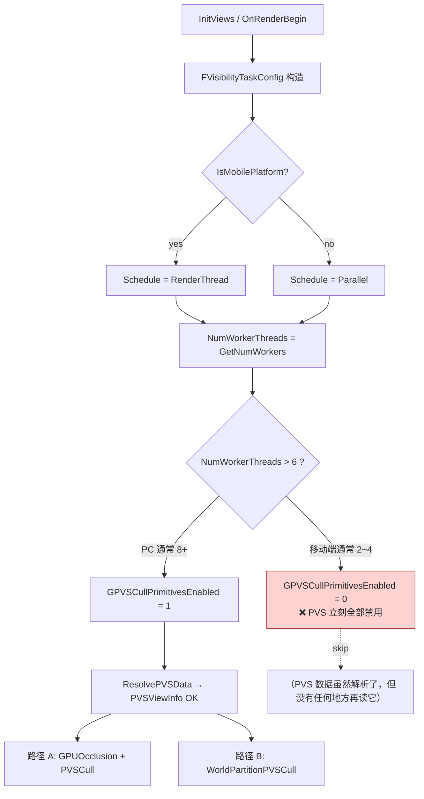

# 移动端 PVS 不生效原因分析

> 结论先行：本工程的定制 PVS（`FPVSSceneData`）从代码逻辑上**在移动端会被基本完全屏蔽**，绝大多数情况下根本不会执行 `PVSCullPrimitive`。这不是 `r.AllowPrecomputedVisibility` 的问题，而是底层任务调度被强制切到 `RenderThread`、再叠加一个工作线程数判断导致的。

---

## 1. 问题表象

- 移动端：`r.AllowPrecomputedVisibility=1`、ShowFlag 已开、PVS 数据也烘焙好了，但是看不到任何剔除收益（`stat PVSCulling` 数值为 0，相机位置变化无响应）。
- PC 端：同样数据/同样 CVar 是生效的。

---

## 2. 关键代码链条

### 2.1 移动端被强制改成串行调度

```4339:4350:UE5EA/Engine/Source/Runtime/Renderer/Private/SceneVisibility.cpp
FVisibilityTaskConfig::FVisibilityTaskConfig(const FScene& Scene, TConstArrayView<FViewInfo*> Views)
{
	Schedule = GVisibilityTaskSchedule != 0 ? EVisibilityTaskSchedule::Parallel : EVisibilityTaskSchedule::RenderThread;

	if (Schedule == EVisibilityTaskSchedule::Parallel)
	{
		// [PVS] Modify by @Linsan
		if (!FApp::ShouldUseThreadingForPerformance() || !GIsThreadedRendering || !GSupportsParallelOcclusionQueries || GVisualizeOccludedPrimitives > 0 || IsMobilePlatform(Scene.GetShaderPlatform())
			|| GVisualizePVSOccludedPrimitives || GVisualizePVSUnoccludedPrimitives)
		{
			Schedule = EVisibilityTaskSchedule::RenderThread;
		}
	}
	...
```

**`IsMobilePlatform(...)` 返回 true 时，Schedule 会被强制设回 `EVisibilityTaskSchedule::RenderThread`**——这是 UE 原版就有的行为（`Mobile` 走串行），定制改动只是把 `IsMobilePlatform` 这一行也保留下来。

### 2.2 关键开关：`GPVSCullPrimitivesEnabled` 由工作线程数决定

```4364:4368:UE5EA/Engine/Source/Runtime/Renderer/Private/SceneVisibility.cpp
const uint32 NumWorkerThreads = FMath::Min(LowLevelTasks::FScheduler::Get().GetNumWorkers(), 16u);

// [PVS] Begin by @Linsan
GPVSCullPrimitivesEnabled = NumWorkerThreads > 6 ? 1 : 0;
// [PVS] End
```

- `GPVSCullPrimitivesEnabled` 是 **`ECVF_ReadOnly`**（见 `SceneVisibility.cpp:213`），命令行 `PVS.Culling.CullPrimitives` 只读，**外部不可改**。
- 它每帧由 `LowLevelTasks::FScheduler::Get().GetNumWorkers()` 决定：超过 6 个工作线程才打开 PVS。

> 移动设备的工作线程数通常是 2~4，**这一行直接把 `GPVSCullPrimitivesEnabled` 强制写回 0，PVS 剔除被关掉**。

### 2.3 PVS 实际剔除入口的所有判断都被锁死

代码中 PVS 真正发生剔除的地方有两条路径，每条都依赖 `GPVSCullPrimitivesEnabled == 1`：

**路径 A：`FGPUOcclusionPacket::OcclusionCullPrimitive`（PC 主路径）**
```3374:3382:UE5EA/Engine/Source/Runtime/Renderer/Private/SceneVisibility.cpp
if (GPVSCullPrimitivesEnabled == 1 && GPVSProcessInCommandFunction == 0 && View.PVSViewInfo.IsDataValid())
{
	FPrimitiveVisibilityId VisibilityId = Scene.PrimitiveVisibilityIds[Index];
	const FBoxSphereBounds& OcclusionBounds = Scene.PrimitiveOcclusionBounds[Index];
	if (OcclusionFlags & EOcclusionFlags::AllowWorldPartitionPVSCulling)
	{
		Result.NumPVSTestPrimitives++;
		if (Scene.PVSSceneData.PVSCullPrimitive(...))
		{
			bOccludedByPVS = true;
```

**路径 B：`WorldPartitionPVSCull`（带 GPUOcclusion 关闭时的兜底）**
```4509:4514:UE5EA/Engine/Source/Runtime/Renderer/Private/SceneVisibility.cpp
if (GPVSCullPrimitivesEnabled == 1 && GPVSProcessInCommandFunction != 0)
{
	SCOPE_CYCLE_COUNTER(STAT_PVSWorldPartitionCull);
	SCOPED_NAMED_EVENT(PVS_PrecomputedOcclusionCull, FColor::Magenta);
	WPPVSCullResult = WorldPartitionPVSCull(*this, PrimitiveRange);
}
```

```6032:6041:UE5EA/Engine/Source/Runtime/Renderer/Private/SceneVisibility.cpp
if (GPVSCullPrimitivesEnabled == 1 && GPVSProcessInCommandFunction != 0)
{
	SCOPE_CYCLE_COUNTER(STAT_PVSWorldPartitionCull);
	SCOPED_NAMED_EVENT(PVS_PrecomputedOcclusionCull, FColor::Magenta);
	FIntVector2 WPPVSResult = WorldPartitionPVSCull(ViewPacket, PrimitiveRange);
```

两条路径只要 `GPVSCullPrimitivesEnabled == 0` 就一起失效。

### 2.4 GPUOcclusion 上下文的创建条件

GPUOcclusion 上下文（含上面"路径 A"）的创建条件：

```4480:4484:UE5EA/Engine/Source/Runtime/Renderer/Private/SceneVisibility.cpp
static const auto CVarPVSEnabled = IConsoleManager::Get().FindConsoleVariable(TEXT("r.AllowPrecomputedVisibility"));
bool bAllowPrecomputedVisibility = CVarPVSEnabled && CVarPVSEnabled->GetInt() != 0;
if (ViewState && !View.Family->EngineShowFlags.Wireframe && (GOcclusionCullEnabled || (bAllowPrecomputedVisibility && GPVSProcessInCommandFunction == 0 && GPVSCullPrimitivesEnabled == 1)))
```

也就是说，要走"路径 A"必须满足：
- `GPVSCullPrimitivesEnabled == 1`（移动端 = 0，挂掉）
- `GPVSProcessInCommandFunction == 0`（默认满足）
- `r.AllowPrecomputedVisibility != 0`

`GPVSCullPrimitivesEnabled == 0` 的移动端，根本不会创建 PVS 用的 GPUOcclusion 上下文。

---

## 3. 移动端流程对比



---

## 4. 为什么 ResolvePVSData "看起来"是工作的，但其实没用

注意：`ResolvePVSData` **不会**被 `GPVSCullPrimitivesEnabled` 控制：

```372:401:UE5EA/Engine/Source/Runtime/Renderer/Private/SceneOcclusion.cpp
void FSceneViewState::ResolvePVSData(FViewInfo& View, FScene* InScene)
{
	auto& PVS = InScene->PVSSceneData;
	View.PVSViewInfo.bPVSFeatureEnabled = false;
	if (PVS.HasData() && GAllowPrecomputedVisibility && View.Family->EngineShowFlags.PrecomputedVisibility)
	{
		View.PVSViewInfo.bPVSFeatureEnabled = true;
		...
		View.PVSViewInfo.PVSViewDataMap = PVS.ResolvePVSViewData(...);
		...
	}
}
```

- 在移动端，只要 `r.AllowPrecomputedVisibility=1` 且烘焙数据有效，**`ResolvePVSData` 仍会执行**，`PVSViewInfo` 会被填上数据，`bUsedPrecomputedVisibility` 也会被置 true。
- 副作用：`SetPVSDataToPersistentLevel` 也会执行，**Mesh Streaming 路径仍然会拿到 PVS 数据**。
- 但**真正用 PVS 去关 `PrimitiveVisibilityMap` 比特的两条剔除路径都不会触发**——因为它们额外要求 `GPVSCullPrimitivesEnabled == 1`。

⚠️ 后果：从 stat / 帧时间上看，**剔除收益为 0**；但 PVS 已经做了"解析+解压+缓存"工作（`zlib decompress`），是**纯开销**。

---

## 5. 还有哪些次要因素也会影响移动端

### 5.1 `bAllowPrecomputedVisibility` 与 HZB IndirectDraw 的耦合

```4197:4203:UE5EA/Engine/Source/Runtime/Renderer/Private/SceneVisibility.cpp
static const auto CVarPVSEnabled = IConsoleManager::Get().FindConsoleVariable(TEXT("r.AllowPrecomputedVisibility"));
bool bAllowPrecomputedVisibility = CVarPVSEnabled && CVarPVSEnabled->GetInt() != 0;
if (State.bHZBOcclusion && CVarHZBIndirectDraw.GetValueOnRenderThread() > 0
	&& !(bAllowPrecomputedVisibility && GPVSProcessInCommandFunction == 0))	// [PVS] Added by @Linsan
{
	return;
}
```
这里只是控制 HZB 早退，与 PVS 是否生效无直接关系，但说明工程做过路径耦合，移动端 HZB 行为与 PC 不一致时会扰乱观察。

### 5.2 移动端的 GPUOcclusion 支持

`GSupportsParallelOcclusionQueries` 在很多移动 RHI（GLES、部分 Vulkan）上为 false，也会把 Schedule 切回 `RenderThread`——和 `IsMobilePlatform` 的效果叠加。

### 5.3 `GPVSCullPrimitivesEnabled` 是 `ECVF_ReadOnly`

```208:214:UE5EA/Engine/Source/Runtime/Renderer/Private/SceneVisibility.cpp
static FAutoConsoleVariableRef CVarPVSCullPrimitivesEnabled(
	TEXT("PVS.Culling.CullPrimitives"),
	GPVSCullPrimitivesEnabled,
	TEXT("Use PVS Data to cull primitives in RenderThread, enabled by default,"
	  "but as it consume some CPU time, it could be disabled on CPU-Bound devices."),
	  ECVF_ReadOnly
	);
```
- 命令行/UI 改不了它，每帧都会被 `FVisibilityTaskConfig::FVisibilityTaskConfig` 用 `NumWorkerThreads > 6` 这个表达式覆盖回来。
- 所以你即便在移动端控制台输入 `PVS.Culling.CullPrimitives 1`，下一帧又会被刷成 0。

### 5.4 `GVisibilityTaskSchedule` 的影响

```336:340:UE5EA/Engine/Source/Runtime/Renderer/Private/SceneVisibility.cpp
static int32 GVisibilityTaskSchedule = 1;
```
默认是 1（启用并行调度），但任何移动端走到 4345 行都会被切回 RenderThread。

---

## 6. 验证方法（建议在移动端 Profile 时确认）

按以下步骤验证 PVS 是否真的没运行：

1. **确认 `GPVSCullPrimitivesEnabled` 的值**（关键）。在 `FVisibilityTaskConfig::FVisibilityTaskConfig` 末尾打 log：
   ```cpp
   UE_LOG(LogPVS, Log, TEXT("PVS: WorkerThreads=%u, CullEnabled=%d, Schedule=%d, IsMobile=%d"),
       NumWorkerThreads, GPVSCullPrimitivesEnabled, (int)Schedule, IsMobilePlatform(Scene.GetShaderPlatform()));
   ```
   预期移动端日志：`WorkerThreads=2~4, CullEnabled=0, Schedule=1(RenderThread), IsMobile=1`

2. **确认 `View.PVSViewInfo.IsDataValid()`**。在 `FGPUOcclusionPacket::OcclusionCullPrimitive` 第 3374 行前打个断点 / log，看是否进入 PVS 分支。预期是从未进入。

3. **`stat PVSCulling`**：移动端所有计数为 0 即可证实剔除路径未跑。

4. **`bUsedPrecomputedVisibility`**：这个 flag 仅由 `ResolvePVSData` 控制，移动端**仍然会是 true**——这是一个迷惑点，**不能用它判断 PVS 是否真的剔除**。

---

## 7. 修复 / 启用思路

要让移动端启用 PVS，至少要解开两道锁：

### 思路 A：移除/调低 `NumWorkerThreads > 6` 阈值（最小改动）

**根因**就在这一行：

```cpp
// SceneVisibility.cpp:4367
GPVSCullPrimitivesEnabled = NumWorkerThreads > 6 ? 1 : 0;
```

替代方案：
```cpp
// 方案 1：放低阈值（移动端常见 2~4 worker）
GPVSCullPrimitivesEnabled = NumWorkerThreads >= 2 ? 1 : 0;

// 方案 2：改为常量打开，靠 r.AllowPrecomputedVisibility 控制
GPVSCullPrimitivesEnabled = 1;

// 方案 3：把 ECVF_ReadOnly 去掉，改为可由配置文件覆盖
//   并在 Mobile DeviceProfile 中显式 PVS.Culling.CullPrimitives=1
```

注意：UE 原版让 mobile 走 `EVisibilityTaskSchedule::RenderThread` 是因为移动端遮挡查询并行化代价不划算，**但 PVS 剔除是纯 CPU 位查找，跟 GPU Occlusion Query 不是一回事**——把它和 worker 数绑定缺乏理论依据，更像是"防御式默认值"。可以放开。

### 思路 B：让 PVS 走"路径 B"（CommandFunction 模式）

`WorldPartitionPVSCull` 路径要求 `GPVSProcessInCommandFunction != 0`，且 `GPVSCullPrimitivesEnabled == 1`。在串行 Schedule 下走它更直观（4509、6032 都包了）：

```ini
[ConsoleVariables]
; 让 mobile 也走 CommandFunction 路径
PVS.Parallel.CommandFunction=1
```

但这一项必须配合 A 把 `GPVSCullPrimitivesEnabled` 打开才有效。

### 思路 C：更激进——彻底解耦平台与开关

把 `GPVSCullPrimitivesEnabled` 改成纯配置驱动，并按 **平台 / DeviceProfile** 做精细化：

```cpp
// 仅当 r.AllowPrecomputedVisibility 开启时才允许
static int32 GPVSCullPrimitivesEnabled = 1;
static FAutoConsoleVariableRef CVarPVSCullPrimitivesEnabled(
    TEXT("PVS.Culling.CullPrimitives"),
    GPVSCullPrimitivesEnabled,
    TEXT("..."),
    ECVF_RenderThreadSafe);   // ← 去掉 ECVF_ReadOnly

// 删除 SceneVisibility.cpp:4367 的强制赋值
// GPVSCullPrimitivesEnabled = NumWorkerThreads > 6 ? 1 : 0;   ← 删
```
然后在 `Config/Android/AndroidEngine.ini`、`Config/IOS/IOSEngine.ini` 或 DeviceProfile 中：
```ini
[ConsoleVariables]
PVS.Culling.CullPrimitives=1
```

---

## 8. 改动后还需要注意的事

1. **PVS 数据要烘焙好**：`PVSSceneData.HasData()` 必须为 true（`APrecomputedVisibilityCellBucketSetActor` 已加载并注册）。打 `PVS.ListAllGrid` 控制台命令查看。
2. **图元注册时机**：`PrimitiveSceneInfo.cpp:2521` 的 `GetApproximatePVSIndexingData` 必须返回 true，才会打上 `EOcclusionFlags::AllowWorldPartitionPVSCulling`。如果 PVS 数据是 *Streaming 进来* 的，先注册的图元可能没拿到这个 flag —— 是另一类隐患，需要在 PVS 数据加载完成后批量重置 OcclusionFlags。
3. **CPU 预算**：移动端 CPU 紧张，开启 PVS 后建议先开 `stat PVSCulling`、`stat unitGraph` 比对 CPU 时间收益是否大于剔除带来的 GPU/Drawcall 节省。如果移动端图元 数 < 几千且大部分本来就被视锥剔除，PVS 收益可能很小。
4. **位查找仍是 O(N)**：`WorldPartitionPVSCull` 是 `for 每个 candidate primitive` 的线性扫描，移动端单线程跑可能是个**热点**——务必 profile。
5. **缓存抖动**：每次跨 Bucket 都要重新 zlib 解压，相机快速移动时移动端 CPU 峰值会比较高，注意调小 `PVS.Culling.MaxQueryCell`、控制 Clipmap 层级。

---

## 9. TL;DR

**移动端 PVS 不生效的直接原因**：

```cpp
// d:/GR_DevTest/UE5EA/Engine/Source/Runtime/Renderer/Private/SceneVisibility.cpp:4367
GPVSCullPrimitivesEnabled = NumWorkerThreads > 6 ? 1 : 0;
```

移动端 `NumWorkerThreads` 通常 ≤ 6，所以 `GPVSCullPrimitivesEnabled = 0`，**两条 PVS 剔除路径全部短路**：
- `FGPUOcclusionPacket::OcclusionCullPrimitive`（line 3374）
- `WorldPartitionPVSCull`（line 4509、6032）

而 `ResolvePVSData` 仍然会跑 → `bUsedPrecomputedVisibility = true` → 这是一个**误导性观测点**，不能用来判断 PVS 是否真的在剔除。

**最小修复**：放宽或删除 `NumWorkerThreads > 6` 这一行，改为按 `r.AllowPrecomputedVisibility` 总开关控制，并把 `GPVSCullPrimitivesEnabled` 的 `ECVF_ReadOnly` 去掉以便 DeviceProfile 覆盖。

---

## 10. 关键代码索引

| 现象 | 位置 |
| --- | --- |
| Mobile 强制串行 | `Renderer/Private/SceneVisibility.cpp:4345` |
| `NumWorkerThreads > 6` 致命门槛 | `Renderer/Private/SceneVisibility.cpp:4367` |
| `GPVSCullPrimitivesEnabled` ReadOnly | `Renderer/Private/SceneVisibility.cpp:207-214` |
| 路径 A 剔除入口 | `Renderer/Private/SceneVisibility.cpp:3374` |
| 路径 B 剔除入口 1 | `Renderer/Private/SceneVisibility.cpp:4509` |
| 路径 B 剔除入口 2 | `Renderer/Private/SceneVisibility.cpp:6032` |
| GPUOcclusion 上下文创建条件 | `Renderer/Private/SceneVisibility.cpp:4483` |
| `ResolvePVSData`（无 `GPVSCullPrimitivesEnabled` 检查） | `Renderer/Private/SceneOcclusion.cpp:372` |
| 图元打 PVS flag | `Renderer/Private/PrimitiveSceneInfo.cpp:2521` |
