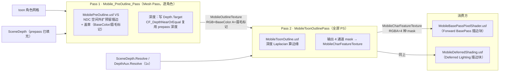
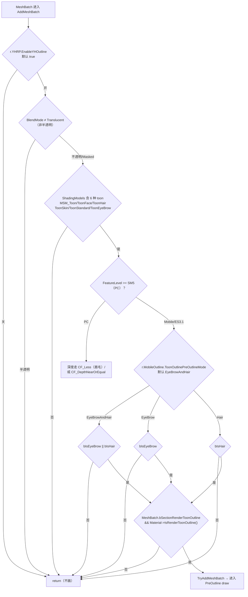

# S1 描边实现分析

> S1/GR（UE5.5，`UE5EA` fork）的角色描边（Toon Outline）实现完整分析：两阶段管线、对象筛选决策树、四通道 mask 语义、CVar 配置、消费方，以及已修复的历史坑（MSAA 涂黑、Forward 通道语义）。
> 本文档为分析梳理，源码位置基于 2026-08-21 复核的 `++GR+DevTest` 分支（CL 1011149）。

---

## 一、架构总览

S1 描边是 **移动端 Mobile 路径专用** 的两阶段实现（PC/Deferred 路径另有独立的 `ToonOutline.usf` 全屏方案，见 §9）：



| | Pass 1（PreOutline） | Pass 2（ToonOutline） |
|---|---|---|
| 类型 | Mesh pass（逐角色 draw） | 全屏 PS |
| 干什么 | 标记"哪里有 toon 角色" + 外扩预留 + 眉毛标记 | 深度 Laplacian 算"哪里是边缘" + 合成 mask |
| 对深度 | **测试 + 写入** | **采样**（Laplacian 数据源，采 1x） |
| 产出 | `MobileOutlineTexture`（RGB=BaseColor, A=眉毛标记） | `MobileCharFeatureTexture`（RGBA=4 种 mask） |
| 调度 | `RenderPreOutlinePass` → 内含 Pass1 + Pass2 | 同左（同一函数内完成两段） |

**关键认知**：描边**主体靠 Pass 2 的深度 Laplacian**（`USE_LAPALACIAN_OUTLINE` 默认开）。Pass 1 只负责深度 Laplacian **拿不到的预描边信息**——眉毛的 BaseColor/Opacity 透传、头发的 NDC 外扩空间。这解释了为什么默认只有眉毛 + 头发走 PreOutline（见 §4）。

---

## 二、Pass 1：Mobile_PreOutline_Pass

### 2.1 调度

`MobileShadingRenderer.cpp:1645-1653`：

```cpp
//Modify by Yoohaozhang add mobile PreOutline Pass // TODO_YOOHAO - Check this location - Commented by Mega.
if(CVarMobileOutlinePassEnable.GetValueOnRenderThread())   // r.YHRP.EnableMobileOutlinePass（默认 true）
{
    RenderPreOutlinePass(GraphBuilder,SceneTextures);      // 内含 Pass1 + Pass2
}
else
{
    SceneTextures.MobileCharFeatureTexture = SystemTextures.Black;
    SceneTextures.MobileOutlineTexture = SystemTextures.Black;
}
```

- 位置在 **BasePass 之前**（`PreRenderBasePass` 之前执行），所以 BasePass 能消费到 `MobileCharFeatureTexture`。
- 总开关 `r.YHRP.EnableMobileOutlinePass`（`CVarMobileOutlinePassEnable`，`MobileShadingRenderer.cpp:94-97`，默认 `true`）。

### 2.2 Mesh Pass 注册

`MobileOutlinePrepearPass.cpp:581-582`：

```cpp
FRegisterPassProcessorCreateFunction RegisterMobilePreOutlinePass(&CreatePreOutlinePassProcessor , EShadingPath::Mobile ,EMeshPass::MobilePreOutline , EMeshPassFlags::CachedMeshCommands | EMeshPassFlags::MainView);
FRegisterPassProcessorCreateFunction RegisterPCOutlinePass(&CreatePreOutlinePassProcessor , EShadingPath::Deferred ,EMeshPass::MobilePreOutline , EMeshPassFlags::CachedMeshCommands | EMeshPassFlags::MainView);		//PC Outline Pass
```

Mobile 与 Deferred 两条渲染路径共用 `EMeshPass::MobilePreOutline`。Pass1 的 mesh 处理器 `FOutlinePrepearPassMeshProcessor`（`MobileOutlinePrepearPass.cpp:282-407`）。

### 2.3 Vertex Shader：NDC 空间外扩

`MobilePreOutline.usf:99-129`（NDC space Outline Implementation，Modify by yoohaozhang）：

```hlsl
float3 ClipSpaceNormal = normalize( mul( WorldNormal , (float3x3)View.TranslatedWorldToClip) );
float3 NDCNormal = float3(normalize(ClipSpaceNormal.xy) , 1) * ScreenPos.w;  //NDC Include ScreenPos.w
NDCNormal *= float3(View.ViewSizeAndInvSize.zw,1);
const float OutlineWidth = ToonOutlineWidth;      // 移动端（PC_ENV 走 0.01）
NDCPositionOffset += NDCNormal * OutlineWidth * OutlineAplha ;
ScreenPos.xy += NDCPositionOffset.xy;             // 只改 xy，z 不动
PrevScreenPosObj.xy += NDCPositionOffset.xy;
```

- **外扩只位移 `xy`**，`z` 的计算路径与 prepass 完全相同。
- `OutlineAplha` 来自材质自定义节点 `GetMobileToonCharacterParameters1`（material parameter collection）。
- `ToonOutlineWidth` = `r.MobileOutline.OutlineWidth`（默认 0.012）。
- 输出位置为 `Output.Position = ScreenPos`（**无任何 depth bias**——历史修复已移除，见 §8.1）。

### 2.4 Pixel Shader：输出什么

`MobilePreOutline.usf:196-255`：

```hlsl
// 角色 特性需要贴图输出
#if MATERIAL_SHADINGMODEL_TOONEYEBROW
    float MaterialOpacity = GetMaterialOpacity(PixelMaterialInputs);
    OutBaseColor = GetMaterialBaseColor(PixelMaterialInputs) * MaterialOpacity;
    // [GR Mobile Toon] Mobile PreOutlinePass is excuted before BasePass and don't have GBuffer data
#elif HAVE_GetMobileToonChracterPixelParameters0 && !MATERIAL_SHADINGMODEL_TOONEYEBROW
    OutBaseColor = GetMobileToonChracterPixelParameters0(MaterialParameters);
#endif
...
#if MATERIAL_SHADINGMODEL_TOONEYEBROW
    OutData = float4(OutBaseColor, min(0.99f, MaterialOpacity));   // 眉毛：标记位 <0.99
#else
    OutData = float4(OutBaseColor, 1.0);                            // 其余：A=1.0
#endif
```

- **眉毛**（`MSM_ToonEyeBrow`）：`A = min(0.99, MaterialOpacity)` —— 用 `< 1.0` 的 A 值做"这是眉毛"的标记。
- **其余 toon 角色**：`A = 1.0`，RGB 走材质自定义节点 `GetMobileToonChracterPixelParameters0` 的 BaseColor。
- `AdditionalOutlineMask`（`GetMobileToonChracterPixelParameters1`）用于 `clip()`，实现按像素剔除。
- 同时输出 `OutVelocity`（TAA velocity）。

### 2.5 Render State（深度）

- attachment 层（`MobileOutlinePrepearPass.cpp:870-876`，ZXB 修复后）：
  ```cpp
  FDepthStencilBinding DepthBinding = FDepthStencilBinding(SceneTextures.Depth.Target,
      ERenderTargetLoadAction::ELoad, ERenderTargetLoadAction::ELoad,
      FExclusiveDepthStencil::DepthWrite_StencilRead);
  ```
- mesh PSO 层默认（`CreatePreOutlinePassProcessor`，:560-566）：`DepthWrite_StencilWrite` + `TStaticDepthStencilState<true, CF_DepthNearOrEqual>`。
- **两层已统一 DepthWrite**（历史修复，见 §8.1）。`CF_DepthNearOrEqual` 复用 prepass 深度，保证外扩部分只画在角色可见处。

### 2.6 MSAA 适配

`MobileOutlinePrepearPass.cpp:877-885`：

```cpp
// RT0 : Temp Texture for Pass Data Into Next Pass;
PassParameters->RenderTargets[0] = FRenderTargetBinding(PreOutlineTexture, SceneTextures.MobileOutlineTexture.IsSeparate() ? SceneTextures.MobileOutlineTexture.Resolve : nullptr, ERenderTargetLoadAction::EClear);
// [ZXB] 修复 Android Vulkan 崩溃：Velocity(1x) 与 4x outline/depth 同 pass samples 不一致 ensure。
// MSAA 下无 TAA 不写 Velocity，跳过。
if (NumMSAASamples <= 1)
{
    PassParameters->RenderTargets[1] = FRenderTargetBinding(SceneTextures.Velocity, ...);
}
```

- MSAA 下输出 4x Target 同时 resolve 1x（供 Pass2 非 MS 采样）。
- 4x outline/depth 与 1x velocity 混绑会触发 samples 不一致 ensure（Android Vulkan 崩溃），MSAA 下跳过 velocity 写入。

---

## 三、Pass 2：MobileToonOutlinePass（全屏 PS）

### 3.1 入口

`RenderMobileOutlineTexturePass`（`MobileOutlinePrepearPass.cpp:652-703`），在 `RenderPreOutlinePass` 内于 Pass1 之后调用（:911-916）。

Permutation 决策（:661-664）：

```cpp
PermutationVector.Set<FMobileToonOutlinePS::FToonRimLightUseLaplacian>(GMobileToonRimLightUseLaplacian);   // r.MobileOutline.ToonRimLightUseLaplacian（默认1）
PermutationVector.Set<FMobileToonOutlinePS::FToonOutlineUseDepth>(GMobileToonOutlineUsePreOutline == 2 || GMobileToonOutlineUsePreOutline == 0);  // 默认2→true
PermutationVector.Set<FMobileToonOutlinePS::FCalcSceneRimLightMask>(GMobileCalcSceneRimLightMask);       // r.MobileOutline.CalcSceneRimLightMask（默认1）
```

深度采样（:683-687，ZXB 修复后）：

```cpp
// [ZXB Fix] outline 采 1x 深度（Depth.Resolve 优先，回退 DepthAux.Resolve）。不能采 Depth.Target：
// 非 MSAA 时 PreOutline DepthWrite 的偏移深度会让 Laplacian 误判角色内部为边缘 → 涂黑。
PassParameters->SceneDepthTex = SceneTextures.Depth.Resolve ? SceneTextures.Depth.Resolve : SceneTextures.DepthAux.Resolve;
```

### 3.2 深度 Laplacian 算法

`MobileToonOutline.usf:48-56`：

```hlsl
float CalcDepthLaplacian(float2 InPos, float CenterDepth, float SampleDist)
{
    float Depth_L = GetDepthByPos(InPos + float2(-1, 0) * SampleDist);
    float Depth_R = GetDepthByPos(InPos + float2( 1, 0) * SampleDist);
    float Depth_U = GetDepthByPos(InPos + float2( 0,-1) * SampleDist);
    float Depth_D = GetDepthByPos(InPos + float2( 0, 1) * SampleDist);
    float DepthSum = Depth_L + Depth_R + Depth_U + Depth_D;
    return -(4.0 * CenterDepth - DepthSum);
}
```

归一化 + smoothstep（:58-65）：

```hlsl
float ComputeOutlineAndRimMask(float CenterDepth, float DepthLaplacian, float OutlineStrength, float MinThreshold = 0.05)
{
    float NormFactor = 100.0 / saturate(100.0 / max(CenterDepth, 1.0));
    float NormalizedLaplacian = (DepthLaplacian / NormFactor);
    OutlineStrength = NormalizedLaplacian * ScreenSizeScale * OutlineStrength;
    return smoothstep(min(MinThreshold, 0.5), 0.5, OutlineStrength);
}
```

### 3.3 四通道 mask 语义（核心）

`MobileToonOutline.usf:124-132`：

```hlsl
if (bNotEyebrow)   // EyebrowOpacity == 1.0（非眉毛像素）
{
    OutColor = float4(SceneRimLightMask, SceneOutlineMask, ToonRimLightMask, ToonOutlineMask);
}
else               // 眉毛像素：透传 PreOutline 的 BaseColor，mask 与眉毛标记求 max
{
    EyebrowOpacity = min(EyebrowOpacity, 0.3);
    OutColor = float4(OrigData.rgb, max(EyebrowOpacity, ToonOutlineMask));
}
```

| 通道 | 含义 | 来源 |
|---|---|---|
| `.r` | SceneRimLightMask | `View.EnableRimLight > 0` 时按 SceneRimLightWidth 大间距 Laplacian |
| `.g` | SceneOutlineMask | `View.EnableSceneOutline > 0` 时按 SceneOutlineWidth Laplacian |
| `.b` | ToonRimLightMask | `USE_LAPALACIAN_RIM_LIGHT` 时按 ToonRimLightWidth 大间距 Laplacian；否则对 ToonOutlineMask 膨胀 4 方向 |
| `.a` | **ToonOutlineMask** | `USE_LAPALACIAN_OUTLINE` 时按 ToonOutlineWidthScale Laplacian；否则 `dot(OrigData.rgb,1) > 0 && bNotEyebrow` |

- **ToonOutlineMask（`.a`）是消费方实际用于"描边涂黑"的通道**。
- **眉毛像素**（`EyebrowOpacity != 1.0`）：`.rgb` 透传 PreOutline 盖章的 BaseColor，`.a = max(眉毛标记, ToonOutlineMask)` —— 让眉毛既能通过 BasePass 盖印显示，又被描边 mask 保护/覆盖。

### 3.4 ToonOutlineMask 两种路径

```hlsl
#if USE_LAPALACIAL_OUTLINE  // 默认开（GMobileToonOutlineUsePreOutline=2）
    float ToonOutlineMask = ComputeOutlineAndRimMask(CenterDepth, OutlineDepthLaplacian, ToonOutlineWidthScale);
#else                      // 关闭时退化为：PreOutline 盖章了就算边缘
    float ToonOutlineMask = dot(OrigData.rgb, 1) > 0.0 && bNotEyebrow ? 1.0 : 0.0;
#endif
```

`USE_LAPALACIAL_OUTLINE` = `GMobileToonOutlineUsePreOutline == 2 || == 0`（`MobileOutlinePrepearPass.cpp:663`）。

**这就是为什么深度被污染就直接涂黑**：默认描边完全靠深度 Laplacian 算，不依赖 Pass1 的 RGB。

---

## 四、Pass 1 对象筛选决策树（谁走 PreOutline）

`FOutlinePrepearPassMeshProcessor::AddMeshBatch`（`MobileOutlinePrepearPass.cpp:282-407`）：



筛选链从粗到细：

| # | 条件 | 判定 | 来源 |
|---|---|---|---|
| 1 | 总开关 `r.YHRP.EnableYHOutline` | 默认 `true` | :288-306 |
| 2 | BlendMode ≠ Translucent | 半透明走 `ToonTranslucentOutline`（另一 pass） | :318 |
| 3 | 6 种 toon shading model | `MSM_Toon/ToonFace/ToonHair/ToonSkin/ToonStandard/ToonEyeBrow` | :336-341 |
| 4 | `r.MobileOutline.ToonOutlinePreOutlineMode` | 默认 `EyeBrowAndHair`（见 §5） | :372-381 |
| 5 | `MeshBatch.bSectionRenderToonOutline` && `Material->IsRenderToonOutline()` | 均默认 `true` | :394-396 |

### 第 4 步：PreOutlineMode 过滤（Mobile/ES3.1 分支）

```cpp
bool bIsEyeBrow = Material->GetShadingModels().HasShadingModel(MSM_ToonEyeBrow);
bool bIsHair = Material->GetShadingModels().HasShadingModel(MSM_ToonHair);
if (!GMobileToonOutlineUsePreOutline ||
    (GMobileToonOutlinePreOutlineMode == (int32)EPreOutlineMode::EyeBrowAndHair && !bIsEyeBrow && !bIsHair) ||
    (GMobileToonOutlinePreOutlineMode == (int32)EPreOutlineMode::EyeBrow && !bIsEyeBrow) ||
    (GMobileToonOutlinePreOutlineMode == (int32)EPreOutlineMode::Hair && !bIsHair))
{
    return;
}
```

`EPreOutlineMode`（:22-29）：`All=0 / EyeBrow=1 / EyeBrowAndHair=2 / Hair=3`，默认 **EyeBrowAndHair（2）**。

### 第 5 步：Section / 材质开关

- `MeshBatch.bSectionRenderToonOutline`：section 级开关，默认 `true`（`SkeletalMeshLODRenderData.cpp:280` 初始化），且受 LOD 限制 `ShouldLODDrawToonOutline(LODIdx, ToonOutlineMaxDrawLOD)`（`SkeletalMesh.cpp:6751`）。
- `Material->IsRenderToonOutline()`：材质属性 `bRenderToonOutline`，默认 `true`（`Material.cpp:1170`），可在材质详情面板 "Render ToonOutline" 关闭。

### PC（SM5）分支差异

PC 下（:343-368）：眉毛不走深度写路径，改 `CF_Less` 深度测试 + 预乘 alpha 混合（`BF_SourceAlpha, BF_InverseSourceAlpha`），用于"眉毛穿过头发"排序；且 **不过 PreOutlineMode 过滤**（:345 只对 EyeBrow 特殊处理，其余直接进）。

---

## 五、默认配置下的实际结果：只有眉毛 + 头发

当前工程 `DefaultEngine.ini` 无任何描边 CVar 覆盖（只有注释掉的 `;r.YHRP.EnableMobileOutlinePass=0`），全部走代码默认值。结合 §4 决策树：

```
r.YHRP.EnableYHOutline        = true        （开）
r.YHRP.EnableMobileOutlinePass= true        （开）
r.MobileOutline.ToonOutlinePreOutlineMode = EyeBrowAndHair
bSectionRenderToonOutline     = true        （受 LOD 限制）
Material->IsRenderToonOutline = true        （材质默认）
```

→ **默认只有 `MSM_ToonEyeBrow`（眉毛）和 `MSM_ToonHair`（头发）通过 Pass 1 的 PreOutline 筛选**。

其他 toon 角色（`MSM_ToonStandard/ToonFace/ToonSkin/Toon`）的描边**完全由 Pass 2 深度 Laplacian 覆盖**，不需要 PreOutline 盖章。

### 为什么这样设计

- **Pass 2 Laplacian 是主描边**：深度不连续处（角色轮廓 vs 背景）Laplacian 就能出边缘，无需 PreOutline。
- **眉毛需要 PreOutline**：眉毛要"穿过头发"显示，且材质是半透明/特殊 opacity——Laplacian 算不出眉毛的细边缘，需要 Pass1 透传 BaseColor + 标记。
- **头发需要 PreOutline 外扩**：头发外扩预留描边空间（NDC 外扩），给 Laplacian 一个稳定的边缘基线。

---

## 六、CVar 配置速查

| CVar | 默认 | 含义 |
|---|---|---|
| `r.YHRP.EnableYHOutline` | true | Pass1 总开关（AddMeshBatch 第 1 层） |
| `r.YHRP.EnableYHToonTransOutline` | - | 半透明描边（`ToonTranslucentOutline` pass） |
| `r.YHRP.EnableMobileOutlinePass` | true | 整个 MobileOutline 流程（Pass1+Pass2）总开关 |
| `r.MobileOutline.OutlineWidth` | 0.012 | Pass1 VS 外扩宽度 |
| `r.MobileOutline.ToonOutlineUsePreOutline` | 2 | 0=禁 Pass1；1=Pass1 盖章结果当描边；**2=Pass1+深度 Laplacian** |
| `r.MobileOutline.ToonOutlinePreOutlineMode` | EyeBrowAndHair(2) | 哪些 shading model 走 Pass1：All/EyeBrow/EyeBrowAndHair/Hair |
| `r.MobileOutline.ToonOutlineWidthScale` | 60 | ToonOutlineMask Laplacian 强度 |
| `r.MobileOutline.ToonRimLightWidthScale` | 8.0 | ToonRimLight 大间距 Laplacian 距离 |
| `r.MobileOutline.SceneRimLightWidthScale` | 4 | SceneRimLight 间距 |
| `r.MobileOutline.SceneOutlineWidthScale` | 1.5 | SceneOutline 强度 |
| `r.MobileOutline.ToonRimLightUseLaplacian` | 1 | ToonRimLight 是否用大间距 Laplacian（0=对 ToonOutlineMask 膨胀） |
| `r.MobileOutline.CalcSceneRimLightMask` | 1 | 是否计算场景 RimLight mask |

---

## 七、消费方（描边 mask 怎么用）

### 7.1 Deferred 路径（MobileDeferredShading.usf）

`MobileDirectionalLightPS`（:409-416 附近）对 toon 角色应用：

```hlsl
float2 OutlineUV = SvPositionToBufferUV(SvPosition);
float4 OutlineRT = MobileSceneTextures.MobileCharacterOutline.SampleLevel(
    MobileSceneTextures.MobileCharacterOutlineSampler, OutlineUV, 0);
float ToonOutlineMask = OutlineRT.a;
Color = lerp(Color, float3(0,0,0), ToonOutlineMask);   // 描边涂黑
```

- 纹理 `MobileCharacterOutline` = `MobileCharFeatureTexture.Target`（Pass2 产出）。
- 采样器 **Point**（`MobileCharacterOutlineSampler`）——二值边缘，不能用 Bilinear 否则边缘模糊变粗。
- 门控：运行时 `ShadingModelIsToonCharacter()`。
- Deferred 的描边在 **Lighting Pass** 应用（此时 RT 已产出），BasePass 不消费。

### 7.2 Forward 路径（MobileBasePassPixelShader.usf）

历史修复后与 Deferred 对齐（见 §8.2），BasePass 描边块：

```hlsl
float2 OutlineUV = SvPositionToBufferUV(SvPosition);
float4 OutlineRT = MobileSceneTextures.MobileCharacterOutline.SampleLevel(
    MobileSceneTextures.MobileCharacterOutlineSampler, OutlineUV, 0);
float ToonOutlineMask = OutlineRT.a;
Color = lerp(Color, float3(0,0,0), ToonOutlineMask);
```

- Forward 在 **BasePass 期间**应用（Forward 没有独立 Lighting Pass）。
- 前提：C++ 侧 `RenderForward` 必须把 `MobileCharFeatureTexture` 传给 BasePass（`MobileBasePassTextures.ScreenSpaceOutline`），否则 shader 拿 fallback 白纹理 → `dot(1,1,1)=3>0` → 整角色涂黑（历史 bug 之一）。
- 门控：编译期 `MATERIAL_SHADINGMODELS_TOON_CHARACTER`。

### 7.3 四通道消费方汇总

| 通道 | 谁用 |
|---|---|
| `.a` ToonOutlineMask | 描边涂黑（Forward BasePass + Deferred Lighting）——**最核心** |
| `.b` ToonRimLightMask | 角色边缘光 |
| `.g` SceneOutlineMask | 场景描边（非角色） |
| `.r` SceneRimLightMask | 场景边缘光 |

---

## 八、历史坑与修复（ZXB 参与）

### 8.1 PreOutline 深度偏移污染 → MSAA 角色涂黑（已修）

**现象**：Android Vulkan 4x MSAA 下 toon 角色内部黑斑 + 后续 BasePass draw 被深度剔除；PC(D3D12) 正常。

**根因链**：
1. `MobilePreOutline.usf` 两处 depth bias（旧 `:128` clip 空间 `z -= 1e-3`；旧 `:139` MSAA 门控 `z += GDepthBias*w`），净值 NDC 恒定 `+0.001`（reverse-Z = 朝相机）。
2. mesh PSO 声明 DepthWrite，attachment 声明 DepthRead → 矛盾：D3D12 read-only DSV 静默忽略 PSO 写；**Vulkan 未定义行为，Adreno 真写入** → 偏近深度落进 Depth.Target。
3. Pass2 采 `Depth.Resolve`（1x）→ Laplacian 采到角色内部的人为深度台阶 → `ToonOutlineMask=1` → BasePass 按 mask 涂黑；偏近深度也让 BasePass `CF_DepthNearOrEqual` 剔除。

**修复**（两处）：
- `MobilePreOutline.usf`：移除全部 depth bias，`Output.Position = ScreenPos`（ZXB region 注释说明）。
- `MobileOutlinePrepearPass.cpp:870-876`：attachment 统一 `DepthWrite_StencilRead`，与 mesh PSO 一致。

> 完整根因 + Checklist 见 `E:\AiDoc\UE-Mobile-Toon描边-PreOutline深度偏移污染-MSAA角色涂黑与BasePass剔除修复.md`。

### 8.2 Forward 描边通道语义错误 → 整角色涂黑（已修）

**现象**：Forward 路径 toon 角色全黑。

**根因链**：
1. C++ `RenderForward` 没把 `MobileCharFeatureTexture` 传给 BasePass → fallback 白纹理 → `dot(1,1,1)=3>0` → 边缘判定恒真。
2. shader 用 `step(0.001, dot(ScreenOutlineTexture.rgb, 1))` 作边缘判据，而 `.rgb` 是三个互无关系的独立遮罩（SceneRimLight/SceneOutline/ToonRimLight），求和当边缘语义错误。
3. Forward 用 Bilinear 采样器，描边边缘模糊变粗。

**修复**：C++ 传 `MobileCharFeatureTexture` + shader 拆 `.a` 通道（ToonOutlineMask）+ 统一 Point 采样器。

> 完整记录见 `E:\AiDoc\UE-Mobile-Forward-Outline-Align-Deferred.md`。

### 8.3 其它相关坑

- **SceneDepth.Resolve 可能为 null**：`bRequiresSceneDepthAux` 时 `bKeepDepthContent=false` → `Depth.Resolve=null`，必须回退 `DepthAux.Resolve`（见 §3.1 的 ZXB 修复）。
- **MSAA + Velocity samples 不一致崩溃**：4x outline/depth + 1x velocity 混绑 → Android Vulkan ensure，`NumMSAASamples<=1` 才写 velocity（§2.6）。
- **`r.MSAACount=1` 边界态**：AA method 仍是 `AAM_MSAA`（DepthRead 成立）但采样数为 1——shader 门控须复用 C++ 侧 AA method 标志，不能按 `NumSceneColorMSAASamples > 1` 判。

---

## 九、PC / Deferred 路径差异（对照）

PC（D3D12）不走 Mobile 两阶段，用 `ToonOutline.usf`（`Engine/Shaders/Private/Toon/ToonOutline.usf`）的独立全屏方案：

- 输入 `ToonDepthTexture` / `ToonNormalTexture` / `ToonIDBufferTexture`（ID buffer 区分 toon 角色）。
- 9-tap Laplacian 卷积（含法线项，`ToonOutline.usf:200-252`），比 Mobile 的 4-tap 深度 Laplacian 更精细。
- 支持 `TOON_OUTLINE_COMBINE_*` 三种合成方式（None / CombineToBaseColor / CombineToSceneColor）。
- Pass 调度：`RenderPCOutlinePass`（`MobileOutlinePrepearPass.cpp:720-779`，走 `EMeshPass::MobilePreOutline` 同 mesh pass）。

---

## 十、资料索引

| 资料 | 位置 |
|---|---|
| 本文档 | `E:\AiDoc\S1描边实现分析.md` |
| PreOutline 深度偏移污染根因+修复（最全） | `E:\AiDoc\UE-Mobile-Toon描边-PreOutline深度偏移污染-MSAA角色涂黑与BasePass剔除修复.md` |
| Forward 描边通道语义修复 | `E:\AiDoc\UE-Mobile-Forward-Outline-Align-Deferred.md` |
| MSAA 描边锯齿根因 | `E:\AiDoc\Mobile-MSAA-角色描边锯齿根因分析.md` |
| 前向/延迟对齐计划 | `docs/Forward_Deferred_CartoonShadow_Alignment_Plan.md` |
| PreOutline samples 修复计划 | `.planning/2026-08-13-mobile-outline-preoutline-samples-fix/` |
| 关键源码 | `UE5EA/Engine/Shaders/Private/MobilePreOutline.usf`、`MobileToonOutline.usf`、`UE5EA/Engine/Source/Runtime/Renderer/Private/MobileOutlinePrepearPass.cpp` |

### 关键源码行号速查（2026-08-21 复核）

| 文件 | 行 | 内容 |
|---|---|---|
| `MobileOutlinePrepearPass.cpp` | 22-29 | `EPreOutlineMode` 枚举 |
| | 38-50 | `ToonOutlineUsePreOutline`=2 / `ToonOutlinePreOutlineMode`=EyeBrowAndHair |
| | 282-407 | `AddMeshBatch` 对象筛选决策树 |
| | 581-582 | Mobile/Deferred 两条路径注册 MobilePreOutline pass |
| | 652-703 | `RenderMobileOutlineTexturePass`（Pass2） |
| | 661-664 | Pass2 permutation 决策 |
| | 683-687 | 采 1x 深度（Resolve 优先） |
| | 720-779 | `RenderPCOutlinePass`（PC 侧） |
| | 839-918 | `RenderPreOutlinePass`（Mobile，含 Pass1+Pass2） |
| | 870-876 | attachment DepthWrite（ZXB 修复） |
| | 877-885 | MSAA velocity 跳过（ZXB 修复） |
| `MobilePreOutline.usf` | 99-129 | NDC 外扩（只改 xy） |
| | 196-255 | PS：眉毛/角色输出 + clip |
| `MobileToonOutline.usf` | 48-56 | `CalcDepthLaplacian` |
| | 58-65 | `ComputeOutlineAndRimMask` |
| | 124-132 | 四通道 mask 输出 |
| `MobileShadingRenderer.cpp` | 94-97 | `r.YHRP.EnableMobileOutlinePass` |
| | 1645-1653 | `RenderPreOutlinePass` 调度（BasePass 前） |
| `Material.cpp` | 1170 | `bRenderToonOutline` 默认 true |
