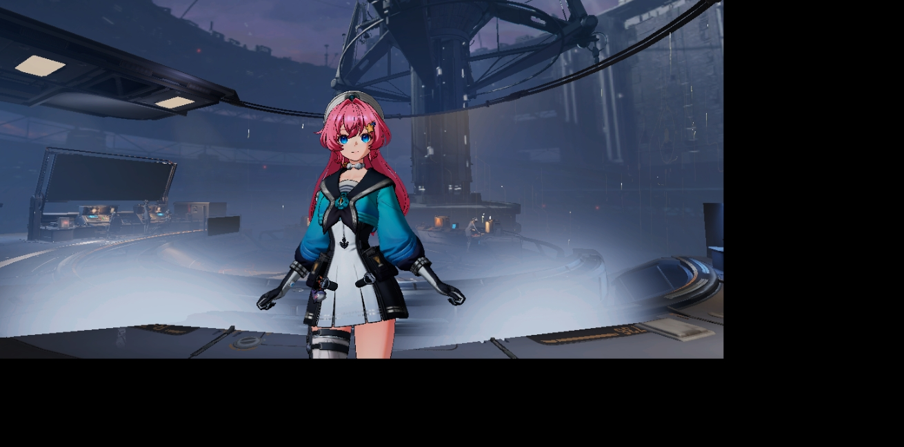
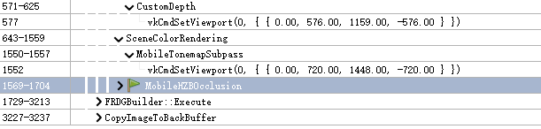

# UE-Mobile-TonemapSubpass-真机viewport变小-ScreenPercentage不匹配根因与规避方案

> 开启 `r.Mobile.TonemapSubpass=1` 后真机画面缩小到左上角。根因：tonemap subpass 的 viewport 用了 **SceneColor 的分配 Extent** 而非 **View.ViewRect**，在 `r.ScreenPercentage < 100` 时二者不等；且 `SubpassLoad` 逐像素 1:1 无缩放能力，错位直接暴露成画面偏小。

---

## 零、结论速览

| 项 | 内容 |
|---|---|
| **触发条件** | `r.Mobile.TonemapSubpass=1` **且** `r.ScreenPercentage < 100`（Vulkan + Forward + MobileHDR） |
| **根因位置** | `PostProcessTonemap.cpp:1207/1255/1257` —— viewport/DrawRectangle 用 `Color.Target->Desc.Extent`，不跟随 ResolutionFraction |
| **上游缺陷** | `IsMobileTonemapSubpassEnabledInline`（`SceneUtils.cpp:100-103`）只检查 Vulkan + MSAA，**未检查 ScreenPercentage**，隐含假设 ResolutionFraction==1.0 |
| **采用方案** | **不改引擎**。开 TonemapSubpass 时强制 `r.ScreenPercentage=100`，降分辨率改用 `r.MobileContentScaleFactor` |
| **不采用** | 修 viewport 为 ViewRect（可行但本次不动引擎）；inline 降级为独立 resolve pass（过度设计） |

---

## 一、问题现象

真机（Adreno 750 / Android Vulkan / Mobile ES3_1 Forward / MobileHDR）开启 `r.Mobile.TonemapSubpass=1` 后，渲染内容只占屏幕左上角一块，右下有多余区域：



RenderDoc 截帧对比两个 pass 的 `vkCmdSetViewport`，差异一目了然：



```
571-625   CustomDepth
  577       vkCmdSetViewport(0, { { 0.00, 576.00, 1159.00, -576.00 } })   ← ViewRect  1159×576
643-1559  SceneColorRendering
  1550-1557   MobileTonemapSubpass
  1552          vkCmdSetViewport(0, { { 0.00, 720.00, 1448.00, -720.00 } })   ← Extent  1448×720
3227-3237 CopyImageToBackBuffer
```

**1159 / 1448 = 576 / 720 = 0.800** → 当前 `r.ScreenPercentage = 80`。

---

## 二、根因分析

### 2.1 三处尺寸来源分叉

同一条 SceneColorRendering 路径上，本该一致的尺寸出现了两个版本：

```cpp
// ① base pass —— 用 ViewRect（正确，跟随 ResolutionFraction）
// MobileBasePassRendering.cpp:616
RHICmdList.SetViewport(View.ViewRect.Min.X, View.ViewRect.Min.Y, 0,
                       View.ViewRect.Max.X, View.ViewRect.Max.Y, 1);        // 1159×576

// ② tonemap subpass —— 用 Extent（错，不跟随 ResolutionFraction）
// PostProcessTonemap.cpp:1207
const FIntPoint TargetSize = SceneTextures.Color.Target->Desc.Extent;      // 1448×720
// PostProcessTonemap.cpp:1255
RHICmdList.SetViewport(0, 0, 0.0f, TargetSize.X, TargetSize.Y, 1.0f);
// PostProcessTonemap.cpp:1257-1264
DrawRectangle(RHICmdList, 0, 0, TargetSize.X, TargetSize.Y,
                          0, 0, TargetSize.X, TargetSize.Y,
              TargetSize, TargetSize, VertexShader, EDRF_UseTriangleOptimization, ...);
```

### 2.2 ViewRect 与 Extent 的关系

```cpp
// SceneRendering.cpp:3816 —— ViewRect 按 ResolutionFraction 缩
FIntPoint ViewSize = ApplyResolutionFraction(ViewFamily, View->UnconstrainedViewRect.Size(),
                                             AdjustedResolutionFractionUpperBounds);
// SceneRendering.cpp:4013-4014
View.ViewRect.Min = ViewRectMin;
View.ViewRect.Max = ViewRectMin + ViewSize;

// SceneRendering.cpp:3833 —— Extent 由 ViewRect 上取整而来
QuantizeSceneBufferSize(FamilySizeUpperBound, DesiredBufferSize);
```

`QuantizeSceneBufferSize`（`RenderUtils.cpp:1255-1270`）**只做向上 4 对齐**（Substrate 时 8），不是缩放：

```cpp
const uint32 DividableBy = FMath::Max(Substrate::IsSubstrateEnabled() ? 8 : 4, SuggestedDivisor);
const uint32 Mask = ~(DividableBy - 1);
OutBufferSize.X = (InBufferSize.X + DividableBy - 1) & Mask;
OutBufferSize.Y = (InBufferSize.Y + DividableBy - 1) & Mask;
```

⚠️ 但真机上 Extent 之所以是 **1448×720（全 backbuffer）而非 1160×576**，是因为 inline subpass 要求 SceneColor 与 backbuffer 同尺寸（见 2.4）。

### 2.3 SubpassLoad 不能缩放（决定性）

tonemap subpass 的 PS（RenderDoc 实测 SPIR-V disasm）：

```
UniformConstant type.subpass.image* GENERATED_SubpassFetchAttachment0 :
    [[DescriptorSet(1), Binding(2), InputAttachmentIndex(1)]];

void main_00000cc4_77795db8() {
  type.subpass.image _62 = *GENERATED_SubpassFetchAttachment0;
  float4 _63 = ImageRead(_62, {0, 0}, );      // ← SubpassLoad，读【当前片元位置】
  ...
}
```

`ImageRead(image, {0,0})` 即 HLSL `SubpassLoad()` —— **没有 UV 输入，只能读当前片元坐标对应的像素，逐像素 1:1，无任何缩放/映射能力**。

⇒ 后果链：

| 环节 | 使用尺寸 | 结果 |
|---|---|---|
| base pass 渲染 | ViewRect 1159×576 | 场景只填 SceneColor 左上角 80% |
| tonemap viewport | Extent 1448×720 | 输出铺满整个 backbuffer |
| PS 取样 | SubpassLoad 1:1 | **不放大** → 场景保持 1159×576 大小落在左上角 |

backbuffer 上 (0,0)-(1159,576) 是场景，(1159,576)-(1448,720) 是未渲染区。

### 2.4 inline subpass 的尺寸硬约束

```cpp
// MobileShadingRenderer.cpp:2005-2011  InitRenderTargetBindings_Forward
if (bTonemapSubpassInline)
{
    // DepthAux is not used with tonemap subpass, since there are no post-processing passes
    // Backbuffer surface provided as a second render target instead of resolve target.
    BasePassRenderTargets[0].SetResolveTexture(nullptr);
    BasePassRenderTargets[1] = FRenderTargetBinding(ViewFamilyTexture, nullptr, ERenderTargetLoadAction::EClear);
}
```

backbuffer 被绑成**同一 render pass 的第二个 color attachment**，而 Vulkan 要求同 pass 内所有 attachment 尺寸严格相等：

```cpp
// VulkanRenderTarget.cpp:1015-1019
if (bSetExtent)
{
    ensure(Extent.Extent3D.width  == FMath::Max(1, TextureDesc.Extent.X >> ColorEntry.MipIndex));
    ensure(Extent.Extent3D.height == FMath::Max(1, TextureDesc.Extent.Y >> ColorEntry.MipIndex));
    ensure(Extent.Extent3D.depth  == TextureDesc.Depth);
}
```

⇒ **SceneColor 的 Extent 必须等于 backbuffer**，这是 inline subpass 的结构性要求。viewport 是 attachment 内的绘制子矩形，与该约束无关 —— 所以正解是「Extent 保持 = backbuffer，viewport 用 ViewRect」。

### 2.5 上游门控的缺口

```cpp
// SceneUtils.cpp:94-103
ENGINE_API bool IsMobileTonemapSubpassEnabled(EShaderPlatform Platform, bool bMultiViewRendering)
{
    static auto* MobileTonemapSubpassPathCvar = IConsoleManager::Get().FindTConsoleVariableDataInt(TEXT("r.Mobile.TonemapSubpass"));
    return ((MobileTonemapSubpassPathCvar && (MobileTonemapSubpassPathCvar->GetValueOnAnyThread() == 1)) || bMultiViewRendering)
        && IsMobileHDR() && !IsMobileDeferredShadingEnabled(Platform);
}

ENGINE_API bool IsMobileTonemapSubpassEnabledInline(EShaderPlatform Platform, bool bMultiViewRendering, uint32 NumMSAASamples)
{
    // As of UE 5.4 only vulkan supports inline (single pass) tonemap
    return IsMobileTonemapSubpassEnabled(Platform, bMultiViewRendering) && IsVulkanPlatform(Platform)
        && (GRHISupportsMSAAShaderResolve || NumMSAASamples <= 1u);
}
```

只检查了 Vulkan 和 MSAA，**完全没有 ScreenPercentage / ResolutionFraction 相关判断** → 该特性在上游就隐含假设 `ResolutionFraction == 1.0`（那时 ViewRect ≈ Extent ≈ backbuffer，用 Extent 也没错）。ScreenPercentage < 100 一开，假设破裂。

---

## 三、r.ScreenPercentage vs r.MobileContentScaleFactor（关键区别）

两者都能降分辨率，但**作用层级不同**，这决定了为什么用 CSF 能规避本 bug：

| | `r.ScreenPercentage` | `r.MobileContentScaleFactor` |
|---|---|---|
| 作用层 | **渲染层** | **窗口 / surface 层** |
| 消费点 | `SceneRendering.cpp:4013-4014`（`View.ViewRect`） | `AndroidWindow.cpp:639` → `AndroidWindowUtils.h:107-115` |
| 影响范围 | **仅 3D 场景 ViewRect**，UI/Slate 仍全分辨率 | **surface + backbuffer + UI + 场景全部** |
| backbuffer | 不变 | 同比缩放 |
| ViewRect 与 backbuffer | **不相等 → 触发本 bug** | **始终相等 → 不触发** |

CSF 的换算公式（`AndroidWindowUtils.h:102-116`，基准固定 1280×720）：

```cpp
const float AspectRatio = (float)InOutScreenWidth / (float)InOutScreenHeight;
if (InOutScreenHeight > InOutScreenWidth)   // 竖屏
    Height = FMath::TruncToInt32(1280.f * RequestedContentScaleFactor);
else                                         // 横屏
    Height = FMath::TruncToInt32(720.f * RequestedContentScaleFactor);
Width = FMath::TruncToInt32((float)Height * AspectRatio + 0.5f);
```

随后 `SanitizeAndroidScreenSize`（`AndroidWindowUtils.h:22-33`）向下取 8 的倍数并 clamp 到原生分辨率：

```cpp
SanitizedDims.X = (RequestedScreenDims.X / 8) * 8;
SanitizedDims.Y = (RequestedScreenDims.Y / 8) * 8;
SanitizedDims.X = FPlatformMath::Min(SanitizedDims.X, MaxScreenDims.X);
SanitizedDims.Y = FPlatformMath::Min(SanitizedDims.Y, MaxScreenDims.Y);
```

### 等效换算表（以本机 surface 短边 720、即当前 CSF=1.0 为基准）

| 目标像素比 | 等效 CSF | 短边 | 备注 |
|---|---|---|---|
| ScreenPercentage 100 | 1.00 | 720 | 基准 |
| ScreenPercentage 80 | 0.80 | 576 | |
| **ScreenPercentage 70** | **0.70** | **504** | 504 = 8×63 ✅ 整除 |
| ScreenPercentage 60 | 0.60 | 432 | |

> 公式：`CSF = 目标比例 × (当前 surface 短边 / 720)`。本机当前 surface 720 = `720 × 1.0` → CSF 就等于目标比例本身。
> 换机型时先确认 surface 短边，再按此式换算。

⚠️ **像素数等效 ≠ 画质等效**：CSF 会让 **UI 和文字一起降分辨率**，ScreenPercentage 只降 3D 场景。这是采用 CSF 方案必须接受的代价。

### ⚠️ 前提：设备可能不走 CSF 路径

```cpp
// AndroidWindow.cpp:626-641
if (CurrentParams.WindowDPI && RequestedResX == 0 && RequestedResY == 0)
{
    FAndroidDisplayInfo Info = GetAndroidDisplayInfoFromDPITargets(
        CurrentParams.WindowDPI, CurrentParams.SceneMaxDesiredPixelCount, CurrentParams.SceneMinDPI);
    ScreenWidth  = Info.WindowDims.X;
    ScreenHeight = Info.WindowDims.Y;
    if (IsInGameThread())
    {
        static IConsoleVariable* CVarSSP = IConsoleManager::Get().FindConsoleVariable(TEXT("r.SecondaryScreenPercentage.GameViewport"));
        CVarSSP->Set((float)Info.SceneScaleFactor * 100.0f);
    }
}
else
{
    AndroidWindowUtils::ApplyContentScaleFactor(ScreenWidth, ScreenHeight);   // ← CSF 只在这条分支生效
}
```

`GAndroidWindowDPI` 非 0 且未设 `r.Mobile.DesiredResX/Y` 时走 **DPI 路径，CSF 被完全忽略**，缩放交给 `r.SecondaryScreenPercentage.GameViewport`。

**判据（启动日志）**：
```
LogAndroidWindowUtils: Setting Width=%d and Height=%d (requested scale = %f)
```
（`AndroidWindowUtils.h:122`）出现这行 → 走 CSF 路径，调 CSF 有效；**没有这行 → DPI 路径，改 CSF 无效**，需改 `r.Mobile.DesiredResX/Y` 或 `SceneMinDPI`/`SceneMaxDesiredPixelCount`。

---

## 四、采用方案（配置规避，不改引擎）

开启 `r.Mobile.TonemapSubpass=1` 时：

```ini
r.Mobile.TonemapSubpass=1
r.ScreenPercentage=100          ; 必须 100，否则 viewport 与 Extent 不匹配 → 画面缩小
r.MobileContentScaleFactor=0.7  ; 降分辨率改由 CSF 承担（backbuffer 与 ViewRect 同比缩，不触发 bug）
```

**要点**：
1. `r.ScreenPercentage` **必须显式配成 100**，不能依赖默认值（Scalability / DeviceProfile 可能覆写）。
2. 降分辨率的诉求全部交给 `r.MobileContentScaleFactor`。
3. 上线前确认设备走的是 CSF 路径（见 §3 判据），否则 CSF 无效。
4. 接受 UI 一起降分辨率的画质代价。

### 关于带宽的澄清

`r.Mobile.TonemapSubpass` 的收益是**结构性**的，与 RT 尺寸无关：

- inline subpass 把 backbuffer 作为同 render pass 第二 attachment（`MobileShadingRenderer.cpp:2005-2011`），tonemap 用 `SubpassLoad` 从 tile memory 直读 SceneColor → **省掉 SceneColor store 到主存 + 后续 tonemap pass 再 load 的一次全屏往返**
- 且 `bRequiresSceneDepthAux = MobileRequiresSceneDepthAux(ShaderPlatform) && !bTonemapSubpass`（`MobileShadingRenderer.cpp:401`）→ **省掉一张 DepthAux**

⇒ `r.ScreenPercentage=100` 使 RT 回到全尺寸，但**并不抵消 subpass 的收益**（少一次往返照旧成立）。RT 变大是 ScreenPercentage 本身的效果，任何管线下都一样，不是 TonemapSubpass 造成的。降带宽的诉求由 CSF 承担即可。

---

## 五、未采用的修复方案（备查）

### 方案 A：viewport 改用 ViewRect（最小正解，本次未采用）

```cpp
// PostProcessTonemap.cpp:1255
RHICmdList.SetViewport(View.ViewRect.Min.X, View.ViewRect.Min.Y, 0.0f,
                       View.ViewRect.Max.X, View.ViewRect.Max.Y, 1.0f);
// :1257-1264 DrawRectangle 同步改用 ViewRect 尺寸
```

**可行性**：SceneColor 与 backbuffer 的 ViewRect 都从 (0,0) 起、同尺寸 → `SubpassLoad` 的 1:1 天然对齐，无需缩放。Extent 保持 = backbuffer（满足 §2.4 约束）。
**未采用原因**：本次不动引擎代码。若后续要做，这是首选。

### 方案 B：尺寸不等时降级为独立 resolve pass

在 `IsMobileTonemapSubpassEnabledInline` 加「Extent == backbuffer」门控，不等时回退 `AddMobileCustomResolvePass`（`PostProcessTonemap.cpp:1277`，独立 pass 无同尺寸约束，`DrawRectangle` 会正确缩放）。
**未采用原因**：过度设计 —— 问题本质只是 viewport 取值错，不需要改变管线结构。

---

## 六、快速排查 Checklist

| # | 检查项 | 命令 / 判据 |
|---|---|---|
| 1 | 是否开了 TonemapSubpass | `r.Mobile.TonemapSubpass` 回读 == 1 |
| 2 | ScreenPercentage 是否 100 | `r.ScreenPercentage` 回读；**≠100 即为本 bug 触发条件** |
| 3 | RenderDoc 比对两处 viewport | base pass（`MobileBasePassRendering.cpp:616`）vs `MobileTonemapSubpass`（`PostProcessTonemap.cpp:1255`），数值不等即确认 |
| 4 | 算比例定 ResolutionFraction | base viewport / tonemap viewport，如 1159/1448 = 0.80 |
| 5 | 确认走 CSF 还是 DPI 路径 | 日志有无 `LogAndroidWindowUtils: Setting Width=... (requested scale = ...)` |
| 6 | 确认 inline 还是独立 pass | RenderDoc 里 `MobileTonemapSubpass` 是否在 `SceneColorRendering` 内、`vkCmdNextSubpass()` 之后 |

---

## 七、关键源码位置索引

| 文件 | 行 | 内容 |
|---|---|---|
| `Renderer/Private/PostProcess/PostProcessTonemap.cpp` | 1207 | `TargetSize = Color.Target->Desc.Extent` ← **根因** |
| 同上 | 1255 | `SetViewport(0,0,0, TargetSize.X, TargetSize.Y, 1)` ← **根因** |
| 同上 | 1257-1264 | `DrawRectangle` 全用 TargetSize |
| 同上 | 1277 | `AddMobileCustomResolvePass`（独立 pass 版本） |
| `Renderer/Private/MobileBasePassRendering.cpp` | 616 | base pass 用 `View.ViewRect`（正确参照） |
| `Renderer/Private/MobileShadingRenderer.cpp` | 401 | `bRequiresSceneDepthAux = ... && !bTonemapSubpass` |
| 同上 | 2005-2011 | inline subpass 把 backbuffer 绑成第二 attachment |
| 同上 | 2122-2128 | `RenderForwardSinglePass` 设 `ESubpassHint::CustomResolveSubpass` |
| `Renderer/Private/SceneRendering.cpp` | 3709-3720 | `ApplyResolutionFraction` |
| 同上 | 3816 / 3833 | ViewSize 计算 + `QuantizeSceneBufferSize` |
| 同上 | 4013-4014 | `View.ViewRect` 赋值 |
| `RenderCore/Private/RenderUtils.cpp` | 1255-1270 | `QuantizeSceneBufferSize`（向上 4/8 对齐） |
| `Engine/Private/SceneUtils.cpp` | 94-103 | `IsMobileTonemapSubpassEnabled(Inline)` ← **门控缺口** |
| `Engine/Private/SceneTexturesConfig.cpp` | 496 / 556-562 | `bCustomResolveSubpass` + 额外 color attachment 格式 |
| `VulkanRHI/Private/VulkanRenderTarget.cpp` | 1015-1019 | attachment 同尺寸 ensure |
| `ApplicationCore/Public/Android/AndroidWindowUtils.h` | 22-33 | `SanitizeAndroidScreenSize`（8 对齐 + clamp） |
| 同上 | 102-116 | CSF 换算（基准 1280×720） |
| 同上 | 122 | CSF 路径判据日志 |
| `ApplicationCore/Private/Android/AndroidWindow.cpp` | 626-641 | DPI 路径 vs CSF 路径分叉 |

---

## 八、排查过程中被推翻的判断（避免重犯）

| 错误判断 | 为什么错 | 正确做法 |
|---|---|---|
| 用 HZB mip0=1024×512 反推 ViewRect=1448×720 | `RoundUpToPowerOfTwo` 下 1086×540 / 1159×576 同样得 1024×512，**HZB 无法区分** | 直接看 `vkCmdSetViewport` 参数，或读 `View_ViewSizeAndInvSize` |
| 给 `SceneTexturesConfig.Extent = BackbufferSize` 加 `IsSimulatedPlatform` 限定 | 方向错 —— Extent **必须**等于 backbuffer 才满足 `VulkanRenderTarget.cpp:1017`；真正错的是 viewport | 已 `p4 revert`，回到 #39 |
| 提出「尺寸不等就降级为独立 pass」 | 过度设计，本质只是 viewport 取值错 | 见方案 A |

---

## 九、相关参考

- inline tonemap subpass 仅 Vulkan 支持（引擎原注释）：`SceneUtils.cpp:102` "As of UE 5.4 only vulkan supports inline (single pass) tonemap"
- Vulkan input attachment / SubpassLoad 规范：<https://registry.khronos.org/vulkan/specs/1.3-extensions/html/vkspec.html#renderpass-input-attachment>
- HLSL `SubpassLoad` 无 UV 参数（本质是 `OpImageRead` on `SubpassData`）：<https://github.com/microsoft/DirectXShaderCompiler/blob/main/docs/SPIR-V.rst#subpass-inputs>
- UE Screen Percentage / Dynamic Resolution 文档：<https://dev.epicgames.com/documentation/en-us/unreal-engine/screen-percentage-with-temporal-upscale-in-unreal-engine>
- 本次 RenderDoc 截帧：真机 `com.sarosgame.S1Game_2026.08.27_20.12_frame1894.rdc`（Adreno 750 / Android Vulkan）
- 引入该问题的相关 CL：1104428（`MobileShadingRenderer.cpp` Extent 覆写，已 revert 本地改动；depot 仍为 #39 状态，需另行评估是否回退该 CL 中的 Extent 段）
