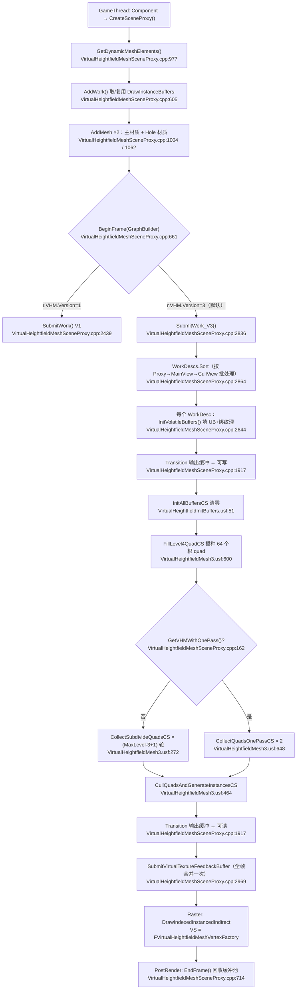
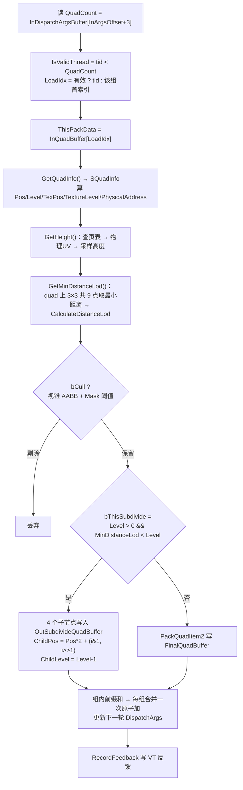
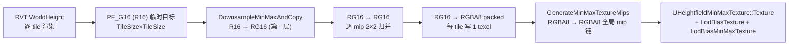

# UE5 VHM 虚拟高度场（Virtual Heightfield Mesh）实现原理与优化学习文档

> VHM 是 UE5 中"用 GPU Driven 四叉树 + 虚拟纹理页表"驱动的地形渲染方案，本仓库（GR 分叉 / UE 5.5.4）在其上做了大量自研改造（V3 三段式流水线、Mask 挖洞、LOD 调参）。
> 本文每条结论均附 `文件:行号`，可逐条回源码核对。

**代码根目录（下称 `‹VHM›`）**：
`D:\GR_DevTest\UE5EA\Engine\Plugins\Experimental\VirtualHeightfieldMesh\`

---

## 〇、TL;DR（三板斧）

1. **它不是"地形 Mesh"，而是"页表遍历器"**。VHM 每帧在 GPU 上遍历 RVT（RuntimeVirtualTexture）的**页表纹理**，把"当前已驻留物理页 + 屏幕需要"的那些页，逐个变成一个 **quad 实例**，最后用 `DrawIndexedInstancedIndirect` 一次性画出来。CPU 全程不知道要画多少个实例。
2. **LOD 不是传统四叉树挑层级，而是"边遍历边细分"**。从最粗的 64 个根 quad 开始，每个 quad 若"离相机够近"就分裂成 4 个子 quad 压回队列，直到层级降到 0。这是一个 **GPU 上的层序（breadth-first）四叉树展开**，天然对齐 VT 的 mip 结构。
3. **几何由 `SV_VertexID` 现场生成，没有顶点缓冲**。每个实例只是一段 16 字节的数据（Pos + Level + 物理页地址），顶点位置由 VS 查页表 → 采高度图 → 位移得到。这就是"GPU Driven"的字面含义。

---

## 一、为什么需要 VHM（动机）

| 痛点 | VHM 的答案 |
|---|---|
| UE5 移除了 Tessellation，Landscape 无法高度位移 | 用 RVT(WorldHeight) + 顶点采样位移，几何全 GPU 生成 |
| 传统 Landscape 是固定网格，远处浪费 | 四叉树按需细分，远处只画大 quad |
| 地形数据量 >> 显存 | 复用 **虚拟纹理** 的流式加载/页表机制，几何量与驻留量解耦 |
| Nanite 在移动端不可用 | VHM 是 Nanite 的地形替代品；本仓库对 SM5/移动端专门放开了 VHM |

**本仓库的关键定位**（`VirtualHeightfieldMeshEnable.cpp`）：
- `r.VHM.Enable` 默认 0（`VirtualHeightfieldMeshEnable.cpp:16-21`）。
- 但 sink 会在**运行时自动改它**：当 Nanite 关闭（或平台不满足）时自动置 1（`VirtualHeightfieldMeshEnable.cpp:55-68`）。
- **GR 自研补丁**：`bNaniteEnabled &= GMaxRHIFeatureLevel > ERHIFeatureLevel::SM5;`（`VirtualHeightfieldMeshEnable.cpp:51-53`，`Engine ZXB` 标记）——使得在 SM5 及以下（含移动端 ES3.1）**即使 Nanite 开关是开的，也不再自动禁用 VHM**，实现两套地形方案共存/切换。
- 最终判定还需 `FeatureLevel >= SM5 || == ES3_1` **且** `UseVirtualTexturing()`（`VirtualHeightfieldMeshEnable.cpp:128-133`）。

工程侧：插件已在 `S1Game.uproject:191-193` 显式 `"Enabled": true`；关卡/组件用 `VirtualTexture` 指向 `ARuntimeVirtualTextureVolume`。

---

## 二、整体架构与每帧流程图

### 2.1 模块分层

```
┌─────────────────────────── Game Thread ───────────────────────────┐
│ UVirtualHeightfieldMeshComponent   (用户资产：RVT / MinMax / Mask / 材质) │
│        │ CreateSceneProxy()                                        │
│        ▼                                                           │
│ FVirtualHeightfieldMeshSceneProxy  (RT 侧：LOD 参数 / UV 矩阵 / VF)    │
└────────────────────────────────────────────────────────────────────┘
                                │ AddWork() / AddMesh()
┌─────────────────────────── Render Thread ─────────────────────────┐
│ FVirtualHeightfieldMeshRendererExtension  (全局单例，帧级调度)        │
│   BeginFrame(GraphBuilder) ──► SubmitWork() / SubmitWork_V3()      │
│        │                                                           │
│        ├─ Compute Pass 链：查页表 → 细分/剔除 → 生成实例              │
│        └─ DrawIndexedInstancedIndirect（主材质 + 洞材质两批）          │
└────────────────────────────────────────────────────────────────────┘
```

全局单例：`TGlobalResource<FVirtualHeightfieldMeshRendererExtension> GVirtualHeightfieldMeshViewRendererExtension`（`VirtualHeightfieldMeshSceneProxy.cpp:588`），通过 `GEngine->GetPreRenderDelegateEx()` 挂 `BeginFrame`、`PostRenderDelegateEx` 挂 `EndFrame`（`VirtualHeightfieldMeshSceneProxy.cpp:590-599`）。

### 2.2 每帧总流程



### 2.3 两个版本的区别

| | **V1**（Epic 原始） | **V3**（本仓库默认，`r.VHM.Version=3`） |
|---|---|---|
| Shader 文件 | `VirtualHeightfieldMesh.usf` | `VirtualHeightfieldMesh3.usf` |
| 遍历方式 | 单 CS **持久波（persistent wave）**：`while(NumActive>0)` 反复从环形队列取节点（`VirtualHeightfieldMesh.usf:137`） | **多轮串行 dispatch**：每轮 CS 处理一批，写出下一批（`VirtualHeightfieldMesh3.usf:272`） |
| 起点 | 从 `Level=MaxLevel` 单根节点开始（`VirtualHeightfieldMesh.usf:87`） | 直接播种 **64 个 `MaxLevel-3` 的 quad**（8×8 Morton 展开），跳过最粗 3 层（`VirtualHeightfieldMesh3.usf:600-632`） |
| 节点打包 | `uint`（Address 24b + Level 8b）+ `uint2` | `uint4`（Morton+Level in .x, PhysicalAddress 三维 in .yzw） |
| 实例打包 | `Pos.x \| Pos.y<<12 \| Level<<24`（12/12/8） | `Pos.x \| Pos.y<<14 \| Level<<28`（14/14/4） |
| 反馈写入 | 每线程一次原子加（`VirtualHeightfieldMesh3.usf:202-221`） | **每组一次**原子加 + 组内偏移（`VirtualHeightfieldMesh3.usf:411-427`） |
| Mask/洞 | 有（`VirtualHeightfieldMesh.usf`，Shiyu 加） | 有（同上，V3 内联） |
| 遮挡查询 | 接了 `OcclusionTexture` | **未接**（`// todo`，`VirtualHeightfieldMesh3.usf:237`） |

---

## 三、数据组织（这是理解 VHM 的钥匙）

### 3.1 三类核心结构（CPU/GPU 共享，改一处必须同步另一处）

> `VirtualHeightfieldMesh.ush:10-13` 原文：*"Structures used by VirtualHeightfieldMesh. These need to be kept in sync with any C++ buffer definitions in VirtualHeightfieldMeshSceneProxy.cpp"*

#### ① `WorkerQueueInfo` — 工作队列游标（持久波用）
来源：`VirtualHeightfieldMesh.ush:16-21` / C++ `VirtualHeightfieldMeshSceneProxy.cpp:1209-1214`

| 字段 | 类型 | 含义 |
|---|---|---|
| `Read` | uint | 消费者游标，每消费一个节点 `InterlockedAdd(+1)` |
| `Write` | uint | 生产者游标，每产出 4 个子节点 `InterlockedAdd(+4)` |
| `NumActive` | int | 在途任务数；降到 ≤0 时所有线程退出 |

#### ② `QuadRenderItem` — 中间态四叉树节点（打包成 `uint2`，8 字节）
来源：`VirtualHeightfieldMesh.ush:55-72`；V3 变体 `uint4` 见 `VirtualHeightfieldMesh3.usf:28-80`

| 位域 | 宽度 | 字段 | 说明 |
|---|---|---|---|
| `.x[11:0]` | 12 | `Pos.x` | 节点在该层的格子 X 坐标（0~4095） |
| `.x[23:12]` | 12 | `Pos.y` | 格子 Y 坐标 |
| `.x[31:24]` | 8 | `Level` | 四叉树层级 |
| `.y[19:0]` | 20 | `PhysicalAddress` | VT 物理页地址 |
| `.y[20]` | 1 | `bCull` | 是否被剔除（V1 的 `REUSE_CULL` 用的缓存标记） |

**V3 换成 `uint4`**：`.x = MortonEncode(Pos) | (Level << 28)`，`.yzw = PhysicalAddress`（三维物理页地址，`VirtualHeightfieldMesh3.usf:73-80`）。用 **Morton 码**替代显式 XY，省一半位宽并能顺带改善访问局部性。

#### ③ `QuadRenderInstance` — 最终渲染实例（打包成 4×uint32 = **16 字节**）
来源：`VirtualHeightfieldMesh.ush:96-116` / C++ `VirtualHeightfieldMeshSceneProxy.cpp:1217-1227`

| 位域 | 宽度 | 字段 |
|---|---|---|
| `PosLevelPacked[13:0]` | 14 | `Pos.x` |
| `PosLevelPacked[27:14]` | 14 | `Pos.y` |
| `PosLevelPacked[31:28]` | 4 | `Level` |
| `PhysicalAddress`（`uint3`） | 96 | VT 物理页地址（含 level + PageX + PageY） |

**注意位宽差异**：中间态 `QuadRenderItem` 用 12/12/8，最终实例 `QuadRenderInstance` 用 14/14/4。原因是中间态要跨 LOD 携带 `Level` 做比较，最终实例的 `Level` 只用于 VS 里算 morph，4 bit 够（最大 15）。

`QuadRenderInstance` 从 **`StructuredBuffer<float4>`** 读入（`VirtualHeightfieldMeshVertexFactory.ush:22-27`，`float4 Data; Inst.PosLevelPacked = asuint(Data.x); Inst.PhysicalAddress = asuint(Data.yzw);`），所以 stride 必须是 16 字节 —— 与 C++ 的 `sizeof(QuadRenderInstance)` 对应（`VirtualHeightfieldMeshSceneProxy.cpp:1787`）。

### 3.2 VT 物理页地址的位打包

来源：`VirtualHeightfieldMesh.ush:135-155`（注释："See packing in PageTableUpdate.usf"）

```
打包装（PageTableUpdate.usf:67-81）：
    Page = vLevel | (pPage.x << 4) | (pPage.y << (4 + PCB))
其中 PCB = PageCoordinateBitCount = 6（UInt16 页表）或 8（UInt32 页表）

页表纹素的容器宽度由格式决定（VirtualTextureSpace.cpp:37-48 GetFormatForNumLayers：
UInt16 → PF_R16*_UINT、UInt32 → PF_R32*_UINT），**两种格式不是都占 32 位**：

UInt32 页表 —— 纹素通道 32 位
├─ bit[3:0]        4 bits : 虚拟层级 vLevel
├─ bit[11:4]       8 bits : PageX
├─ bit[19:12]      8 bits : PageY   ← 与 PageX 同宽
└─ bit[31:20]     12 bits : 无字段（恒 0；写端最大只到第 20 位，读端不取 bit ≥ 20）

UInt16 页表 —— 纹素通道 16 位
├─ bit[3:0]        4 bits : 虚拟层级 vLevel
├─ bit[9:4]        6 bits : PageX
└─ bit[15:10]      6 bits : PageY   ← 与 PageX 同宽，4 + 6 + 6 = 16 刚好占满，没有空位
```

`NumAddressBits` 由页表格式决定：`EVTPageTableFormat::UInt16 ? 6 : 8`（`VirtualHeightfieldMeshSceneProxy.cpp:922`、`VirtualHeightfieldMeshSceneProxy.cpp:2497`、`VirtualHeightfieldMeshSceneProxy.cpp:2701`）。

引擎读端用的掩码与上表逐位一致：`UInt32` 走 `(pa >> 4) & 0xff` / `(pa >> 12) & 0xff`，`UInt16` 走 `(pa >> 4) & 0x3f` / `(pa >> 10) & 0x3f`（`VirtualTextureCommon.ush:904-905`）。

格式由物理空间大小挑选：只有每维 tile 数 ≤ 64 才够格用 16 位（`VirtualTexturePhysicalSpace.h:121` `DoesSupport16BitPageTable()`），选择点 `AllocatedVirtualTexture.cpp:138`。

**8 位地址实际用不满。** 物理空间尺寸算完后有两道更紧的钳制（`VirtualTextureSystem.cpp:1049-1053`
纹理维度上限、`VirtualTextureSystem.cpp:1057-1060` tile 总数上限）：
页表编码给的是 `1<<16`（开方 256，对应 8 位），但页池 `FBinaryHeap<uint32, uint16> FreeHeap`
（`TexturePagePool.h:230`）是 16 位且要留溢出位 → `MaxTiles = 1 << 15`、`MaxTilesSqrt = 181`。
**实际上限 181 × 181**。两道钳制都在挑格式之前，故 8 位编码宽度永远不是瓶颈。

> ⚠️ 反馈通道里 `PageTableFeedbackId` 占 **bit[31:28]**（`GetSpaceID() << 28`，`VirtualHeightfieldMeshSceneProxy.cpp:2498`），与 `Level` 字段在高位区"打架"——shader 注释里直白写着 *"PageTableFeedbackId is 4bit data, this value had shift to [28,32). fuck..."*（`VirtualHeightfieldMesh3.usf:214`）。这是已知的紧凑打包代价。

### 3.3 缓冲清单（V3 一帧用到的全部 GPU 缓冲）

| 缓冲 | 元素 / 大小 | 访问 | 谁写 | 谁读 |
|---|---|---|---|---|
| `QueueBuffer` / `SubdivideQuadBuffer[2]` | `uint4` × MaxRenderItems | RW | 细分 CS 下一批 | 细分 CS 上一批（**双缓冲**） |
| `ArgsBuffer[2]` | 10 × uint32（Indirect） | RW | 细分 CS | `DispatchIndirect` 参数源 |
| `FinalQuadBuffer` | `uint4` × MaxRenderItems | RW | 细分 CS 叶子输出 | 剔除 CS |
| `FinalQuadArgsBuffer` | 10 × uint32 | RW | 细分 CS | `DispatchIndirect`（剔除 CS 启动） |
| `InstanceBuffer` | `QuadRenderInstance` × MaxRenderItems | UAV→SRV | 剔除 CS | VS（`VHMInst.InstanceBuffer`） |
| `HoleInstanceBuffer` | 同上（容量 /4） | UAV→SRV | 剔除 CS | VS（洞材质那批） |
| `IndirectArgsBuffer` | 10 × uint32 = **160 B** | UAV | 剔除 CS | **Raster 的 IndirectDraw 参数** |
| `VTFeedbackBuf` | uint32 × MaxFeedbackItems+1 | UAV + CopySrc | 细分 CS | VT 流送系统 |
| `StatBuffer` | uint32 × 64 | UAV | 各 CS | GPU Readback（默认编译关闭） |

容量常量：`IndirectArgsCount = 10`、`IndirectArgsByteSize = 4*4*10 = 160`、`MergeDispatchArgsOffset = 5`、`MaxStatCount = 64`（`VirtualHeightfieldMeshSceneProxy.cpp:216-222`）。

**`IndirectArgsBuffer` 的 10 个 uint 布局**（这是"两批 draw"的关键）：

```
[0..4]  : DrawIndexedInstanced 参数 ——
          0=IndexCountPerInstance(NumIndices)
          1=InstanceCount        ← 剔除 CS 原子加
          2=StartIndexLocation
          3=BaseVertexLocation
          4=StartInstanceLocation
[5..9]  : 第二批（Hole/洞材质）的同结构参数
```

对应两个 FMeshBatch：主材质 `IndirectArgsOffset = 0`（`VirtualHeightfieldMeshSceneProxy.cpp:1025`），洞材质 `IndirectArgsOffset = 5*sizeof(uint32)`（`VirtualHeightfieldMeshSceneProxy.cpp:1083`）。

### 3.4 共享常量缓冲 `FVHMCSSharedParameters`（UB 名 `"VHMParam"`）

来源：`VirtualHeightfieldMeshSceneProxy.cpp:418-441`；填充点 `VirtualHeightfieldMeshSceneProxy.cpp:2670-2726`

| 字段 | 来源 |
|---|---|
| `ViewOrigin` | **已变换到 UV 空间**的相机位置 |
| `FrustumPlanes[5]` | **已变换到 UV 空间**的视锥 5 平面 |
| `UVToWorld` / `UVToWorldScale` | VT Volume 的变换 |
| `LodDistances` | `CalculateLodRanges()` 的返回值（见 §6.1） |
| `MaxLevel` / `RVTMinLevel` / `ExtSubdivisionLevel` | LOD 层级体系 |
| `PageTableSize` / `PhysicalPageTransform` / `NumPhysicalAddressBits` | VT 地址换算 |
| `OutBufferSizeMask` / `FinalQuadBufferSizeMask` / `QuadInstanceBufferSizeMask` | 全是 `MaxRenderItems - 1`，用于 **位与取模** |
| `OutBufferSizeMask` 等掩码的副作用 | 溢出时**回绕覆盖**而非丢弃（`& Mask`），所以容量必须开够 |

---

## 四、GPU 侧核心算法

### 4.1 层级体系（先把 Level 的定义搞对）

```
Level 越大 = 越粗（覆盖范围越大）
Level = MaxLevel  → 1 个 quad 覆盖整个地形
Level = 0         → 最细（1 个 texel/page 一格）

MaxLevel = floor(log2(RVT.TileCount)) + NumQuadsPerTileOfTwo + ExtSubdivisionLevel
RVTMinLevel        = NumQuadsPerTileOfTwo
NumInstanceVertexSide = 1 << (log2(RVT.TileSize) - NumQuadsPerTileOfTwo)
```
来源：`VirtualHeightfieldMeshSceneProxy.cpp:877-882`。

组件默认值（`VirtualHeightfieldMeshComponent.h:80-120`）：
`NumQuadPerTileOfTwo = 4`、`ExtSubdivisionLevel = 0`、`Lod0ScreenSize = 1`、`Lod0Distribution = 1`、`LodDistribution = 2`、`LodBiasScale = 0`、`Lod0LevelBias = 4`。

**几何层级 vs 纹理层级**：几何可以比纹理细（`ExtSubdivisionLevel`），两者通过 `GeoToTexLevelOffset` 换算（`VirtualHeightfieldMesh3.usf:86-88`）：
```hlsl
const int TmpLevel = max(int(Item.Level) - VHMParam.ExtSubdivisionLevel, 0);
const uint GeoToTexLevelOffset = max(int(InRVTMinLevel) - TmpLevel, 0)
                               + max(0, VHMParam.ExtSubdivisionLevel - (int)Item.Level);
```
即：几何比纹理细时，多个几何 quad 共享同一个物理页（`SampleTexPos = Pos >> offset`）。

### 4.2 播种：`FillLevel4QuadCS`

`VirtualHeightfieldMesh3.usf:600-632`，`[numthreads(64,1,1)]`。

```hlsl
const uint Level = VHMParam.MaxLevel - 3;          // 跳过最粗 3 层
ThisPackData.x = ThisThreadID | (Level << 28);     // 直接用线程号当 Morton 码
...
ThisPackData.yzw = ThisInfo.PhysicalAddress.xxx;   // 三层共用同一个物理页地址（注释：this layer, parent layer, parent parent layer）
```
并预置 dispatch 参数：`OutDispatchArgsBuffer[0..3] = {2, 1, 1, 64}`（`VirtualHeightfieldMesh3.usf:608-611`）。

**巧思**：`ThisThreadID`（0~63）被直接当作 Morton 码，经 `MortonDecode` 后正好铺成 **8×8 网格**（因为 64 = 8×8，6 bit 的 Morton 码恰好覆盖 0~63 的所有二维组合）。一行代码生成 64 个根节点，零循环。

> 为什么从 `MaxLevel-3` 起？因为再粗的 3 层（1/2/4 quad）在任何视角下要么全屏要么全剔除，遍历它们纯属浪费。这是**用一层预处理换掉 3 轮 dispatch**。

### 4.3 细分：`CollectSubdivideQuadsCS`（V3 核心）

`VirtualHeightfieldMesh3.usf:272-456`，`[numthreads(32,1,1)]`。单节点流程：



关键点：
- **组内前缀和（prefix sum）**：`SubdivideQuadFlag[33]` / `FinalQuadFlag[33]` 在 groupshared 里攒，线程 0 做一次扫描，然后用 `flag[ThisThreadID]` 作为自己在组内的输出偏移（`VirtualHeightfieldMesh3.usf:383-407`、`VirtualHeightfieldMesh3.usf:448`、`VirtualHeightfieldMesh3.usf:453`）。**整组只做常数次全局原子操作**，这是 GPU 工作分配的标准高效写法。
- **`APPLY_LQT_OPTIM`**：宏开启时用 `NumActiveGroupThread = clamp(QuadCount - GroupID.x*32, 0, 32)` 直接算出组内活跃线程数（`VirtualHeightfieldMesh3.usf:294-296`），替代每个线程 `InterlockedMax` 的写法（`VirtualHeightfieldMesh3.usf:306-313` 的 `#if !APPLY_LQT_OPTIM` 分支）。
- **距离 LOD 用 9 点采样**而非 4 角：`GetMinDistanceLod` 在 quad 内取 3×3 = 9 个采样点求最小距离（`VirtualHeightfieldMesh3.usf:120-129`），避免大 quad 上"角点远但中心近"导致的错误降级。
- **细分判据只有一条**：`MinDistanceLod < Level`（`VirtualHeightfieldMesh3.usf:335`）。含义是"该 quad 的屏幕尺寸已经撑不起当前层级了，需要更细"。V1 版本还额外减了 `MinMaxLodBias.y`（`VirtualHeightfieldMesh.usf:261`），V3 简化为不用 bias。

### 4.4 剔除：`IsCullQuad`

`VirtualHeightfieldMesh3.usf:234-262`。三种剔除：

```hlsl
const bool bOccludeCull = false;                     // :237 遮挡剔除 todo，未接
const float MaskValue = GetMaskValue(ThisInfo);      // :241 采 Mask 纹理
bOpacity  = abs(MaskValue - 1.0f) < 1e-3;            // :242 mask==1 → 不透明地面
const bool bMaskCull = MaskValue < 0.333f;           // :243 mask<1/3 → 直接剔除
// 视锥：用 MinMax 高度构成 AABB 做 5 平面测试
const float2 MinMaxHeight = UnPackMinMaxHeight(...);
const float3 UVMin = float3(UV0, MinMaxHeight.x);
const float3 UVMax = float3(UV1, MinMaxHeight.y);
const bool bFrustumCull = !PlaneTestAABB(VHMParam.FrustumPlanes, UVCenter, UVExtern);
```

**MinMax 纹理的意义**：一个 quad 的高度范围只有 [min, max] 两个数，却能构造一个**保守 AABB** 做视锥剔除——不需要采样整块高度图。这就是那套金字塔的用处。

> ⚠️ 这里有一个**本仓库内可复现的不一致**，详见 §9.1。

### 4.5 实例生成：`CullQuadsAndGenerateInstancesCS`

`VirtualHeightfieldMesh3.usf:463-594`，`[numthreads(32,1,1)]`。

```
读 FinalQuadBuffer → 再剔除一次 → 按 Mask 二分流：
    bOpacity  → QuadInstanceBuffer[offset]      （主材质那批）
    !bOpacity → HoleQuadInstanceBuffer[offset]  （洞材质那批）
打包实例：Instance.PosLevelPacked = Pos.x | (Pos.y << 14) | (Level << 28)
原子加：InstanceArgsBuffer[1]      += 不透明实例数
        InstanceArgsBuffer[5 + 1]  += 洞实例数
```
（`VirtualHeightfieldMesh3.usf:548-549`、`VirtualHeightfieldMesh3.usf:556`、`VirtualHeightfieldMesh3.usf:564-570`）

**为什么要分两批？** 不透明地面的 quad 和"被挖洞/遮罩"的 quad 需要用**不同材质**渲染（`Material` vs `HoleMaterial`，`VirtualHeightfieldMeshComponent.h:69-75`）。与其在一批 draw 里做材质分支，不如在 CS 里就分流、产出两套 Indirect 参数、发两次 IndirectDraw——**把分支成本从每像素挪到每实例**。

### 4.6 可选：One-Pass 持久线程版本

`r.VHM.WithOnePass = 1` 时（默认 0，`VirtualHeightfieldMeshSceneProxy.cpp:154-160`），改用 `CollectQuadsOnePassCS`（`VirtualHeightfieldMesh3.usf:648-776`）：

```hlsl
while (!bExit)
{
    InterlockedAdd(RWQueueInfo[0].NumActive, -1, NumActive);   // 抢任务
    if (NumActive <= 0) { InterlockedAdd(RWQueueInfo[0].NumActive, 1, NumActive); }
    else {
        InterlockedAdd(RWQueueInfo[0].Read, 1, Read);          // 取节点
        ... 细分 → InterlockedAdd(RWQueueInfo[0].Write, 4, Write); // 压 4 子节点
        ... 叶子 → InterlockedAdd(FinalDispatchArgsBuffer[3], 1, Write);
    }
    DeviceMemoryBarrier();
    if (NumGroupTasks == 0) bExit = true;                       // 队列空则退出
}
```

它把"多轮串行 dispatch"换成"一次 dispatch + GPU 内部循环"，省掉 N 次 dispatch 开销与 kernel launch 尾部延迟。还带一个 `VHM_END_WITH_ONE_STEP` 优化：当剩余任务数 ≤ `r.VHM.NumActiveForOnePassStep`（默认 640）时主动请求退出（`VirtualHeightfieldMesh3.usf:755-762`），避免最后几个任务时大量线程空转。

> 注意：`FCollectionQuadsOnePass_CS` 有 `ShouldCompilePermutation` 限制在 **SM6**（`VirtualHeightfieldMeshSceneProxy.cpp:1525-1528`），移动端（ES3.1/SM5）不会编译这个 permutation。

### 4.7 顶点生成（"无顶点缓冲"的实现）

`VirtualHeightfieldMeshVertexFactory.ush:115-251`。VF 是**完全自建**，不继承 `FLocalVertexFactory`，`InitRHI()` 里只挂了一个 `VertexBuffer=nullptr, Stride=0` 的 NullVertexStream，元素声明列表为空（`VirtualHeightfieldMeshVertexFactory.cpp:153-179`）。

```hlsl
uint2 VertexCoord = uint2(Input.VertexId % GRID_SIZE, Input.VertexId / GRID_SIZE);
float2 LocalUV    = (float2)VertexCoord / (float)(GRID_SIZE - 1);
```
其中 `#define GRID_SIZE (VHM.NumInstanceVertexSide+1)`（`VirtualHeightfieldMeshVertexFactory.ush:7`）。

也就是说：**一个 quad 实例 = 一个 (NumInstanceVertexSide+1)² 个顶点的规则网格**，顶点索引由 `SV_VertexID` 直接算出，索引缓冲全实例共享（`NumIndices = NumInstanceVertexSide² * 6`，`VirtualHeightfieldMeshSceneProxy.cpp:2041`）。

**顶点 morph（消除 LOD 跳变）**：`MorphVertex`（`VirtualHeightfieldMeshVertexFactory.ush:86-101`）把顶点 UV 向粗网格"吸附"：

```hlsl
float2 MorphVertex(float2 InLocalUV, uint InGridSize, uint InMorphFactorFloor, float InMorphFactorFrac)
{
    float2 MorphedUV = InLocalUV;
    float MorphGridSize = InGridSize >> InMorphFactorFloor;
    float2 MorphOffset1 = frac(InLocalUV * MorphGridDimensions.x) * MorphGridDimensions.y;
    MorphedUV -= MorphOffset1;                                        // 整级吸附
    float2 MorphOffset2 = frac(MorphedUV * MorphGridDimensions.x * 0.5f) * MorphGridDimensions.y * 2.f;
    MorphedUV -= MorphOffset2 * InMorphFactorFrac;                    // 分数级平滑过渡
    return MorphedUV;
}
```

morph 因子由 **VS 内实时算的距离 LOD** 决定（`VirtualHeightfieldMeshVertexFactory.ush:170-191`）：因为 VS 已经采了一次高度（为了算距离），顺手就得到了精确的 morph 目标，**不需要 CPU 传 LOD**。

> 设计注释（`VirtualHeightfieldMeshVertexFactory.ush:184-187`）原文：
> *"NOTE: Removing fractional continuous LOD here. This is because fractional locations come away from the surface of the triangles that they interpolate and we see the resultant surface shimmer. A fix for this while keeping fractional LOD is to use some sort of triangle barycentric interpolation when sampling the height texture instead of bilinear. But snapping to units here looks OK."*
> —— 这是"**双线性插值 + 分数 UV 导致表面闪烁**"的经典权衡记录，值得记住。

**高度采样用双 mip 线性插值**（`VirtualHeightfieldMeshVertexFactory.ush:208-214`）：
```hlsl
VTPageTableResult VTResult0 = TextureLoadVirtualPageTableLevel(..., floor(SampleLevel) - GetGlobalVirtualTextureMipBias());
VTPageTableResult VTResult1 = TextureLoadVirtualPageTableLevel(..., ceil(SampleLevel)  - GetGlobalVirtualTextureMipBias());
float Height0 = VHM.HeightTexture.SampleLevel(VHM.HeightSampler, UV0, 0);
float Height1 = VHM.HeightTexture.SampleLevel(VHM.HeightSampler, UV1, 0);
float Height = lerp(Height0.x, Height1.x, frac(SampleLevel));
```
查两次页表、采两次物理页，再按 `frac(SampleLevel)` 插值——**高度图没有硬件 mip 链**（物理页纹理只有 level 0），mip 过渡必须手工做。

**法线是假的**：`Intermediates.WorldNormal = float3(0, 0, 1);`（`VirtualHeightfieldMeshVertexFactory.ush:248`），切线也退化为单位阵（`VirtualHeightfieldMeshVertexFactory.ush:368-371`）。三维起伏靠材质里的法线贴图补。

---

## 五、CPU 侧：帧调度与资源复用

### 5.1 工作项（WorkDesc）与排序

`FWorkDesc { ProxyIndex, MainViewIndex, CullViewIndex, BufferIndex }`（`VirtualHeightfieldMeshSceneProxy.cpp:557-563`），排序键：

```cpp
SortKey = (ProxyIndex << 24) | (MainViewIndex << 16) | (CullViewIndex << 8) | BufferIndex;
```
（`VirtualHeightfieldMeshSceneProxy.cpp:569-580`）

**为什么这样排**：`SubmitWork` 的外层循环按 Proxy 聚合、内层按 MainView 聚合（`VirtualHeightfieldMeshSceneProxy.cpp:2471`、`VirtualHeightfieldMeshSceneProxy.cpp:2511`、`VirtualHeightfieldMeshSceneProxy.cpp:2597` 的三层 while）。同 Proxy 同 View 的多个工作项共享同一套 volatile 缓冲与 UB 填充——**排序把"重复计算"变成"复用"**。

### 5.2 缓冲池与老化回收

`AddWork()`（`VirtualHeightfieldMeshSceneProxy.cpp:606-660`）为 `(Proxy, MainView, CullView)` 组合分配 `FDrawInstanceBuffers`：
1. 先找完全相同的已有 WorkDesc → 直接复用（`VirtualHeightfieldMeshSceneProxy.cpp:624-631`）；
2. 否则找 `DiscardIds[i] < DiscardId` 的空闲槽（`VirtualHeightfieldMeshSceneProxy.cpp:636-645`）——**跨帧复用，避免每帧重新分配 GPU 缓冲**；
3. 都没有才新建（`VirtualHeightfieldMeshSceneProxy.cpp:649-657`）。

`EndFrame()` 里 `DiscardId++`，超过 4 帧未使用的槽被释放（`VirtualHeightfieldMeshSceneProxy.cpp:730-744`）。这个 4 帧延迟是为了**避免 GPU 还在读的时候就把缓冲释放**。

### 5.3 帧挂载点

```cpp
GEngine->GetPreRenderDelegateEx().AddRaw(this, &...::BeginFrame);
GEngine->GetPostRenderDelegateEx().AddRaw(this, &...::EndFrame);
```
（`VirtualHeightfieldMeshSceneProxy.cpp:595-596`）

`GetDynamicMeshElements` 里有保险：
```cpp
if (GVirtualHeightfieldMeshViewRendererExtension.IsInFrame()) { return; }
```
（`VirtualHeightfieldMeshSceneProxy.cpp:984-992`），注释说明：UE5.0 缺 `InitViewsAfterPrepass` 钩子，导致阴影绘制时会撞上 `bInFrame`，强行继续会导致缓冲提前释放崩溃。

### 5.4 遮挡查询（仅 V1 生效）

`BuildOcclusionVolumes()`（`VirtualHeightfieldMeshSceneProxy.cpp:1137-1183`）在构造时从 MinMax 数据在 **CPU 端**构建遮挡体 AABB 数组，配 `NumOcclusionLods` 控制级数。查询结果通过 `AcceptOcclusionResults` 回填到 `GOcclusionResults`，下一帧上传成 `Texture2D<float>` 供 shader 使用（`VirtualHeightfieldMeshSceneProxy.cpp:2539-2583`，逐 mip 逐 texel 填充 0/255）。

注意：V3 的 `IsCullQuad` 里 `bOccludeCull = false`（`VirtualHeightfieldMesh3.usf:237`），**V3 路径实际没有遮挡剔除**。

---

## 六、关键数学

### 6.1 LOD 距离函数

`CalculateLodRanges()`（`VirtualHeightfieldMeshSceneProxy.cpp:400-414`）：

```cpp
const float Lod0UVSize    = 1.f / (float)(1 << MaxLevel);
const FVector2D Lod0WorldSize = UVToWorldScale.XY * Lod0UVSize;
const float Lod0WorldRadius   = Lod0WorldSize.Size();
const float ScreenMultiple    = max(0.5f * Proj[0][0], 0.5f * Proj[1][1]);
const float Lod0Distance      = Lod0WorldRadius * ScreenMultiple / Lod0ScreenSize;
return FVector4f(Lod0Distance, Lod0Distribution, LodDistribution, LodScale);
```

shader 侧消费（`VirtualHeightfieldMesh.ush:120-126`）：
```hlsl
float CalculateDistanceLod(float InDistanceSq, float4 InLodFactors)
{
    float ScaledDistance   = sqrt(InDistanceSq) * InLodFactors.w;                       // w = LodScale
    float LodForDistance0  = saturate(ScaledDistance / (InLodFactors.x * InLodFactors.y)); // x=Lod0Distance, y=Lod0Distribution
    float LodForDistanceN  = log2(1 + max((ScaledDistance / InLodFactors.x - InLodFactors.y), 0)) / log2(InLodFactors.z); // z=LodDistribution
    return LodForDistance0 + LodForDistanceN;
}
```

**读法**：近处用线性段（`Lod0Distance × Lod0Distribution` 内 LOD 从 0 涨到 1），远处用对数段（底数 `LodDistribution`）。`LodDistribution` 必须 > 1 否则 `log2(z)` 为 0 会除零——这也是组件上 `ClampMin = 1.0` 的原因（`VirtualHeightfieldMeshComponent.h:93`）。

**符号说明**：`InLodFactors.w = LodScale = ViewLodDistanceFactor × r.VHM.LodScale`，其中 `ViewLodDistanceFactor` 默认强制为 1（`r.VHM.EnableViewLodFactor=0`），原因见 `VirtualHeightfieldMeshSceneProxy.cpp:69-80` 的注释：`ULocalPlayer` 里已经乘过 FOV 缩放，再乘一次就是**双重计算**。

**代入示例**（`r.VHM.LodScale=1`, `Lod0Distance=500`, `Lod0Distribution=1`, `LodDistribution=2`）：
- 距离 250 → `Scaled=250`；`Lod0 = saturate(250/500) = 0.5`；`LodN = log2(1+max(250/500-1,0))/log2(2) = log2(1+0)/1 = 0` → **LOD = 0.5**
- 距离 1000 → `Scaled=1000`；`Lod0 = saturate(2) = 1`；`LodN = log2(1+1)/1 = 1` → **LOD = 2.0**

### 6.2 LOD Bias（材质驱动的局部细分密度）

`CalculateBiasLod`（`VirtualHeightfieldMesh.ush:129-132`）：
```hlsl
return max((InValue - 0.05f) * InLodBiasScale - 1.f, 0);
```
`LodBiasTexture` 由 MinMax 构建阶段生成（高度差归一化），`LodBiasMinMaxTexture` 存其 min/max 以抑制跳变。VS 里用 `clamp(LodForDistance - LodBias, Level, MaxLod)` 修正（`VirtualHeightfieldMeshVertexFactory.ush:177`）——**几何起伏大的地方自动加密**。

### 6.3 MinMax 打包（8888 双 16 位）

打包端 `HeightfieldMinMaxRender.usf:12-21`：
```hlsl
float4 PackMinMax(in float2 UnPacked)   // UnPacked = (Min, Max)
{
    uint2 UnPackedUint = floor(UnPacked * 65535.f);
    float4 Packed = float4(
        (float)(UnPackedUint.y >> 8) / 255.f,      // .x = Max 高字节
        (float)(UnPackedUint.x & 0xff) / 255.f,    // .y = Min 低字节
        (float)(UnPackedUint.x >> 8) / 255.f,      // .z = Min 高字节
        (float)(UnPackedUint.y & 0xff) / 255.f);   // .w = Max 低字节
    return Packed;
}
```
解包端（同文件 `HeightfieldMinMaxRender.usf:23-29`）严格互为逆运算：
```hlsl
uint2 UnPackedScaled = uint2(PackedScaled.z << 8 | PackedScaled.y,   // = Min
                             PackedScaled.x << 8 | PackedScaled.w);  // = Max
```

**为什么要打乱通道？** 注释（`HeightfieldMinMaxRender.usf:11`）原文：*"Packing swizzles so that RGBA texture (required format for UAV) can be read after mapping on CPU as BGRA"* —— 因为 UAV 必须是 RGBA8，而 CPU 侧读回的 `UTexture2D` 是 **BGRA8**，打乱通道让两边都能直接读。

### 6.4 视锥 AABB 测试

`PlaneTestAABB`（`VirtualHeightfieldMesh.ush:188-205`）：对 5 个平面，取 AABB 在平面法线方向上"最远"的那个角，只要它在任一平面外就剔除。

```hlsl
PlaneSigns = sign(InPlanes[PlaneIndex].xyz);       // 取指向法线正方向的角
bInsidePlane = dot(plane, float4(center + extent * PlaneSigns, 1.0)) > 0;
```
其中 `extent` 的语义是**半长**（V1：`UVExtent = UVMax - UVCenter`，`VirtualHeightfieldMesh.usf:390`）。
V3 传的是**全长** `UVExtern = UVMax - UVMin`（`VirtualHeightfieldMesh3.usf:256`）→ 测试盒放大 2 倍 → 偏保守（少剔除、不漏画）。这是个"安全方向"的取舍。

---

## 七、Heightfield 预处理链路（离线烘焙）

### 7.1 MinMax 金字塔

全部在 **Editor 模块** `VirtualHeightfieldMeshEditor`，`WITH_EDITOR` 保护，**不是运行时**。



- CS：`MinMaxHeightCS`，`[numthreads(8,8,1)]`（`HeightfieldMinMaxRender.usf:43`）
- Dispatch：`((SrcSize.X/2 + 7)/8, (SrcSize.Y/2 + 7)/8, 1)`
- 归并时 **Min 排除 0 值**（`Min4(Values, ReplaceZero)`，`HeightfieldMinMaxRender.usf:31-36`）—— 避免空洞像素把 min 拉到 0
- mip 级数：`NumMips = CeilLogTwo(Max(NumTilesX, NumTilesY)) + 1`（`HeightfieldMinMaxTextureBuild.cpp:257`）
- **mip0 的每个 texel = 一个 RVT tile 的高度范围**，往上逐级合并

三张纹理（`HeightfieldMinMaxTexture.h:31-41`）：`Texture`（BGRA8，全 mip，TF_Nearest，NeverStream）、`LodBiasTexture`（G8 单 mip）、`LodBiasMinMaxTexture`（BGRA8 全 mip）。

### 7.2 Mask 纹理（GR 自研）

`HeightfieldMaskRender.usf:16-84`，`[numthreads(8,8,1)]`，与 MinMax 链路对称。

三值语义（`HeightfieldMaskRender.usf:52-81`）：
| 输出 | 条件 | 含义 |
|---|---|---|
| `0.0` | 2×2 全 0 | 完全遮蔽 |
| `1.0` | 2×2 全 1 | 完全可见（→ 主材质） |
| `0.5` | 混合 | 边界（若邻域有非 0/1 值则取最大） |

输入源可选 RGB A / RGB B / R8（`INPUT_FORMAT_MASK_RGBA8_A / _B / _MAST_R8`，`HeightfieldMaskRender.usf:34-49`），由 `MaterialTypeForMask` 决定。

### 7.3 触发与失效

| 触发 | 行为 | 位置 |
|---|---|---|
| 用户点编辑器按钮 | 全量重建 | `HeightfieldMinMaxTexture.cpp:31-38` |
| `MaxCPULevels` 变化 | 只重建 CPU 数据 | `HeightfieldMinMaxTexture.cpp:18-29` |
| 纹理重建完成 | 遍历引用它的 Component → `MarkRenderStateDirty()` | `HeightfieldMinMaxTextureNotify.cpp:16-38` |
| **RVT 材质修改** | **不自动触发**，需手动重建 | （未找到自动监听路径） |
| WP Builder | 烘焙时批量 Build | `WorldPartitionVirtualHeightfieldMeshBuilder.cpp:48-55` |

调试：`r.VHM.CaptureBuildTexture`（`HeightfieldMinMaxTextureBuild.cpp:22-28`）非零时挂 `RenderCaptureInterface::FScopedCapture`，可联动 RenderDoc 截帧。

> 构建是**同步阻塞**的：逐 tile 入队后 `FlushRenderingCommands()` 两次（`HeightfieldMinMaxTextureBuild.cpp:275-396`），带 `FScopedSlowTask` 进度条与取消。

---

## 八、本仓库（GR 分叉）的自研改动清单

标注体系：`#pragma region S1_Engine_Shiyu` / `Engine CYH` / `Engine ZXB`。

| 贡献者 | 改动 | 关键位置 |
|---|---|---|
| **Shiyu**（主力） | **Mask 纹理 + HoleMaterial 挖洞系统**：地形可"挖洞"（洞穴/隧道），mask<1/3 剔除、==1 走主材质、其余走洞材质 | `HeightfieldMaskRender.usf` 全文件；`VirtualHeightfieldMeshComponent.h:53-76`；`VirtualHeightfieldMeshSceneProxy.cpp:813-824`、`VirtualHeightfieldMeshSceneProxy.cpp:1061-1120` |
| **Shiyu** | **VHM V3 流水线**（`VirtualHeightfieldMesh3.usf` 全新增）：三段式 + 双缓冲 args + 组内前缀和 | `VirtualHeightfieldMeshSceneProxy.cpp:1421-1612`、`VirtualHeightfieldMeshSceneProxy.cpp:2117-2436`、`VirtualHeightfieldMeshSceneProxy.cpp:2837-2972` |
| **Shiyu** | **LOD 全局调参 CVar**：`r.VHM.AddLodDistribution`、`r.VHM.AddLod0LevelBias`、`r.VHM.Lod0LevelBias` | `VirtualHeightfieldMeshSceneProxy.cpp:138-152`；`VirtualHeightfieldMeshComponent.h:87-88` |
| **Shiyu** | **`NumQuadPerTileOfTwo` / `ExtSubdivisionLevel` / `r.VHM.EnableExtSubdivisionLevel`**：几何可细于纹理 | `VirtualHeightfieldMeshComponent.h:115-122`；`VirtualHeightfieldMeshEnable.cpp:33-38` |
| **Shiyu** | **One-Pass 持久线程** + `r.VHM.WithOnePass` / `NumActiveForOnePassStep` | `VirtualHeightfieldMesh3.usf:648-776`；`VirtualHeightfieldMeshSceneProxy.cpp:154-173` |
| **Shiyu** | **GPU Stat 采集**（按 LOD 统计剔除前/后实例数与三角面） | `VirtualHeightfieldMeshSceneProxy.cpp:183-212`、`VirtualHeightfieldMeshSceneProxy.cpp:2978-3047`；`VirtualHeightfieldMesh3.usf:574-592` |
| **Shiyu** | `r.VHM.DisableCull` / `r.VHM.CloseMorphVertexForDebug` | `VirtualHeightfieldMeshSceneProxy.cpp:124-136` |
| **CYH** | `r.VHM.Visualize` 调试开关；**Nanite/VHM 自动互斥框架**（非 Editor 构建下二选一） | `VirtualHeightfieldMeshEnable.cpp:23-31`、`VirtualHeightfieldMeshEnable.cpp:43-70` |
| **ZXB** | **SM5 下不禁用 VHM**：`bNaniteEnabled &= GMaxRHIFeatureLevel > ERHIFeatureLevel::SM5;` | `VirtualHeightfieldMeshEnable.cpp:51-53` |
| **JLP** | `GR_SHOULD_CACHE_VF` — VF permutation 缓存标记 | `VirtualHeightfieldMeshVertexFactory.h:93` |
| 工程配置 | LOD 全局偏移：`r.VHM.AddLodDistribution=-0.3`、`r.VHM.AddLod0LevelBias=2`；容量放大到 256K；**关异步计算修闪烁** | `S1Game/Config/DefaultEngine.ini:293-299`、`S1Game/Config/DefaultEngine.ini:324` |

### 工程侧 CVar 配置（`S1Game/Config/DefaultEngine.ini`）

```ini
; Add by Shiyu upscale landscape precision
r.VHM.AddLodDistribution = -0.3
r.VHM.AddLod0LevelBias = 2
; 256*1024
r.VHM.MaxPersistentQueueItems = 262144
r.VHM.MaxRenderInstances      = 262144
; 256*1024 * 10
r.VHM.MaxFeedbackItems = 81920
; shiyu: fix VHM flicker when use AsyncCompute
r.VHM.UseAsyncCompute = 0
```

### 一个悬空的配置段（需人工确认）

`S1Game/Config/DefaultVirtualHeightfieldMesh.ini` 声明了：
```ini
[/Script/VirtualHeightfieldMesh.VirtualHeightfieldMeshSetting]
+VirtualHeightDecalMaterials=/Game/Arts/.../M_VirtualHeightDecal.M_VirtualHeightDecal
+VirtualHeightDecalMaterials=/Game/Arts/.../M_VirtualHeightDecal_Inverse.M_VirtualHeightDecal_Inverse
MaterialPivotZParameterName=VHMPivotZ
```
但在 `UE5EA/Engine/`、`UE5EA/Engine/Plugins/Experimental/VirtualHeightfieldMesh/`、`S1Game/Source/`、`S1Game/Plugins/` 全量搜索 **均未找到 `VirtualHeightfieldMeshSetting` 这个 UCLASS**，也未找到 `VirtualHeightDecalMaterials` / `VHMPivotZ` 的任何引用。即该配置段目前**没有对应的代码消费方**（可能是尚未落地的功能，或代码在其它未同步的分支）。**结论：以源码为准，当前该配置不生效。**

---

## 九、已做的优化总结

### 9.1 Epic 原始设计的优化点

| # | 优化 | 为什么有效 | 位置 |
|---|---|---|---|
| 1 | **几何量由 VT 驻留量驱动**，而非固定网格 | 磁盘/显存只有 N 页，GPU 就只画 N 个 quad —— 几何复杂度与地形总规模解耦 | 全程 |
| 2 | **MinMax 金字塔做保守剔除** | 一个 quad 是否可见只需 2 个 float 的 AABB，O(1) 判定，不必采整块高度 | `VirtualHeightfieldMesh.ush:173-179`、`VirtualHeightfieldMesh.ush:188-205` |
| 3 | **无顶点/索引缓冲的实例化** | 顶点由 `SV_VertexID` 现场算，索引缓冲全局共享一份；每实例仅 16 字节 | `VirtualHeightfieldMeshVertexFactory.ush:7`、`VirtualHeightfieldMeshVertexFactory.ush:128-129` |
| 4 | **CDLOD 顶点 morph** | 消除 LOD 切换的几何跳变（popping），不需要额外过渡网格 | `VirtualHeightfieldMeshVertexFactory.ush:86-101` |
| 5 | **持久波工作队列**（V1） | 遍历工作量未知也能一次 dispatch 跑完，无需 CPU 回读 | `VirtualHeightfieldMesh.usf:137` |
| 6 | **`DrawIndexedInstancedIndirect`** | CPU 完全不知道实例数，无同步点，可完美并行/异步计算 | `VirtualHeightfieldMeshSceneProxy.cpp:1024` |
| 7 | **VS 内实时算 LOD（含冻结视图支持）** | 不必把逐实例 LOD 从 CPU 传下来；顺带支持 FreezeRendering | `VirtualHeightfieldMeshVertexFactory.ush:170-191` |
| 8 | **视锥平面预变换到 UV 空间** | 每帧每视图只变换 5 个平面，而不是每 quad 变换一次 | `VirtualHeightfieldMeshSceneProxy.cpp:2527-2537` |

### 9.2 本仓库（Shiyu 等）新增的优化

| # | 优化 | 收益 | 位置 |
|---|---|---|---|
| 1 | **V3 起点播种 `MaxLevel-3`**（8×8 = 64 个根 quad，Morton trick 一行生成） | 省掉最粗 3 轮的完整 dispatch + 遍历 | `VirtualHeightfieldMesh3.usf:600-632` |
| 2 | **`APPLY_LQT_OPTIM`：直接算组内活跃线程数** | 替代逐线程 `InterlockedMax`，减少原子争用 | `VirtualHeightfieldMesh3.usf:294-296` |
| 3 | **反馈写入按组合并**（`InterlockedAdd` 一次/组 + 组内偏移写） | 全局原子操作数降到 1/32 | `VirtualHeightfieldMesh3.usf:411`、`VirtualHeightfieldMesh3.usf:419-426` |
| 4 | **VT 反馈全帧合并成一次提交** | V1 是每个 MainView 一次；V3 所有 work 共用一个 buffer 最后一次提交 | `VirtualHeightfieldMeshSceneProxy.cpp:2855-2862`、`VirtualHeightfieldMeshSceneProxy.cpp:2963-2971` |
| 5 | **Mask 分流 + 双 IndirectDraw** | 剔除在 CS 里做，避免 PS 阶段的 discard/alpha test（移动端 TBDR 上 discard 会破坏 HSR） | `VirtualHeightfieldMesh3.usf:509-519`；`VirtualHeightfieldMeshSceneProxy.cpp:1083` |
| 6 | **双缓冲 Args/Quad 缓冲**（`ArgsBuffer[2]` / `SubdivideQuadBuffer[2]`） | 读写分离，避免同一 pass 内 Read-After-Write 冲突 | `VirtualHeightfieldMeshSceneProxy.cpp:1861-1872`、`VirtualHeightfieldMeshSceneProxy.cpp:2221-2236` |
| 7 | **One-Pass 持久线程 + 提前退出** | 省 N 次 dispatch；尾部用 `NumActiveForOnePassStep` 主动收敛，避免空转 | `VirtualHeightfieldMesh3.usf:755-762` |
| 8 | **RT 缓冲池跨帧复用 + 4 帧老化** | 避免每帧重建 GPU 缓冲 | `VirtualHeightfieldMeshSceneProxy.cpp:636-657`、`VirtualHeightfieldMeshSceneProxy.cpp:730-744` |
| 9 | **WorkDesc 排序批处理** | 同 Proxy/View 复用 volatile 缓冲与 UB 填充 | `VirtualHeightfieldMeshSceneProxy.cpp:569-580` |
| 10 | **`ExtSubdivisionLevel`：几何细于纹理** | 同物理页可服务多个几何 quad，提升近景几何精度而不增加 VT 内存 | `VirtualHeightfieldMesh3.usf:86-88` |
| 11 | **全局 LOD 调参 CVar** | 策划/TA 可不改资产全局调 LOD 分布 | `VirtualHeightfieldMeshSceneProxy.cpp:138-152` |
| 12 | **`r.VHM.UseAsyncCompute=0`（工程配置）** | 修 AsyncCompute 下的 VHM 闪烁 | `DefaultEngine.ini:324` |

### 9.3 性能观测手段（本仓库自带）

`r.VHM.StatEnable=1`（需 `VHM_ENABLE_STAT=1` 重新编译；该宏在 `VirtualHeightfieldMeshSceneProxy.cpp:176-181`，本工作区已打开为 1，见 `VirtualHeightfieldMeshSceneProxy.cpp:179-180`）后，可读回：

| Stat | 含义 |
|---|---|
| `VHM.BeforeCullInstances` | 剔除前实例总数 |
| `VHM.DrawInstances-ALL` | 剔除后绘制实例数 |
| `VHM.DrawInstances-Opacity` / `-Mask` | 主材质 / 洞材质各自的实例数 |
| `VHM.DrawInstances-LOD0..9` | 各 LOD 层的实例分布（看 LOD 分布是否合理） |
| `VHM.DrawTriangles` | `实例数 × NumInstanceVertexSide² × 6 / 3` |

> ⚠️ **行号基线说明**：本文档中 `VirtualHeightfieldMeshSceneProxy.cpp` 的行号对齐的是**本工作区的当前版本（3053 行）**——该文件第 179-180 行被本地加了一行 `// [ZXB]` 注释并打开 `VHM_ENABLE_STAT`，使第 176 行之后的代码整体下移 1 行。若你读的是 depot 版本（3052 行），则第 176 行之后的行号需各减 1。

实现：CS 用 `InterlockedAdd(RWStatBuffer[...])` 累计（`VirtualHeightfieldMesh3.usf:574-592`），`AddEnqueueCopyPass` 拷到 readback 缓冲，`CollectStat()` 在 `BeginFrame` 读取（`VirtualHeightfieldMeshSceneProxy.cpp:2978-3047`）。

---

## 十、已知问题与待人工确认

### 10.1 ⚠️ `UnPackMinMaxHeight` 与 `PackMinMax` 互不可逆（Min/Max 互换）

这是**纯本地源码即可复现**的不一致，建议优先确认：

| 端 | 文件:行 | 表达式 |
|---|---|---|
| 打包 | `HeightfieldMinMaxRender.usf:12-21` | `.x=Max>>8, .y=Min&0xff, .z=Min>>8, .w=Max&0xff` |
| 逆运算（正确） | `HeightfieldMinMaxRender.usf:23-29` | `UnPackedScaled = (`.z<<8\|`.y`, `.x<<8\|`.w`)` → **(Min, Max)** |
| 解包（**不一致**） | `VirtualHeightfieldMesh.ush:173-179` | `UnPackedScaled = (`.x<<8\|`.y`, `.z<<8\|`.w`)` |

**数值验证**（Min=0.25, Max=0.75）：

```
PackMinMax:  MinU=0x3FFF(16383), MaxU=0xBFFF(49151)
             → RGBA8 = (191, 255, 63, 255)

UnPackMinMaxHeight:  (191<<8|255, 63<<8|255) = (49151, 16383) = (0.75001, 0.25000)
                     ↑ 返回的是 (≈Max, ≈Min)  ← 与函数名/调用方期望相反

UnPackMinMax（.usf）: (63<<8|255, 191<<8|255) = (16383, 49151) = (0.25000, 0.75001)  ✅ 正确
```

**影响面**：`UnPackMinMaxHeight` 的 3 个调用点全部把返回值当作 `(Min, Max)` 用：
- `VirtualHeightfieldMesh3.usf:252-254`：`UVMin.z = MinMaxHeight.x`、`UVMax.z = MinMaxHeight.y`
- `VirtualHeightfieldMesh.usf:200-202`、`VirtualHeightfieldMesh.usf:384-386`：同上

即 AABB 的 Z 区间被**反转**（zmin ≈ Max > zmax ≈ Min）。`UVCenter` 仍然正确（中点对称），但 `UVExtern.z` 变成负值，导致 `PlaneTestAABB`（`VirtualHeightfieldMesh.ush:200`）测试的是 **Z 方向镜像的那个角**——剔除判定在与视锥平面 Z 分量相关的方向上会被反转。

**待确认**：(a) 这是否是引入通道打乱时漏改的遗漏；(b) 实际影响是"多剔除"（地形缺块）还是"少剔除"（浪费），需实测（可对比 `VHM.DrawInstances-ALL` 与到视锥边界的距离）。

> 如确认是缺陷，最小修复是把 `VirtualHeightfieldMesh.ush:176` 改为 `.z << 8 | .y`（第一个）与 `.x << 8 | .w`（第二个），与 `HeightfieldMinMaxRender.usf:26` 对齐。

### 10.2 其它观察

| 项 | 说明 | 位置 |
|---|---|---|
| `VHM_CollectQuad.usf` 是**死文件** | 全插件 `Source/` 与 `IMPLEMENT_GLOBAL_SHADER` 列表中均无引用（另有 `CollectQuadsPerLayerCS` 但无注册点） | `Shaders/Private/VHM_CollectQuad.usf` |
| V3 无遮挡剔除 | `bOccludeCull = false` 硬编码 | `VirtualHeightfieldMesh3.usf:237` |
| V3 视锥测试盒偏大 2 倍 | 传全长而非半长，方向保守（少剔除、不漏画） | `VirtualHeightfieldMesh3.usf:256` |
| V1 中 `UV[8]` 的 Z 分量全部用 `MinMaxHeight.x` | 但仅 `.xy` 被使用（距离计算），Z 无实际作用，**非缺陷** | `VirtualHeightfieldMesh.usf:205-225` |
| 容量掩码是"回绕覆盖"而非"丢弃" | `& BufferSizeMask` 溢出时会覆盖已有数据，容量必须开够 | `VirtualHeightfieldMesh3.usf:448`、`VirtualHeightfieldMesh3.usf:453` |
| V3 的 `HeightMinMaxTexture` 采样层级用 `TextureLevel` | 与 V1 的 `TextureLevel + MinMaxLevelOffset` 不同 | `VirtualHeightfieldMesh3.usf:252` vs `VirtualHeightfieldMesh.usf:199-200` |
| 洞实例缓冲容量只有主缓冲的 1/4 | `MaxRenderItems * InstanceSize / 4`，注释"hold instance just little" | `VirtualHeightfieldMeshSceneProxy.cpp:1802` |

---

## 十一、CVar 速查表

| CVar | 默认 | 作用 | 位置 |
|---|---|---|---|
| `r.VHM.Enable` | 0 | 总开关（运行时会被 Nanite 逻辑自动改写） | `VirtualHeightfieldMeshEnable.cpp:16-21` |
| `r.VHM.Visualize` | 1 | 调试用可视化开关 | `VirtualHeightfieldMeshEnable.cpp:25-31` |
| `r.VHM.EnableExtSubdivisionLevel` | 0 | 允许几何细于纹理 | `VirtualHeightfieldMeshEnable.cpp:33-38` |
| `r.VHM.Version` | **3** | 1=V1 流水线，2=已废弃，其它=V3 | `VirtualHeightfieldMeshSceneProxy.cpp:117-122` |
| `r.VHM.UseAsyncCompute` | 1（工程改 **0**） | 计算 pass 走 AsyncCompute | `VirtualHeightfieldMeshSceneProxy.cpp:46-52` |
| `r.VHM.NumActiveForOnePassStep` | 640 | One-Pass 尾部收敛阈值 | `VirtualHeightfieldMeshSceneProxy.cpp:167-173` |
| `r.VHM.WithOnePass` | 0 | 启用 One-Pass 持久线程遍历 | `VirtualHeightfieldMeshSceneProxy.cpp:154-160` |
| `r.VHM.DisableCull` | 0 | 关闭剔除（调试） | `VirtualHeightfieldMeshSceneProxy.cpp:131-136` |
| `r.VHM.CloseMorphVertexForDebug` | 0 | 关闭顶点 morph | `VirtualHeightfieldMeshSceneProxy.cpp:124-129` |
| `r.VHM.LodScale` | 1.0 | 全局 LOD 缩放 | `VirtualHeightfieldMeshSceneProxy.cpp:62-67` |
| `r.VHM.AddLodDistribution` | 0（工程 **-0.3**） | LOD 分布全局偏移 | `VirtualHeightfieldMeshSceneProxy.cpp:138-144` |
| `r.VHM.AddLod0LevelBias` | 0（工程 **2**） | Lod0 层级偏置 | `VirtualHeightfieldMeshSceneProxy.cpp:146-152` |
| `r.VHM.EnableViewLodFactor` | 0 | 是否乘 `View.LODDistanceFactor`（默认关，防 FOV 双计） | `VirtualHeightfieldMeshSceneProxy.cpp:73-80` |
| `r.VHM.Occlusion` | 1 | 硬件遮挡查询（V1 生效） | `VirtualHeightfieldMeshSceneProxy.cpp:82-87` |
| `r.VHM.MaxRenderInstances` | 65536（工程 **262144**） | 实例/quad 缓冲容量 | `VirtualHeightfieldMeshSceneProxy.cpp:89-94` |
| `r.VHM.MaxFeedbackItems` | 40960（工程 **81920**） | VT 反馈缓冲容量 | `VirtualHeightfieldMeshSceneProxy.cpp:96-101` |
| `r.VHM.MaxPersistentQueueItems` | 65536（工程 **262144**） | 工作队列容量（**必须是 2 的幂**，用掩码取模） | `VirtualHeightfieldMeshSceneProxy.cpp:103-108` |
| `r.VHM.CollectPassWavefronts` | 16 | One-Pass 的 wavefront 数 | `VirtualHeightfieldMeshSceneProxy.cpp:110-115` |
| `r.VHM.StatEnable` | 0 | GPU Stat 采集（需 `VHM_ENABLE_STAT=1` 编译） | `VirtualHeightfieldMeshSceneProxy.cpp:206-211` |
| `r.VHM.CaptureBuildTexture` | 0 | 构建时挂 RenderDoc 捕获 | `HeightfieldMinMaxTextureBuild.cpp:22-28` |

---

## 十二、网络资料勘误

按 skill 要求，对检索到的公开资料逐条与本地源码交叉比对。

| # | 网络说法 | 本地核实结果 |
|---|---|---|
| 1 | "VHM 依赖 WorldHeight 类型的 RVT" | ✅ **准确**。代码硬性判定：`RuntimeVirtualTexture->GetMaterialType() == ERuntimeVirtualTextureMaterialType::WorldHeight`，不满足则完全不创建 VF（`VirtualHeightfieldMeshSceneProxy.cpp:870`） |
| 2 | "VHM 在顶点着色器采样 height RVT 置换几何" | ✅ **准确**。`VHM.HeightTexture.SampleLevel(...)` 在 VS 内完成（`VirtualHeightfieldMeshVertexFactory.ush:208-214`） |
| 3 | "Mesh 生成基于 GPU Driven Pipeline，构建 Indirect Args 后以 Instance 绘制" | ✅ **准确**。见 §4、`VirtualHeightfieldMeshSceneProxy.cpp:1024` |
| 4 | "提供 quad-tree primitive，只做 Z 轴位移、无碰撞；碰撞由 Landscape 提供" | ✅ **准确**。`WorldNormal = float3(0,0,1)`；插件无任何碰撞代码；俯视投影由 `UVToWorld` 决定 |
| 5 | "VHM 需在项目设置开启 virtual texture support" | ✅ **准确**。运行时判定含 `UseVirtualTexturing(InFeatureLevel)`（`VirtualHeightfieldMeshEnable.cpp:132`） |
| 6 | "官方说法将替代传统 landscape rendering" | ⚠️ **属旧版本口径**。本仓库（GR 分叉）已改为 **VHM 与 Nanite 按平台互斥**，SM5 及以下走 VHM、SM6 走 Nanite（`VirtualHeightfieldMeshEnable.cpp:44-68`） |
| 7 | 论坛帖："UE 5.8 VHM 的 LOD popping 是因为 `VirtualHeightfieldMesh.usf` 未同步 `VirtualTextureFeedbackBias`" | ❌ **对本仓库不适用**。本仓为 **UE 5.5.4**（`Engine/Build/Build.version`，CL 1128341），`Engine/Shaders/Shared/VirtualTextureDefinitions.h` **不存在**，`VirtualTextureFeedbackBias` **全仓无定义**。因此这里用 `LevelPlusOne = SampleTextureLevel + 1`（`VirtualHeightfieldMesh3.usf:213`）是**正确**的，不是 bug。**若日后同步到 5.8+ 引擎，此处必须一并处理。** |
| 8 | "VHM 在 4.26 推出，5.0.3 仍为 Experimental" | ✅ 与本地一致。`VirtualHeightfieldMesh.uplugin` 中 `"IsExperimentalVersion": true`、`"EnabledByDefault": false` |
| 9 | "四叉树用 indirection texture 烘焙、动态调整 sector 大小" | ❌ **张冠李戴**。该描述来自 *Advances in Real-Time Rendering 2023*（ATVI 的《Large Scale Terrain Rendering》），讲的是该商用引擎自己的方案，**不是 UE VHM**。UE VHM **没有** indirection texture 的逐帧 delta 更新机制；它是**每帧重新遍历 RVT 页表纹理**（`Texture2D<uint>`）现场构建四叉树。本仓的 `VirtualToPhysicalUV`（`VirtualHeightfieldMesh.ush:142-155`）是标准的 VT 页表寻址，与 ATVI 方案不同源。 |
| 10 | 部分中文博文称 VHM 内有"LRU/free/locked 页链表、每帧算四叉树 delta" | ❌ **不成立**。这些是 **UE 通用 Virtual Texture 系统**（`Engine/Source/Runtime/Renderer/Private/VT/`）的机制，VHM **只是消费者**，自身代码里没有任何页表管理/淘汰逻辑。VHM 只做两件事：读页表、写反馈（`RecordFeedback`，`VirtualHeightfieldMesh3.usf:202-221`）。 |
| 11 | 各类文章提到的 `r.VHM.*` CVar | ⚠️ **需以本仓为准**。本仓比公开资料多出 `r.VHM.Version`、`r.VHM.WithOnePass`、`r.VHM.NumActiveForOnePassStep`、`r.VHM.DisableCull`、`r.VHM.AddLodDistribution`、`r.VHM.AddLod0LevelBias`、`r.VHM.Visualize`、`r.VHM.EnableExtSubdivisionLevel`、`r.VHM.StatEnable` 等**自研 CVar**，公开文档里不会有。 |

---

## 十三、一页总结

```
                      ┌──────── 每帧 ────────┐
   RVT 页表纹理 ─────► │  FillLevel4QuadCS    │ 播种 64 个 MaxLevel-3 的 quad（MortonDecode(tid)）
   (Texture2D<uint>)   │         ↓            │
                       │ CollectSubdivide CS  │ ×(MaxLevel-3+1) 轮：距离 LOD 判细分
                       │  距离<层级? 分4子 : 收叶子 │
                       │         ↓            │
                       │ CullQuads&GenInst CS │ 视锥+Mask 剔除 → 分主/洞两批实例
                       │         ↓            │
                       │ IndirectArgsBuffer   │ [0..4]=主材质批次, [5..9]=洞材质批次
                       └──────────┬───────────┘
                                  ↓ DrawIndexedInstancedIndirect ×2
   ┌──────────── VS（无顶点缓冲，顶点由 SV_VertexID 生成）────────────┐
   │ VertexCoord = (VID % GRID, VID / GRID)  →  LocalUV               │
   │ 读 InstanceBuffer[IID] → Pos / Level / PhysicalAddress           │
   │ 查页表 → 物理UV → 采高度 ×2 mip → lerp  → MorphVertex(CDLOD)     │
   │ LocalPos = mul(float3(NormalizedPos, Height, 1), UVToLocal)      │
   └──────────────────────────────────────────────────────────────────┘
```

**三句话记住 VHM**：
1. **几何来源是页表，不是 Mesh**——画什么由 VT 已驻留的页决定。
2. **LOD 是"边遍历边细分"**——从 64 个粗 quad 出发，够近就分裂，判据只有 `MinDistanceLod < Level`。
3. **CPU 只出参数，GPU 决定一切**——实例数、剔除、LOD 全在 CS 里定，CPU 侧只有一次 `SubmitWork` 提交 pass 链。

**本仓库要特别留意的三点**：
- VHM 在移动端是 **Nanite 的替代**，`VirtualHeightfieldMeshEnable.cpp:51-53` 的 ZXB 补丁是"SM5 不禁用 VHM"的关键。
- **Mask/Hole 是自研能力**，公开资料里没有；它是移动端避免 `discard` 而做的 CS 侧分流设计。
- §10.1 的 **MinMax 解包互换**是本地可复现的不一致，建议实测确认影响面。

---

## 十四、参考

- 本地源码：`D:\GR_DevTest\UE5EA\Engine\Plugins\Experimental\VirtualHeightfieldMesh\`（UE 5.5.4 / CL 1128341，`//GR/DevTest/UE5EA/...`）
- [UVirtualHeightfieldMeshComponent — Epic 官方 API 文档](https://dev.epicgames.com/documentation/unreal-engine/API/Plugins/VirtualHeightfieldMesh/UVirtualHeightfieldMeshComponent)
- [UHeightfieldMinMaxTexture — Epic 官方 API 文档](https://dev.epicgames.com/documentation/unreal-engine/API/Plugins/VirtualHeightfieldMesh/UHeightfieldMinMaxTexture)
- [UE 5.8: VirtualHeightfieldMesh terrain LOD popping — cause and fix（Epic 开发者社区）](https://forums.unrealengine.com/t/ue-5-8-virtualheightfieldmesh-terrain-lod-popping-cause-and-fix/2737099)（**注意：仅适用于 5.8+，本仓 5.5.4 不适用**，见 §12 第 7 条）
- [UE5 VirtualHeightfieldMesh 简述（知乎）](https://zhuanlan.zhihu.com/p/575398476)
- [Virtual Texture for everything（知乎）](https://zhuanlan.zhihu.com/p/567526654)
- [Advances in Real-Time Rendering 2023 — Large Scale Terrain Rendering（ATVI）](https://advances.realtimerendering.com/s2023/Etienne(ATVI)-Large%20Scale%20Terrain%20Rendering%20with%20notes%20(Advances%202023).pdf)（**与 UE VHM 非同一方案**，见 §12 第 9 条）

---

*文档生成时间：2026-09-23*
*核对基线：`UE5EA` UE 5.5.4 / CL 1128341 @ P4 workspace `DJANGOZHAN-PCFW_GR_DevTest`*
