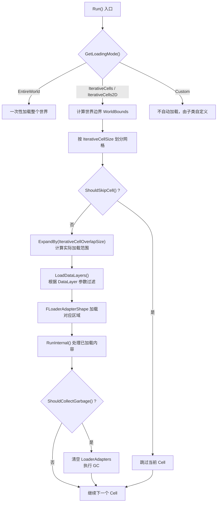

# UWorldPartitionBuilder 加载数量控制 — 技术总结

## 一、概述

`UWorldPartitionBuilder` 是 UE5 World Partition 系统中用于批量处理世界内容的基础类。

- **头文件**：`Engine/Source/Editor/UnrealEd/Public/WorldPartition/WorldPartitionBuilder.h`
- **实现文件**：`Engine/Source/Editor/UnrealEd/Private/WorldPartition/WorldPartitionBuilder.cpp`

其核心函数 `Run()` 负责按策略分块加载世界中的 Actor 并执行处理。加载数量的控制贯穿 **加载模式选择 → 空间分块 → 数据层过滤 → GC 管理** 整个流程。

---

## 二、加载流程概览



---

## 三、控制加载数量的关键参数

### 3.1 空间分块参数

| 参数 | 类型 | 默认值 | 作用 |
|---|---|---|---|
| `IterativeCellSize` | `int32` | `102400`（约 1024m） | 每次迭代加载的 Cell 边长，**直接决定单次加载区域大小** |
| `IterativeCellOverlapSize` | `int32` | `0` | Cell 边界向外扩展的重叠区域大小，增大会使实际加载范围超过 Cell 本身 |
| `IterativeWorldBounds` | `FBox` | 无效（使用整个世界） | 限定 Builder 只处理世界的某个子区域，缩小范围可减少总 Cell 数 |

**代码位置（WorldPartitionBuilder.cpp）**：

```cpp
// IterativeCellSize 用于划分网格（约第 222-247 行）
int32 NumCellsX = FMath::CeilToInt(WorldBoundsSize.X / IterativeCellSize);
int32 NumCellsY = FMath::CeilToInt(WorldBoundsSize.Y / IterativeCellSize);
int32 NumCellsZ = FMath::CeilToInt(WorldBoundsSize.Z / IterativeCellSize);

// IterativeCellOverlapSize 用于扩展加载范围（约第 256 行）
BoundsToLoad.ExpandBy(IterativeCellOverlapSize);
```

**调整建议**：
- 减小 `IterativeCellSize`（如从 `102400` 改为 `51200`）是**最直接**降低单次加载量的方式。
- 保持 `IterativeCellOverlapSize = 0` 可避免不必要的边界冗余加载。
- 设置有效的 `IterativeWorldBounds` 可限制处理范围，适合只需处理部分区域的场景。

---

### 3.2 加载模式（ELoadingMode）

| 模式 | 说明 | 加载量 |
|---|---|---|
| `EntireWorld` | 一次性加载整个世界 | **最大**，无法分块控制 |
| `IterativeCells` | 按 3D 网格分块迭代（X/Y/Z 三轴划分） | 受 `IterativeCellSize` 控制 |
| `IterativeCells2D` | 按 2D 网格迭代（仅 X/Y 划分，Z 取全范围） | 受 `IterativeCellSize` 控制，Z 轴不分块 |
| `Custom` | 不自动加载，由子类完全自定义 | 取决于子类实现 |

**关键差异**：`IterativeCells2D` 模式下 `NumCellsZ` 强制为 1，Z 轴取整个世界高度范围：
```cpp
if (LoadingMode == ELoadingMode::IterativeCells2D)
{
    NumCellsZ = 1;
}
```

**注意**：只有 `IterativeCells` 和 `IterativeCells2D` 模式下，`IterativeCellSize` 等空间分块参数才生效。

---

### 3.3 DataLayer 过滤参数

| 参数 | 类型 | 默认值 | 作用 |
|---|---|---|---|
| `bLoadNonDynamicDataLayers` | `bool` | `true` | 是否加载非动态 DataLayer |
| `bLoadInitiallyActiveDataLayers` | `bool` | `true` | 是否加载初始激活的 DataLayer |
| `DataLayerShortNames` | `TSet<FName>` | 空 | 额外指定需要加载的 DataLayer |
| `ExcludedDataLayerShortNames` | `TSet<FName>` | 空 | 排除不需要加载的 DataLayer |

**判定逻辑**（`LoadDataLayers()` 函数，约第 282-325 行）：

```cpp
for (UDataLayer* DataLayer : WorldDataLayers->GetDataLayerObjects())
{
    bool bLoadDataLayer = false;
    // 1. 检查是否在指定的 DataLayerShortNames 中
    // 2. 非动态层且 bLoadNonDynamicDataLayers 为 true
    // 3. 初始激活层且 bLoadInitiallyActiveDataLayers 为 true
    // 4. 最后检查是否在 ExcludedDataLayerShortNames 排除列表中
}
```

**调整建议**：
- 通过 `ExcludedDataLayerShortNames` 排除无关数据层，可以**大幅减少**加载的 Actor 数量。
- 将 `bLoadNonDynamicDataLayers` 或 `bLoadInitiallyActiveDataLayers` 设为 `false`，可跳过对应类型的数据层。

---

### 3.4 Cell 跳过机制

```cpp
virtual bool ShouldSkipCell(const FWorldBuilderCellCoord& CellCoord) const { return false; }
```

子类可重写此虚函数，根据 `CellCoord` 判断是否跳过特定 Cell，从而避免不必要的加载。

---

### 3.5 GC（垃圾回收）管理

在迭代过程中，`LoaderAdapters` 数组会持续累积已加载的数据：

```cpp
// 每次迭代添加新的 Loader（约第 261 行）
FLoaderAdapterShape* Loader = &LoaderAdapters.Emplace_GetRef(World, BoundsToLoad, TEXT("%."));

// GC 触发时才清空（约第 270-273 行）
if (FWorldPartitionHelpers::ShouldCollectGarbage())
{
    LoaderAdapters.Empty();
    FWorldPartitionHelpers::DoCollectGarbage();
}
```

**注意**：`Run()` 入口处会关闭引擎自动 GC：
```cpp
GEngine->ForceGarbageCollection(false);
```
GC 完全由 `ShouldCollectGarbage()` 控制，影响内存中同时存在的加载数据峰值。

---

## 四、参数优先级与推荐调整策略

### 影响力排序（从大到小）

```
1. GetLoadingMode()         → 决定是否分块，从根本上控制加载策略
2. IterativeCellSize        → 单次加载的区域大小，直接影响每次加载量
3. DataLayer 过滤参数        → 控制哪些 Actor 参与加载，影响加载密度
4. IterativeWorldBounds     → 限制总处理范围，影响总加载次数
5. IterativeCellOverlapSize → 边界扩展，影响单次加载的额外冗余
6. ShouldSkipCell()         → 细粒度跳过，影响实际执行的 Cell 数
```

### 典型优化方案

| 场景 | 推荐调整 |
|---|---|
| 内存不足，单次加载过多 | 减小 `IterativeCellSize`，设 `IterativeCellOverlapSize = 0` |
| 只需处理地图某个区域 | 设置有效的 `IterativeWorldBounds` |
| 某些数据层无需处理 | 使用 `ExcludedDataLayerShortNames` 排除 |
| 需要完全自定义加载逻辑 | 使用 `Custom` 模式，子类实现加载策略 |

---

## 五、命令行参数支持

`WorldPartitionBuilder.h` 中提供了命令行参数读取方法：

```cpp
bool HasParam(const TCHAR* Param) const;
const FString* GetParamValue(const TCHAR* Param) const;
```

同时支持通过 `.ini` 配置文件加载参数（`LoadConfig` 机制），可在 Commandlet 运行时动态指定参数，无需修改代码。

---

## 六、注意事项

1. **`IterativeCells2D` 与 `IterativeCells` 的区别**：仅在于 Z 轴是否分块。对于主要是平面分布的世界（大多数开放世界游戏），`IterativeCells2D` 更合适。
2. **内存累积风险**：`LoaderAdapters` 不会在每次迭代后立即清空，而是在 GC 条件满足时批量清理。如果迭代次数多且 GC 不够频繁，内存可能持续增长。
3. **引擎自动 GC 被关闭**：`Run()` 入口处通过 `ForceGarbageCollection(false)` 关闭了引擎自动 GC，全部由 Builder 内部的 `ShouldCollectGarbage()` 管理。
4. **子类扩展点**：`GetLoadingMode()`、`ShouldSkipCell()`、`RunInternal()` 均为虚函数，子类可灵活定制加载和处理行为。
5. **DataLayer 过滤的优先级**：`ExcludedDataLayerShortNames` 的排除优先级最高，即使其他条件满足，在排除列表中的 DataLayer 也不会被加载。
6. **命令行参数优先级**：命令行指定的参数会覆盖 `.ini` 配置文件中的默认值。