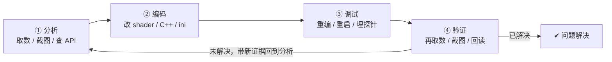
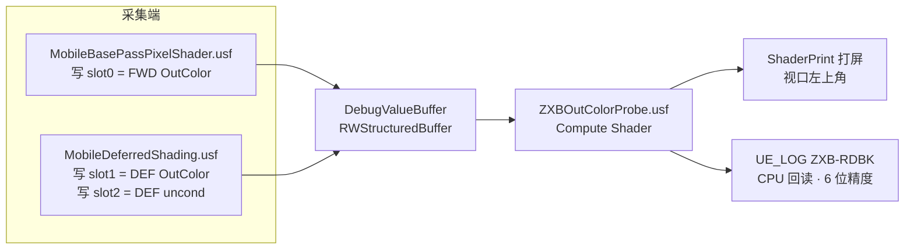
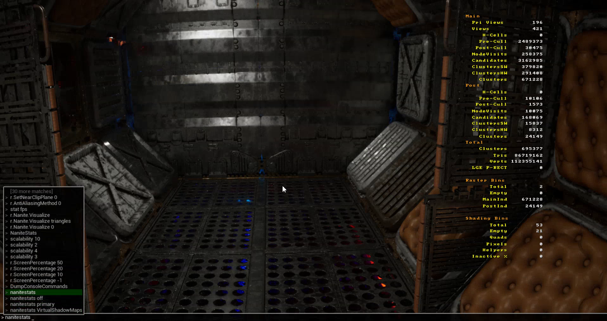
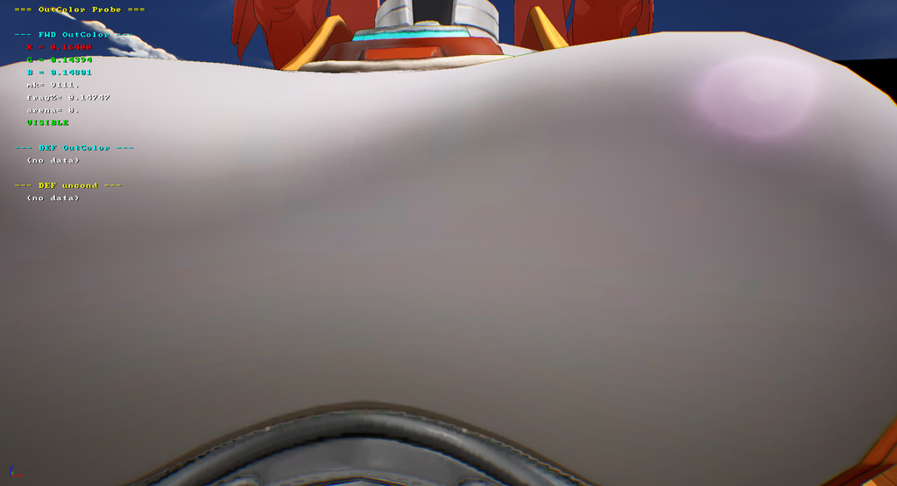
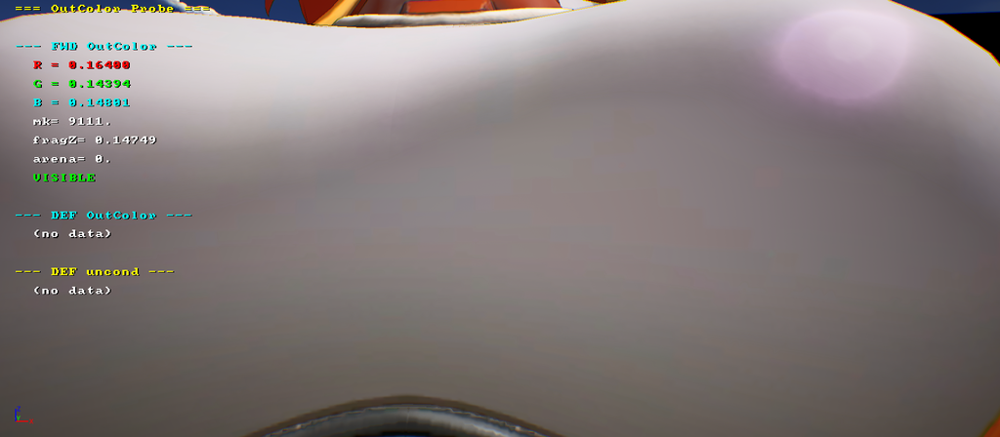

# ZXBUnrealDebug 使用文档

> **S1/GR 渲染调试 AI Harness 工作模式** —— 驱动 AI 自主"分析→编码→调试→验证"闭环，直到问题解决
> 文档日期：2026-08-16 · 环境：UE 5.5.4（UE5EA fork）、Windows 11、Unreal MCP、受管 Python 3.13.12

---

## 目录

1. [这是什么](#一这是什么)
2. [原理](#二原理)
3. [快速上手（5 分钟）](#三快速上手5-分钟)
4. [14 项能力说明](#四14-项能力说明)
5. [实践教程（真实数据）](#五实践教程真实数据)
6. [常见坑速查](#六常见坑速查)
7. [附录](#七附录)

---

## 一、这是什么

`ZXBUnrealDebug` 是 S1/GR 工程**渲染调试的 AI Harness 工作模式**——把"分析 → 编码 → 调试 → 验证"的闭环全部交给 AI 自主执行，让它**循环迭代直到问题解决**，人只在关键决策点介入。

共 **14 项能力**，按 Harness 循环的环节组织：

| 环节 | 能力 | 一句话 |
|---|---|---|
| **分析** | ③ 加载监控 ④ 截图 ⑤ API验证 ⑫ 一键取数 ⑬ OCR | 定位现象、量化差异、查 API |
| **编码** | ① 构建 ② 停止 ⑥ 切管线 ⑦ 切平台 ⑭ 探针框架 | 改代码、重编、埋探针 |
| **调试** | ⑧ 切LuxGI ⑨ 切阴影 ⑩ 刷shader ⑪ 沉浸 ⑭ 恢复环境 | 复现、热重载、抓中间值 |
| **验证** | ④ 截图 ⑫ 取数 ⑬ OCR | 确认改动是否生效 |

### 1.1 AI Harness 工作模式（核心）


> **图渲染不了？**（查看器不支持 Mermaid 时）等效流程：
> `分析 → 编码 → 调试 → 验证 → 问题解决`；验证未通过则**带新证据回到分析**，循环直到问题解决。

**一次典型闭环**（今天实测就是完整一圈）：
1. **分析**：取数发现 Forward 值与期望有偏差 → 用 ⑫④⑤
2. **编码**：改 shader / 恢复探针框架 → 用 ①⑥⑦⑭
3. **调试**：重编 + 重启 + 设 CVar + 切平台 → 用 ①②③⑦⑩
4. **验证**：再取数，`mk=9111 VISIBLE` 确认数据可信 → 用 ⑫④⑬
5. **再循环**：偏差仍在 → 带着新的取数证据回到分析，定位下一层

**AI 自主推进原则**（Harness 的关键）：
- **能自己验证的，不打扰人**：重编→重启→取数→判读，AI 全链路自主完成
- **验证失败 → 按「零输出排查」7 步自查**（见实践 4），而不是停下来问
- **只在三种情况停下来问人**：① 要改基准/换视角（影响数据可比性）② 要动架构/大改（如恢复整个框架）③ 结果与预期矛盾且自查无果

**它解决什么问题？**
- 用命令行/一句话完成"编译编辑器 → 打开 → 切平台 → 截图"的重复操作；
- 更核心的是：**用探针量化两条渲染管线（Forward / Deferred）的差异**，让 AI 能基于**数据**而非肉眼判断，自主迭代修复。

---

## 二、原理

### 2.1 Unreal MCP 架构（为什么 AI 能操作编辑器）


> **图渲染不了？** 等效：AI 会话 `stdio` ⇄ `unreal_mcp_server.py`(Python) `TCP 58123` ⇄ Unreal 编辑器(UnrealMCP 插件)。

- **MCP server**（`unreal_mcp_server.py`，来自开源项目 <https://github.com/mscrnt/unreal-mcp>）负责把 AI 的请求转发给编辑器里的 UnrealMCP 插件。
- **端口**（本工程 58123）有两处配置：编辑器侧读 `S1Game/Config/DefaultEditor.ini`，MCP server 侧读 `~/.tclaude/.claude.json` 的 `UNREAL_PORT`。**端口被占用时改这两处并重启**（见实践 3）。
- ⚠️ **改配置只影响"未来"的进程**：运行中的 MCP server 端口定死在启动时。所以改端口后必须 `/mcp` 重连（或重启会话），这是最容易漏的一步。

### 2.2 ShaderPrint 探针框架（怎么"取数"）

一套**常驻、CVar 门控、默认零开销**的探针系统，抓"渲染管线算出来的最终颜色值"：


> **图渲染不了？** 等效：
> - **采集端** → Forward(`MobileBasePassPixelShader.usf`) 写 slot0；Deferred(`MobileDeferredShading.usf`) 写 slot1/2 → 共享 **DebugValueBuffer**(RWStructuredBuffer)
> - **显示端** → `ZXBOutColorProbe.usf`(Compute) 读 buffer → ① ShaderPrint 打屏（视口左上角）② `UE_LOG [ZXB-RDBK]` CPU 回读

**三个关键设计**（每个都是踩坑换来的）：

1. **marker 魔数**（区分"管线没跑" vs "跑了但值真是 0"）：

   | slot | 内容 | marker |
   |---|---|---|
   | 0 | Forward 最终 OutColor | **9111** |
   | 1 | Deferred lighting OutColor | **8642** |
   | 2 | Deferred 无条件探针 | **7777** |
   | 3 | FWD fragZ + 深度擂台 | **6321** |

   `(no data)` = 空槽（本帧没写），**不许当 0 输出**。

2. **深度擂台 VISIBLE 自证**：PS 写 UAV 会禁用 early-Z，被遮挡的片元也会写探针。用 `InterlockedMax` 原子擂台记住"曾见过的最近深度"，只有可见片元才写。屏幕上 `fragZ == arena` 且 `VISIBLE` = 数据可信。

3. **两条取数通道**（同一份数据）：

   | 通道 | 输出 | 精度 | 何时用 |
   |---|---|---|---|
   | ShaderPrint 打屏 | 视口左上角文本 | 5 位 | 看画面+数值对应、截图 |
   | CPU 回读日志 | `[ZXB-RDBK]` UE_LOG | 6 位 | 全精度、grep/贴回 |

### 2.3 UE 引擎如何使用 ShaderPrint（Lumen / Nanite 实战）

上面 2.2 是我们的探针框架；它建立在 **UE 引擎自带的 ShaderPrint 调试系统**之上。了解引擎原生怎么用，既方便你在任意 shader 里直接打屏调试，也让你明白框架为什么长这样。

**ShaderPrint 是什么**：UE5 官方的 shader 调试打印系统——直接在 shader 里把调试信息"画"到视口（光栅化类似 imgui 的文本/线），**免去 GPU→CPU readback**。开关：`r.ShaderPrint` CVar + `FEngineShowFlags.ShaderPrint` showflag。

**工作原理（两层）**：
- **shader 侧写**：CS/PS 用 `Print(Ctx, 值/文本, 颜色)` + `Newline(Ctx)` 写进 `RWEntryBuffer/RWStateBuffer`，统一走 `WriteSymbol`；
- **渲染侧画字**：`ShaderPrint::DrawSymbols` 绑 uniform buffer，`InstanceDraw` 逐字符渲染——VS 读每字符实例信息算 `AsciiTexture` UV，PS 采样 ASCII 字符纹理画到屏幕左上角。

**C++ 侧接入（三步，Lumen/Nanite 通用）**：
```cpp
ShaderPrint::SetEnabled(true);        // 1. 开全局开关（引擎 30+ 子系统调它）
ShaderPrint::RequestSpaceForLines(N); // 2. 申请画线空间
ShaderPrint::SetParameters(GraphBuilder, View.ShaderPrintData, PassParameters->ShaderPrintUniformBuffer); // 3. 绑进 pass
```
shader 侧再 `InitShaderPrintContext` → `Print` → `Newline`。

**Nanite 实战**（`nanitestats` 命令）：
- C++：`Nanite.cpp:46` → `GNaniteShowStats = 1; ShaderPrint::SetEnabled(true);`
- 数据：`FRDGBuffer` 里 `FNaniteStats`（NumTris / NumVerts / NumMainInstancesPreCull / PostCull / NumVisitedNodes / NumCandidateClusters / NumNanitePixels / NumShadedPixels…）
- shader：`NanitePrintStats.usf` 的 `PrintStats()` CS（`#if SHADER_PRINT_STATS` 门控），`PrintSymbol(_SPC_)` 对齐 + `Print(Context, Value)`，打出 **H-Cells / Pre-Cull / Post-Cull / NodeVisits**
- 参数：`nanitestats list | primary | * | <自定义 filter 如 VirtualShadowMaps> | off`



**Lumen 实战**：
- 光照统计：`r.LumenScene.Lighting.Stats 1` → `LumenSceneLightingStatsCS` 打间接卡片页分配器信息
- 追踪可视化：`r.Lumen.Visualize.UseShaderPrintForTraces`（默认 1）控制追踪线用 ShaderPrint 还是自定义线渲染器；`LumenVisualize.cpp:580` 的 `FVisualizeTracesCS` 是典型用法
- 辐射缓存调试：`LumenRadianceCacheDebug.usf` 里 `Print(Context, PriorityHistogram[BucketIndex])` 打更新成本

> **示例图说明**：Lumen ShaderPrint 输出（`r.LumenScene.Lighting.Stats 1` 的左上角统计块）本工程暂未配图——实跑需切桌面平台，但 **VULKAN_SM5_Preview 在此工程的 GlobalShaders 编译有 172 个错误**（`LuxGISliceUploader.usf` / `LumenScreenProbeGather.usf` 等，非探针引入，Mobile 平台正常），导致编辑器 Fatal 退出；网上亦无现成公开截图。如需配图，需在能编译 VULKAN_SM5 的环境执行 `r.LumenScene.Lighting.Stats 1` 后截图。

**和我们的关系**：引擎原生 ShaderPrint 打**调试文本/数字**（配各子系统 debug 命令）；我们的探针框架扩展成**把任意 shader 中间值写进自定义 RWStructuredBuffer**、显示端读回对比（过程值 vs 最终值）。Desktop 引擎自带完整 `DrawView` 链开箱即用；**Mobile 预览平台**缺失（即我们解决的"四阻塞点"）。

> 参考：[Epic FEngineShowFlags.ShaderPrint 文档](https://dev.epicgames.com/documentation/unreal-engine/API/Runtime/Engine/FEngineShowFlags/ShaderPrint)、[知乎 UE5 Shader Print 系统](https://zhuanlan.zhihu.com/p/637929634)、[markjg.com Nanite stats](https://markjg.com/blog/nanite-debugging-stats/)、[Epic 论坛 How to log nanite stats](https://forums.unrealengine.com/t/how-to-log-nanite-stats/2599303/2)

### 2.4 Forward/Deferred 对比的语义陷阱（必须理解）

**Deferred 的探针只取到"一半"**：Forward 的 OutColor 是最终色；Deferred 是 lighting pass 的加性贡献（`BlendState = BF_One, BF_One`），**不含** base pass 写的 emissive。

> ⇒ 直接对比会看到"Deferred 比 Forward 暗一截"，这是**结构差异，不是 bug**。判读时必须计入。

---

## 三、快速上手（5 分钟）

最简路径：打开编辑器 → 截个图看看。

```bash
# 1. 打开编辑器（能力③，schtasks 交互令牌启动，等 shader 编完）
C:/Users/djangozhang/.workbuddy/binaries/python/versions/3.13.12/python.exe \
  "C:/Users/djangozhang/.tclaude/skills/ZXBUnrealDebug/scripts/open_project.py" \
  "D:/GR_DevTest/S1Game/S1Game.uproject" --force-restart --wait-shaders --wait-verify 30
# → [RESULT] 已启动编辑器 ✅

# 2. 等 MCP 就绪（10-60s），然后截图（能力④，自动进沉浸模式提高分辨率）
#    直接对 AI 说 "截图" 即可
```

> ⚠️ 首次用会触发引擎 shader 编译（几分钟），以后增量秒开。**改过 C++ 源码必须重编**（能力①），否则探针/日志根本不存在（表现 = 零输出）。

---

## 四、14 项能力说明

> 触发方式：直接对 AI 说触发词，或手动调用对应脚本。

### ① 构建
编译 S1GameEditor（复刻 UGS 右键 Build）。动态定位引擎（平级 UE5EA / 注册表 GUID），无需硬编码路径。
```bash
C:/Users/djangozhang/.workbuddy/binaries/python/versions/3.13.12/python.exe \
  "C:/Users/djangozhang/.tclaude/skills/ZXBUnrealDebug/scripts/build_s1_editor.py" \
  "D:/GR_DevTest/S1Game/S1Game.uproject" --log /tmp/bs1.log
```
增量十几秒~几分钟，输出里程碑 + `[RESULT] SUCCESS/FAILED`。失败自动拉尾部 100 行。

### ② 停止
`stop_compile.py` 杀 UBT/cl/link 编译进程树，`[RESULT] CLEAN` 秒级。

### ③ 打开 + 加载监控
`open_project.py` 比对源码/产物 mtime，需要则先编译再开。**关键**：用计划任务 InteractiveToken 启动（避免降权令牌导致 DDC 只读/PSO 卡死）。启动后 AI 自动等 MCP 就绪（分段轮询 + Python ping）。

### ④ 截图
等资产/Shader 编译完 → **先进沉浸模式（分辨率 2.2×）** → 刷视口 → 截图 → 退回。默认 PNG。截图目录 `D:/GR_DevTest/Saved/_Screenshots/`。

### ⑤ API 发现 / 存在性验证
`mcp_find_api.py` 查 unreal 反射表，动手前验证类/方法存在 + 签名（GR fork 特有 API 训练数据里没有）。

### ⑥ 切换渲染管线
改 `DefaultEngine.ini` 的 `r.Mobile.ShadingPath`（0=Forward, 1=Deferred）+ **重启**（热切无效）。
> ⚠️⚠️ **绝不用 `-dpcvars` 切**——该 CVar 读 ini 不走运行时求值，`-dpcvars` 会造出"最终值显示 1、实际管线还是 0"的假象。切完必须回读 `ProjectSetting:` 层确认。

### ⑦ 切换预览平台
`set_preview_platform_by_name` 热切。AndroidVulkan High/Mid/Low、IOSMetal、Vulkan SM5 等。切换触发 shader 重编。

### ⑧ ⑨ 切 LuxGI / 阴影
热切 CVar（`r.LuxGI` / `r.ShadowQuality`）。A/B 对比常用。阴影要记住原值、用完恢复。

### ⑩ 刷新 Shader
只改 `.usf/.ush` 时 `recompileshaders changed` 热重载，无需重启。改 C++ 则必须重编+重启。

### ⑪ 视口沉浸
`LevelEditor.ToggleImmersive`（等价 F11）。toggle 语义，切换带动画且非当帧生效——**必须截图核实**。

### ⑫ 一键取数（测试流程模板）
把**用户指定管线**的最终 OutColor 取出来对比。**每次必须由用户提供 5 参数**（缺一不可）：
**地图 / 视角 / 渲染管线 / Preview 平台 / 对比的数值**。流程：切平台 → 设 CVar → 视角回读 → 推帧 → 读屏幕/日志。完整实践见下文。

### ⑬ OCR 提取字符串
模型读不了图时，PaddleOCR v6 从截图读 ShaderPrint 数值。`ocr_paddle.py <图> --x2`（两轮一致才可信）。

### ⑭ ShaderPrint 调试（框架 + 恢复环境）
探针框架本体（patch 在 `ZXBUnrealDebug/shaderprint-debug/`）。**恢复调试环境** = 8 文件 patch + 重编 + 重启（完整流程见实践 1）。

---

## 五、实践教程（真实数据）

### 5.0 总览：今天这一圈 = 一个完整的 Harness 循环

| 环节 | 本次做的 | 对应能力 |
|---|---|---|
| 分析 | 发现 `r.ZXB.Probe` 查不到 = 探针框架没编进 DLL | ⑤ |
| 编码 | 恢复 8 文件探针框架（patch 6 + 重建 usf 探针块） | ⑭ |
| 调试 | 重编（42s）→ 重启 → 切平台 → 设 CVar | ①②③⑦ |
| 验证 | 取数 `R=0.164003 mk=9111 VISIBLE` + 截图 + OCR 校验 | ⑫④⑬ |
| 再分析 | 与历史存档逐位一致 → 判定链路全通，闭环结束 | ⑫判读 |

下面 4 个实践就是这一圈的展开。

### 实践 1：恢复探针框架（2026-08-16 全程实测，编译 42s）

前提：当前引擎 DLL 里**没有**探针框架（`r.ZXB.Probe` CVar 不存在 = 框架没编译进）。

```bash
cd D:/GR_DevTest
PATCH="C:/Users/djangozhang/.tclaude/skills/ZXBUnrealDebug/shaderprint-debug"

# ① 新建文件复制到引擎
cp $PATCH/MobileBasePassDebugSlots.ush UE5EA/Engine/Shaders/Private/
cp $PATCH/MobileOutColorProbe.usf    UE5EA/Engine/Shaders/Private/

# ② P4 迁出 8 个文件（7 edit + 2 add）
p4 edit UE5EA/Engine/Shaders/Private/MobileDeferredShading.usf \
        UE5EA/Engine/Source/Runtime/Renderer/Private/ShaderPrint.cpp \
        UE5EA/Engine/Source/Runtime/Renderer/Private/MobileBasePassRendering.cpp \
        UE5EA/Engine/Source/Runtime/Renderer/Private/MobileBasePassRendering.h \
        UE5EA/Engine/Source/Runtime/Renderer/Private/MobileDeferredShadingPass.cpp \
        UE5EA/Engine/Source/Runtime/Renderer/Private/MobileShadingRenderer.cpp \
        UE5EA/Engine/Shaders/Private/MobileBasePassPixelShader.usf
p4 add UE5EA/Engine/Shaders/Private/MobileBasePassDebugSlots.ush \
        UE5EA/Engine/Shaders/Private/MobileOutColorProbe.usf

# ③ apply 6 个 patch（P4 格式需先转 a/b 相对路径，再 patch -p1）
#    （转换脚本见 shaderprint-debug/README.md；核心：-- 行去 //GR/DevTest/ 和 D:\GR_DevTest\ 前缀，反斜杠转正斜杠）
patch -p1 < <(转换后的 MobileDeferredShading.usf.patch)  # ...6 个

# ④ MobileBasePassPixelShader.usf 是混合 patch——只手动加探针块（文件已含 [ZXB Fix] 功能性修复）：
#    a) #include "ThinTranslucentCommon.ush" 后加:
#       // [ShaderPrint Debug] ...
#       #include "MobileBasePassDebugSlots.ush"
#    b) SafeGetOutColor 之后加（英文注释）:
#       if (MobileBasePass.OutColorProbeEnable != 0) {
#           DBG_ARENA_CLAIM(SvPosition);
#           if (DBG_IS_CENTER_VISIBLE(SvPosition)) {
#               MobileBasePass.MobileDebugValueBufferUAV[DBGSLOT_FWD_OUTCOLOR] = float4(OutColor.rgb, DBGMARK_FWD);
#               MobileBasePass.MobileDebugValueBufferUAV[DBGSLOT_FWD_FRAGZ] = float4(SvPosition.z, 0, 0, DBGMARK_FWD_FRAGZ);
#           }
#       }

# ⑤ 停编辑器 → 编译（42s 增量）→ 重启 → 验证 CVar
#    execute_console_command("r.ZXB.Probe") → "0"  = 框架生效 ✅
```

**验证判据**：`r.ZXB.Probe` 能查到 = 框架进 DLL；查不到 = 没编进去。

### 实践 2：一键取数（Forward，本次实测数据）

**5 参数**（本次演示用存档基准）：地图 `DT_Showcase` · 视角 `location=[201.995511,18.774568,128.560938] rotation=[15.0001,266.59991,-1e-6]` · 管线 **Forward** · 平台 **AndroidVulkan_Preview** · 对比值 `R=0.164003 存档`。

```python
# ① 切平台（能力⑦）
unreal.PreviewPlatformScriptLibrary.set_preview_platform_by_name('AndroidVulkan_Preview', True, 'Android_High')
# ② 设 CVar（能力⑫ 清单；Forward 不需要 ForceDeferredMultiPass）
#    r.ZXB.Probe 1 / ProbeLogValues 1 / ShaderPrintForceEnable 1 / ShaderPrint 1
#    r.Mobile.DeferredLightingSplitPass 0 / ShadowQuality 0 / FontSize 16 / FontSpacingY 20
# ③ 设视角（MCP set_viewport_camera）+ 回读核对
# ④ 推帧：editor_invalidate_viewports() × 4（每次独立 MCP 调用，编辑器空闲不渲染必须推帧）
```

**实测结果**（`[ZXB-RDBK]` 日志，2026-08-16 16:11）：

```
=== OutColor Probe ===
--- FWD OutColor ---
  R = 0.164003   G = 0.143941   B = 0.148013
  mk= 9111  fragZ= 0.147495  VISIBLE     ← marker 非 0 = Forward 跑过；VISIBLE = 数据可信
--- DEF OutColor ---
  (no data)                               ← Forward 管线下 Deferred lighting 不跑, 符合预期
--- DEF uncond ---
  (no data)
```

**CPU Read Back 原始日志片段**（`grep "ZXB-RDBK" S1Game/Saved/Logs/S1Game.log | tail -14`，2026-08-16 16:11 实测）：

```
[2026.08.16-16.11.15:517][260]LogTemp: Warning: [ZXB-RDBK] === OutColor Probe ===
[2026.08.16-16.11.15:517][260]LogTemp: Warning: [ZXB-RDBK] --- FWD OutColor ---
[2026.08.16-16.11.15:517][260]LogTemp: Warning: [ZXB-RDBK]   R = 0.164003
[2026.08.16-16.11.15:517][260]LogTemp: Warning: [ZXB-RDBK]   G = 0.143941
[2026.08.16-16.11.15:518][260]LogTemp: Warning: [ZXB-RDBK]   B = 0.148013
[2026.08.16-16.11.15:518][260]LogTemp: Warning: [ZXB-RDBK]   mk= 9111
[2026.08.16-16.11.15:518][260]LogTemp: Warning: [ZXB-RDBK]   fragZ= 0.147495
[2026.08.16-16.11.15:518][260]LogTemp: Warning: [ZXB-RDBK]   arena= 0.000000
[2026.08.16-16.11.15:518][260]LogTemp: Warning: [ZXB-RDBK]   VISIBLE
[2026.08.16-16.11.15:518][260]LogTemp: Warning: [ZXB-RDBK] --- DEF OutColor ---
[2026.08.16-16.11.15:518][260]LogTemp: Warning: [ZXB-RDBK]   (no data)
[2026.08.16-16.11.15:518][260]LogTemp: Warning: [ZXB-RDBK] --- DEF uncond ---
[2026.08.16-16.11.15:518][260]LogTemp: Warning: [ZXB-RDBK]   (no data)
```

> 说明：这是 **CPU 回读通道**（6 位精度）的原始日志；屏幕 ShaderPrint 是同一份数据的 5 位版（内容逐行一致）。`arena=0.000000` 是深度擂台首帧未收敛值（下一帧收敛到 0.147495），`VISIBLE` 已自证数据来自可见片元。

**实拍截图**（文档嵌图；当前模型无多模态能力，数值请以 `[ZXB-RDBK]` 日志为准，图片辅助核对画面）：





> 图里左上角应为 `=== OutColor Probe ===` → FWD OutColor `R=0.164003 G=0.143941 B=0.148013` + `mk=9111` + `VISIBLE`；DEF 为 `(no data)`（Forward 管线下符合预期）。中心像素 = 相机前向射线命中点，即屏幕上角色所在位置的颜色。

**判读**：`mk=9111` 非 0 + `VISIBLE` = 数据有效。`(no data)` = 空槽，**不许当 0 报**。数据与历史存档逐位一致（R=0.164003），证明框架恢复 + 取数链路全通。

### 实践 3：改 MCP 端口（端口被占用时）

端口有两个消费方，必须**同步改 + 各自重启**：

| 侧 | 文件 | 改哪 |
|---|---|---|
| UE（编辑器监听） | `S1Game/Config/DefaultEditor.ini` | `[/Script/UnrealMCP.UMCPSettings]` 和 `[/Script/UnrealMCP.MCPSettings]` 两段 `Port=` |
| Python（MCP 连哪） | `~/.tclaude/.claude.json` | `unrealMCP.env.UNREAL_PORT` |

步骤：选空闲端口 → `p4 edit` 改 UE ini（先备份 `.claude.json`）→ 重启编辑器 → **用户敲 `/mcp` 重连** → 验证 `mcp_connected: true`。
（2026-08-16 实测把 58080 → 58123，全链路验证通过。）

### 实践 4：零输出排查（最重要的排障流程）

"零输出"是 **7 个不同原因的同一个表象**，日志上无法区分。**固定顺序从最便宜查起**：

| 序 | 查什么 | 命中特征 |
|---|---|---|
| 1 | DLL 是否比源码新（`stat` 比 mtime） | DLL 早于源码 = 没重编 |
| 2 | 窗口是否聚焦/最大化 | `[ZXB-SP]` 时间戳停止增长 = 视口停摆 |
| 3 | 管线是否真切了（`ProjectSetting:` 层） | 该层不是目标值（`-dpcvars` 假象）|
| 4 | 是否用 execute_python+sleep 造帧 | 帧数极少 |
| 5 | 预览平台是否切了（API 回读） | 不是用户指定的平台 |
| 6 | 中心像素是否命中目标物体（`SM` 值） | `SM` != 预期 = 前置异常，不是该换视角 |
| 7 | shader 是否编译失败（grep error） | 有编译错误行 |

**1~6 都是操作漏项**，占绝大多数；7 才是代码真有问题。**别一上来怀疑 shader 编译失败**。

---

## 六、常见坑速查

| 坑 | 一句话 |
|---|---|
| `-dpcvars` 切管线静默失效 | `r.Mobile.ShadingPath` 读 ini，只能改 ini + 重启；回读认 `ProjectSetting:` 层 |
| MCP 端口改了不生效 | 运行中 server 端口定死，必须 `/mcp` 重连或重启会话 |
| `strings` 判断 DLL 内容 | UE 日志字面量是 UTF-16，`strings` 扫不到；判 DLL 新旧只认 mtime |
| 截图用 `HighResShot WxH` | 自定义分辨率会卡死视口，只能重启；用 MCP `take_screenshot` |
| 编辑器视口空闲零帧 | 必须 `editor_invalidate_viewports()` 独立调用推帧，别用 execute_python+sleep |
| Deferred 探针偏暗 | 加性叠加语义，只取到 lighting 一半，是结构差异不是 bug |
| 功能性修复 + 探针混文件 | 绝不能整文件 `p4 revert`，按 `[ZXB Fix]`/`[ShaderPrint Debug]` 标记逐块挑 |
| shader 注释用中文 | `.usf/.ush` 注释必须英文，中文会乱码 |

---

## 七、附录

### CVar 清单（能力⑫ 取数用）

| CVar | 值 | 作用 |
|---|---|---|
| `r.ZXB.Probe` | 1 | **总开关**（采集 + 显示 + readback）|
| `r.ZXB.ProbeLogValues` | 1（用后必关 0）| CPU 回读打 `[ZXB-RDBK]` 日志（持续刷）|
| `r.ZXB.ShaderPrintForceEnable` | 1 | 绕过 Mobile ShaderPrint 三处失效检查 |
| `r.ShaderPrint` | 1 | 全局开关 |
| `r.ZXB.ForceDeferredMultiPass` | 1（仅 Deferred）| Vulkan subpass 内 UAV 写被丢弃，必须走 MultiPass |
| `r.Mobile.DeferredLightingSplitPass` | 0 | 关 split，走 ubershader 单 draw |
| `r.ShadowQuality` | 0 | F/D 阴影未对齐，污染光照对比 |

⚠️ 全是 `ECVF_Cheat`，不吃 `-dpcvars`，只能控制台手设。重启后部分回默认，每轮重设。

### 资源位置

- **skill 获取（git 仓库）**：`git clone git@git.woa.com:djangozhang/skills.git`（内含本 skill 全套脚本/patch/references）
- skill 目录：`C:/Users/djangozhang/.tclaude/skills/ZXBUnrealDebug/`
- 探针框架资产：`ZXBUnrealDebug/shaderprint-debug/`（patch + references/ 9 篇方法论文档 + PC/）
- 脚本：`ZXBUnrealDebug/scripts/`（build/open/stop/ocr/mcp_find_api + BuildEditor.bat）
- 截图：`D:/GR_DevTest/Saved/_Screenshots/`

### 参考基准存档（历史值，仅回溯参考，不是本次默认参数）

```
地图：/Game/Delete/Yoohaozhang/DT_ShowCase/DT_Showcase
视角：location=[201.995511, 18.774568, 128.560938]  rotation=[15.0001, 266.59991, -1e-6]
管线：Forward（ProjectSetting: 0）  平台：AndroidVulkan_Preview
FWD OutColor  R=0.164003  G=0.143941  B=0.148013   mk=9111  VISIBLE
```
