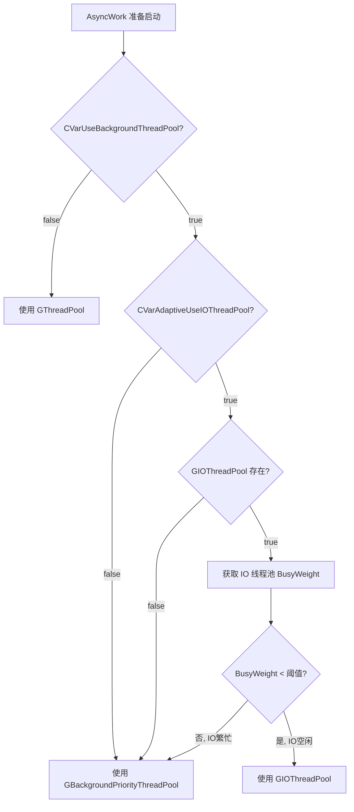
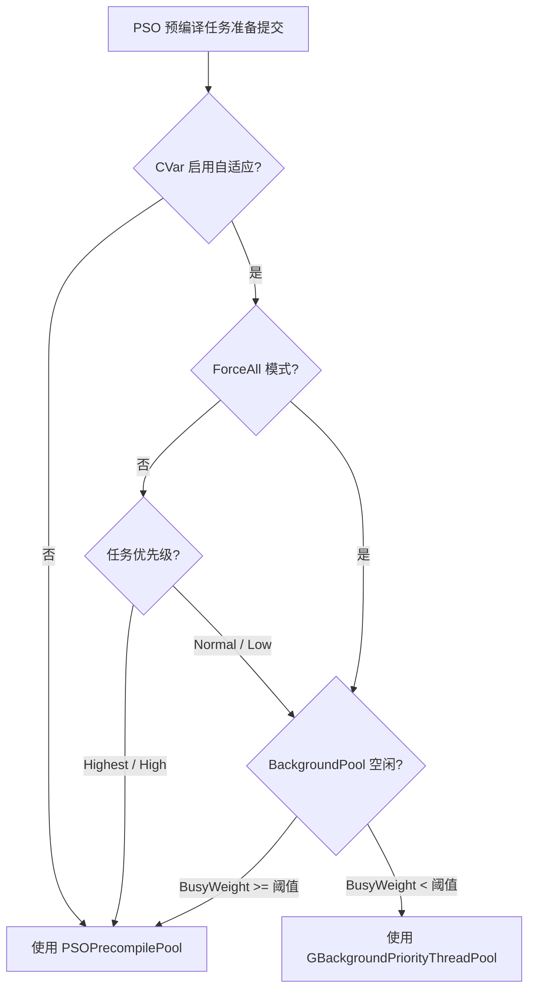

# 自适应线程池调度 — IO 与 PSO 任务跨池借用技术方案

> **作者**: ZXB  
> **日期**: 2026-04-22  
> **涉及模块**: Engine/Streaming, Engine/RHI, Engine/D3D12RHI, GameFundamental/CPUUsageTrack  
> **关键技术**: 自适应线程池调度、GetBusyWeight 繁忙度检测、TLS 标记、CVar 运行时控制

---

## 1. 背景与动机

UE5 引擎中存在多个专用线程池，各自服务于不同的子系统：

| 线程池 | 线程数 | 线程优先级 | 用途 |
|--------|--------|-----------|------|
| `GThreadPool` | 平台核心数相关 | `TPri_SlightlyBelowNormal` | 通用计算任务 |
| `GBackgroundPriorityThreadPool` | 2（Server为1） | `TPri_Lowest` | 低优先级后台任务 |
| `GIOThreadPool` | 4（Server为2） | `TPri_AboveNormal` | IO 密集型任务 |
| `PSOPrecompilePool` | 硬件线程数的25% | `TPri_BelowNormal` | PSO 预编译专用 |

在实际运行中，这些线程池的负载并不均匀——例如 IO 线程池在非加载密集期几乎空闲，BackgroundPool 在无后台任务时也处于闲置状态。**本方案的核心思想是：在某个线程池空闲时，将其他子系统的任务"借用"过去执行，从而更充分地利用 CPU 资源。**

---

## 2. 技术架构总览

```
┌─────────────────────────────────────────────────────────────────┐
│                     CPUUsageTrack 系统                           │
│  (监控 CPU 使用率，在 Busy/Relaxed 状态间切换 CVar 开关)          │
└──────────────┬──────────────────────────┬───────────────────────┘
               │                          │
               ▼                          ▼
┌──────────────────────────┐  ┌──────────────────────────────────┐
│  Streaming AsyncWork     │  │  PSO Precompile Tasks            │
│  (Mip 计算任务)           │  │  (Pipeline State 编译任务)        │
│                          │  │                                  │
│  自适应选择：             │  │  自适应选择：                     │
│  GBackgroundPool         │  │  PSOPrecompilePool               │
│       ↕                  │  │       ↕                          │
│  GIOThreadPool           │  │  GBackgroundPriorityThreadPool   │
└──────────────────────────┘  └──────────────────────────────────┘
```

---

## 3. 方案一：Streaming AsyncWork 自适应借用 IO 线程池

### 3.1 问题分析

`FRenderAssetStreamingMipCalcTask` 是纹理流式系统的核心异步任务，负责：
- 计算视图信息（`ComputeViewInfoExtras`）
- 更新包围盒大小（`UpdateBoundSizes_Async`）
- 遍历所有流式资源计算理想 Mip 级别（`PerfectWantedMips`）
- 根据内存预算做 Mip 取舍（排序、TryDrop、TryKeep）
- 生成加载/取消请求

这是一个**纯 CPU 计算密集型任务**，默认运行在 `GBackgroundPriorityThreadPool`（`TPri_Lowest`）。

### 3.2 为什么不直接挪到 GIOThreadPool

| 维度 | 评估 |
|------|------|
| 语义匹配 | ❌ CPU 计算任务不应放 IO 线程池 |
| 性能影响 | ❌ 会挤占 IO 线程，影响资源加载 |
| 优先级 | ❌ IO 池优先级过高（`TPri_AboveNormal`），不适合后台计算 |
| 线程容量 | ❌ IO 线程池仅 4 线程，容量紧张 |
| 栈大小 | ⚠️ IO 池 96KB 栈可能不够 |

### 3.3 自适应方案

**核心思路**：不是"挪过去"，而是"在 IO 线程池空闲时借用"。



### 3.4 关键接口：GetBusyWeight

繁忙度检测依赖 `FQueuedThreadPool::GetBusyWeight()` 方法（定义于 `ThreadingBase.cpp`）：

```
BusyWeight = (NumActiveJobs + NumQueuedJobs) / NumThreads * 100
```

该接口受 `LQT_ADAPTIVE_PRELOAD_SHADER_THREAD` 宏控制（默认为 1，已启用）。

### 3.5 修改文件

**文件**: `Engine/Source/Runtime/Engine/Private/Streaming/StreamingManagerTexture.cpp`

#### 新增 CVar

| CVar | 默认值 | 说明 |
|------|--------|------|
| `r.Streaming.AdaptiveUseIOThreadPool` | `0`（关闭） | 是否启用自适应 IO 线程池借用 |
| `r.Streaming.IOThreadPoolBusyThreshold` | `50` | IO 线程池繁忙度阈值 |

#### 新增函数

```cpp
static FQueuedThreadPool* SelectStreamingAsyncWorkThreadPool()
{
    if (!CVarUseBackgroundThreadPool.GetValueOnGameThread())
        return GThreadPool;

    if (CVarAdaptiveUseIOThreadPool.GetValueOnGameThread() && GIOThreadPool)
    {
        const int32 IOBusyWeight = GIOThreadPool->GetBusyWeight();
        if (IOBusyWeight < CVarIOThreadPoolBusyThreshold.GetValueOnGameThread())
            return GIOThreadPool;
    }

    return GBackgroundPriorityThreadPool;
}
```

#### 修改调度点

```cpp
// 修改前
AsyncWork->StartBackgroundTask(CVarUseBackgroundThreadPool.GetValueOnGameThread() 
    ? GBackgroundPriorityThreadPool : GThreadPool);

// 修改后
AsyncWork->StartBackgroundTask(SelectStreamingAsyncWorkThreadPool());
```

---

## 4. 方案二：PSO 预编译任务自适应借用 BackgroundPool

### 4.1 问题分析

PSO（Pipeline State Object）预编译是 UE5 的重要优化机制，通过提前编译渲染管线状态来避免运行时卡顿。PSO 预编译任务有明确的优先级分层：

| 优先级 | 来源 | 场景 |
|--------|------|------|
| `Low` | 初始创建（Draw Cache） | 预缓存，不急 |
| `Normal` | 初始创建（File Cache） / 计算 PSO | 文件缓存加载 |
| `High` | 材质系统 Boost | 即将使用 |
| `Highest` | 渲染帧急需 / 最高优先级 Boost | 渲染正在等待 |

### 4.2 自适应方案



### 4.3 关键技术挑战：bIsAsyncPSO 线程名判断

在 `WindowsD3D12PipelineState.cpp` 中，D3D12 层通过线程名判断当前是否在异步 PSO 线程上执行：

```cpp
const bool bIsAsyncPSO = CurrentThreadName.Contains(TEXT("PSOPrecompilePool"));
```

当任务被调度到 `GBackgroundPriorityThreadPool` 后，线程名变为 `BackgroundThreadPool`，导致判断失效。

**解决方案：TLS（Thread-Local Storage）标记**

在 PSO 任务的 lambda 执行体中设置 TLS 标记：

```cpp
// PipelineStateCache.cpp
static thread_local bool GIsCurrentThreadPSOPrecompile = false;

// 在任务 lambda 中
GIsCurrentThreadPSOPrecompile = true;
ON_SCOPE_EXIT { GIsCurrentThreadPSOPrecompile = false; };
ThreadPoolTask->CompilePSO(&PriOverride);
```

在 D3D12 层同时检查线程名和 TLS 标记：

```cpp
// WindowsD3D12PipelineState.cpp
const bool bIsAsyncPSO = CurrentThreadName.Contains(TEXT("PSOPrecompilePool")) 
    || PipelineStateCache::IsCurrentThreadPSOPrecompile();
```

### 4.4 修改文件

#### 文件 1: `Engine/Source/Runtime/RHI/Public/PipelineStateCache.h`

在 `PipelineStateCache` 命名空间中新增 TLS 标记查询接口：

```cpp
/** 检查当前线程是否正在执行PSO预编译任务（通过TLS标记，支持自适应线程池调度场景） */
extern RHI_API bool IsCurrentThreadPSOPrecompile();
```

#### 文件 2: `Engine/Source/Runtime/RHI/Private/PipelineStateCache.cpp`

**新增 CVar：**

| CVar | 默认值 | 说明 |
|------|--------|------|
| `r.pso.AdaptiveUseBackgroundThreadPool` | `0`（关闭） | 是否启用自适应 BackgroundPool 借用 |
| `r.pso.BackgroundPoolBusyThreshold` | `50` | BackgroundPool 繁忙度阈值 |
| `r.pso.ForceAllPSOToBackgroundPool` | `0`（关闭） | 是否忽略优先级限制，所有 PSO 任务都参与自适应调度 |

**新增函数：**

```cpp
static FQueuedThreadPool* SelectPSOPrecompileThreadPool(EQueuedWorkPriority InPriority)
{
    // 当未开启ForceAll模式时，高优先级任务始终使用专用PSO线程池
    if (!GPSOForceAllToBackgroundPool && InPriority <= EQueuedWorkPriority::High)
        return &GPSOPrecacheThreadPool.Get();

    // 自适应模式：在BackgroundPool空闲时借用
    if (GPSOAdaptiveUseBackgroundThreadPool && GBackgroundPriorityThreadPool)
    {
        const int32 BackgroundBusyWeight = GBackgroundPriorityThreadPool->GetBusyWeight();
        if (BackgroundBusyWeight < GPSOBackgroundPoolBusyThreshold)
            return GBackgroundPriorityThreadPool;
    }

    return &GPSOPrecacheThreadPool.Get();
}
```

**修改的 4 个调度点：**

| 位置 | 原始代码 | 修改后 |
|------|----------|--------|
| 图形 PSO `StartBackgroundTask` | `&GPSOPrecacheThreadPool.Get()` | `SelectPSOPrecompileThreadPool(TaskPriority)` |
| 计算 PSO `StartBackgroundTask` | `&GPSOPrecacheThreadPool.Get()` | `SelectPSOPrecompileThreadPool(Normal)` |
| 材质 Boost `Reschedule` | `&GPSOPrecacheThreadPool.Get()` | `SelectPSOPrecompileThreadPool(NewPriority)` |
| 渲染急需 `Reschedule` | `&GPSOPrecacheThreadPool.Get()` | `SelectPSOPrecompileThreadPool(Highest)` |

**两个 lambda 中添加 TLS 标记：**

```cpp
GIsCurrentThreadPSOPrecompile = true;
ON_SCOPE_EXIT { GIsCurrentThreadPSOPrecompile = false; };
```

#### 文件 3: `Engine/Source/Runtime/D3D12RHI/Private/Windows/WindowsD3D12PipelineState.cpp`

修改 `bIsAsyncPSO` 判断逻辑，同时支持线程名和 TLS 标记。

### 4.5 行为矩阵

| ForceAll | AdaptiveUse | 任务优先级 | BackgroundPool 空闲 | 调度目标 |
|----------|-------------|-----------|---------------------|---------|
| 0 | 0 | 任意 | 任意 | PSOPrecompilePool |
| 0 | 1 | Highest/High | 任意 | PSOPrecompilePool |
| 0 | 1 | Normal/Low | 是 | BackgroundPool |
| 0 | 1 | Normal/Low | 否 | PSOPrecompilePool |
| **1** | **1** | **Highest/High** | **是** | **BackgroundPool** |
| **1** | **1** | **Highest/High** | **否** | **PSOPrecompilePool** |
| 1 | 1 | Normal/Low | 是 | BackgroundPool |
| 1 | 1 | Normal/Low | 否 | PSOPrecompilePool |

---

## 5. CPUUsageTrack 系统集成

### 5.1 概述

`FWindowsCPUUsageTrack` 是一个 CPU 使用率监控系统，每秒查询一次 CPU 使用率，当超过阈值（默认 80%）时进入 `CPU_Busy` 状态，触发一系列降负载措施。

### 5.2 与自适应线程池的集成

在 `WindowsCPUUsageTrack.cpp` 中，CPU Busy/Relaxed 状态切换时会自动控制 PSO 自适应调度的开关：

**CPU Busy 时**（`OnCpuStateBusy`）：
```cpp
// PSO Thread Pool to Background Thread Pool
static IConsoleVariable* ValueVar = IConsoleManager::Get().FindConsoleVariable(
    TEXT("r.pso.ForceAllPSOToBackgroundPool"));
if (ValueVar)
    ValueVar->Set(1, ...);
```

**CPU Relaxed 时**（`OnCpuStateRelaxed`）：
```cpp
// PSO Thread Pool to Background Thread Pool
static IConsoleVariable* ValueVar = IConsoleManager::Get().FindConsoleVariable(
    TEXT("r.pso.ForceAllPSOToBackgroundPool"));
if (ValueVar)
    ValueVar->Set(0, ...);
```

### 5.3 CPUUsageTrack 触发的完整降负载措施

| 措施 | Busy 时 | Relaxed 时 |
|------|---------|-----------|
| FPS 限制 | 降至 `BusyTargetFPS` | 恢复至 `RelaxedTargetFPS` |
| IO 线程池 | `MarkBusy()` | `MarkNormal()` |
| PSO 跨池调度 | `ForceAllPSOToBackgroundPool = 1` | `ForceAllPSOToBackgroundPool = 0` |
| 前台 Worker 数 | 限制为 `MaxForegroundWorkerCount` | 恢复为 -1（无限制） |
| 后台 Worker 数 | 限制为 `MaxBackgroundWorkerCount` | 恢复为 -1（无限制） |
| 纹理流式 | 限制每帧流式数量 | 恢复原始值 |
| LuxGI 加载范围 | 缩小 Group1/Group3 | 恢复原始值 |
| LuxGI 分摊预算 | 缩小至 50% | 恢复原始值 |

---

## 6. 高优先级 PSO 任务详解

### 6.1 优先级提升场景

所有 PSO 任务初始创建时都是 `Normal` 或 `Low` 优先级，高优先级（`High`/`Highest`）都是通过 **Reschedule 优先级提升** 机制触发的：

#### 场景一：渲染帧急需（Highest）

当渲染线程实际需要使用某个 PSO，但发现其预编译任务还在队列中排队时，将其提升到 `Highest` 优先级"插队"。

```
触发条件: !Initializer.bFromPSOFileCache && !OutCachedState->IsComplete()
```

#### 场景二：材质系统 Boost（High / Highest）

由 `PSOPrecacheMaterial.cpp` 中的 `CheckCompilingPSOs()` 触发，当材质系统检测到某个 PSO 仍在编译中且需要加速时，根据 `PrecacheData.Priority` 提升优先级。

### 6.2 ForceAll 模式的影响

当 `r.pso.ForceAllPSOToBackgroundPool = 1` 时：
- 即使是 `Highest`/`High` 优先级的任务，也会先检查 BackgroundPool 是否空闲
- 如果 BackgroundPool 空闲（`BusyWeight < 阈值`），任务会被调度到 BackgroundPool
- 如果 BackgroundPool 繁忙，仍然回退到专用 PSOPrecompilePool
- **安全保障**：BackgroundPool 繁忙时，高优先级任务不会被延迟

---

## 7. CVar 配置参考

### 7.1 Streaming 相关

```ini
; 启用自适应 IO 线程池借用（默认关闭）
r.Streaming.AdaptiveUseIOThreadPool=1

; IO 线程池繁忙度阈值（默认 50，范围 0-400）
r.Streaming.IOThreadPoolBusyThreshold=50
```

### 7.2 PSO 相关

```ini
; 启用自适应 BackgroundPool 借用（默认关闭）
r.pso.AdaptiveUseBackgroundThreadPool=1

; BackgroundPool 繁忙度阈值（默认 50，范围 0-400）
r.pso.BackgroundPoolBusyThreshold=50

; 忽略优先级限制，所有 PSO 任务都参与自适应调度（默认关闭）
r.pso.ForceAllPSOToBackgroundPool=0
```

### 7.3 CPUUsageTrack 相关

```ini
; 启用 CPU 使用率监控（默认关闭）
t.CPUUsageTrack.Enable=1

; CPU 使用率阈值（默认 80%）
t.CPUUsageTrack.CPUUsageLimitPercent=80

; 低核心数阈值（核心数 <= 此值时启用监控）
t.CPUUsageTrack.LowCoreNum=8
```

---

## 8. 修改文件清单

| 文件 | 修改类型 | 说明 |
|------|----------|------|
| `Engine/Source/Runtime/Engine/Private/Streaming/StreamingManagerTexture.cpp` | 新增 + 修改 | Streaming AsyncWork 自适应 IO 线程池借用 |
| `Engine/Source/Runtime/RHI/Public/PipelineStateCache.h` | 新增 | `IsCurrentThreadPSOPrecompile()` 声明 |
| `Engine/Source/Runtime/RHI/Private/PipelineStateCache.cpp` | 新增 + 修改 | PSO 自适应 BackgroundPool 借用 + TLS 标记 + CVar |
| `Engine/Source/Runtime/D3D12RHI/Private/Windows/WindowsD3D12PipelineState.cpp` | 修改 | `bIsAsyncPSO` 判断逻辑扩展 |
| `Plugins/GameFundamental/.../WindowsCPUUsageTrack.cpp` | 修改 | CPUUsageTrack 集成 PSO ForceAll 开关 |

---

## 9. 注意事项

1. **所有功能默认关闭** — 需要通过 CVar 手动启用，零风险
2. **运行时可调** — 所有 CVar 支持运行时修改，可通过控制台命令随时调整
3. **阈值调优** — `BusyThreshold = 50` 是保守值，实际使用中应根据 Profiling 数据调整
4. **栈大小风险** — IO 线程池栈大小为 96KB，Mip 计算任务中有大量 TArray 排序操作，需关注栈溢出
5. **PSO 编译不可中断** — PSO 编译任务是 `FNonAbandonableTask`，一旦开始执行无法取消，因此阈值不宜设太高
6. **CPUUsageTrack 仅在低核心数设备上生效** — 核心数 > `LowCoreNum`（默认 8）时不会触发
